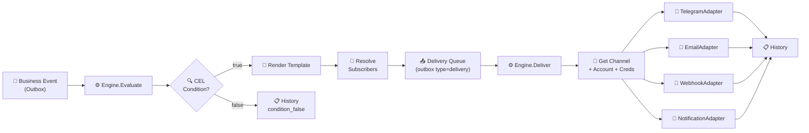
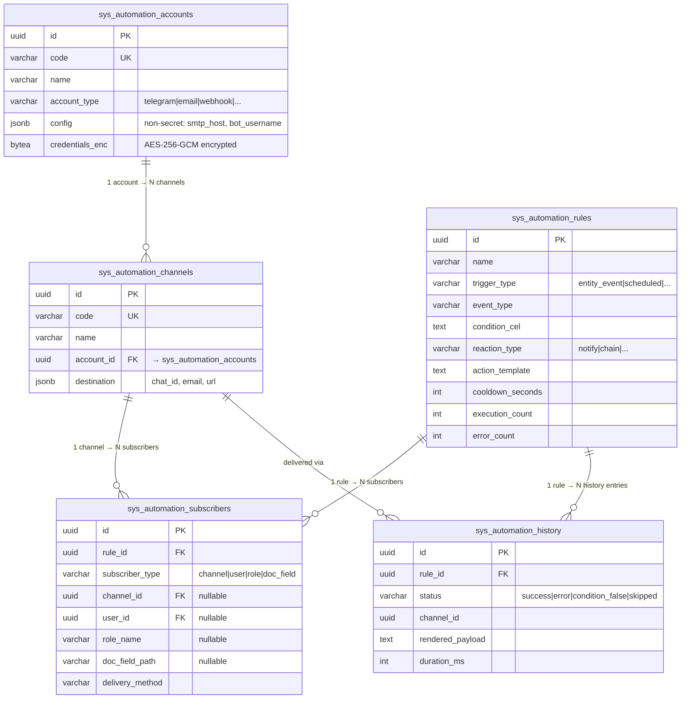

# Подсистема Автоматизации (Automation Engine) — Финальный План v2

> **Роли:** Fullstack-Meta + Мудрец ERP + UI/UX Архитектор  
> **Дата:** 2026-04-16  
> **Статус:** Ожидает утверждения

---

## Решения по Open Questions

| # | Вопрос | Решение |
|---|--------|---------|
| Q1 | Миграция данных `sys_service_accounts` | **DROP + CREATE.** База пересоздаётся, новые миграции |
| Q2 | Email adapter | **`net/smtp` напрямую** |
| Q3 | Scheduled triggers (`trigger_type = "scheduled"`) | **Включаем в MVP** — CRON-планировщик в Go |
| Q4 | Chain reactions (`reaction_type = "chain"`) | **Включаем в MVP** — publish internal event в outbox |

> [!IMPORTANT]
> **Ключевое архитектурное изменение:** Вводим **трёхуровневую модель** доставки, разделяя **credentials отправителя** и **адрес получателя**.

---

## Часть 0. Диагностика текущего состояния

12 проблем текущей реализации (без изменений по сравнению с v1):

### 🔴 Критические

| # | Проблема | Где |
|---|---------|-----|
| 1 | **ServiceAccount смешивает credentials и destination** — Bot Token + Chat ID в одном объекте | `integrations/model.go` |
| 2 | **Нет Подписчиков** — 1 правило = 1 получатель | `automations/rule.go:20` |
| 3 | **Синхронный I/O в Outbox Worker** — HTTP внутри цикла обработки | `engine.go:149` |
| 4 | **pgcrypto для credentials** — encryption key в SQL | `00025_sys_service_accounts.sql:9` |

### 🟠 Мажорные

| # | Проблема | Где |
|---|---------|-----|
| 5 | **Хардкоженные EVENT_GROUPS** в 3 копиях | `integrations-section.tsx`, `new/page.tsx`, `[id]/page.tsx` |
| 6 | **Нет cooldown/debounce** | `engine.go:98` |
| 7 | **CEL cache без TTL** | `engine.go:28` |
| 8 | **`[key: string]: unknown`** в формах | `new/page.tsx:28` |
| 9 | **History без duration/channel/status enum** | `history.go:13` |
| 10 | **Нет Replay** | `automation_history.go:51` |
| 11 | **Validate не проверяет CEL syntax** | `rule.go:51` |
| 12 | **Нет Optimistic Locking** в UpdateRequest | `rule.go:39` |

---

## Часть 1. Целевая архитектура — Трёхуровневая модель доставки

### Концептуальная модель

```
💡 ERP Insight: Разделение Аккаунтов, Каналов и Подписчиков
│ 1С:      "Учётная запись почты" (SMTP, пароль) ≠ "Подписки на события" (кому)
│ ERPNext: "Email Account" (общий) → "Notification" → "Recipients" (конкретные)
│ Odoo:    "mail.server" (SMTP-сервер) ≠ "mail.alias" (адрес) ≠ "mail.followers" (кому)
│ N8N:     "Credentials" (Bot Token) ≠ "Node Config" (Chat ID) ≠ "Workflow"
│ ───────────────────
│ Metapus: 3 уровня:
│   1. Account (credentials)  — "От чьего имени" (Bot Token, SMTP pass)
│   2. Channel  (destination) — "Куда"           (Chat ID, email-адрес, URL)
│   3. Subscriber (binding)   — "Кто из правила" (привязка канала к правилу)
│ 
│ Почему: Один Telegram-бот (1 Token) → 5 чатов (5 Chat ID).
│         Сменился Token → меняем в 1 месте → все 5 каналов работают.
```

### 3 уровня в таблице

```
┌──────────────────────────────────────────────────────────────────────┐
│  УРОВЕНЬ 1: Системный аккаунт (Account)                             │
│  ─────────────────────────────────────                              │
│  "От чьего имени отправляем"                                        │
│  Хранит: credentials (Bot Token, SMTP password, API Key)            │
│  Пример: "Telegram Bot: @metapus_bot" (token=xxx)                  │
│          "SMTP: noreply@company.com" (password=xxx, host, port)     │
│                                                                      │
│  ┌────────────────────────────────────────────────────────────────┐  │
│  │  УРОВЕНЬ 2: Канал доставки (Channel)                          │  │
│  │  ─────────────────────────────────                            │  │
│  │  "Куда доставляем" — ссылается на Account                     │  │
│  │  Хранит: destination config (Chat ID, email, URL)              │  │
│  │  Пример: "Telegram: Бухгалтерия" → account + chat_id=-100... │  │
│  │          "Telegram: Руководство" → account + chat_id=-200... │  │
│  │          "Email: Главбух"        → account + to=ivanova@...  │  │
│  │                                                                │  │
│  │  ┌──────────────────────────────────────────────────────────┐  │  │
│  │  │  УРОВЕНЬ 3: Подписчик (Subscriber)                       │  │  │
│  │  │  ─────────────────────────────                           │  │  │
│  │  │  "Кто получает из конкретного правила"                    │  │  │
│  │  │  Ссылается на Channel, User, Role или DocField           │  │  │
│  │  │  Пример: Правило "Крупное поступление"                   │  │  │
│  │  │    → Subscriber 1: channel="Telegram: Бухгалтерия"       │  │  │
│  │  │    → Subscriber 2: user="Иванов" → UI notification       │  │  │
│  │  │    → Subscriber 3: role="Бухгалтер" → Email              │  │  │
│  │  └──────────────────────────────────────────────────────────┘  │  │
│  └────────────────────────────────────────────────────────────────┘  │
└──────────────────────────────────────────────────────────────────────┘
```

### Pipeline (Event → Condition → Reaction → Delivery)



---

## Часть 2. Модель данных (Миграции)

### 2.1 Системные аккаунты — `sys_automation_accounts`

> Замена `sys_service_accounts`. Централизованные credentials отправителя.

```sql
-- +goose Up
-- Системные аккаунты отправителей (централизованные credentials)
CREATE TABLE sys_automation_accounts (
    id                UUID          PRIMARY KEY DEFAULT gen_random_uuid_v7(),
    code              VARCHAR(50)   NOT NULL,
    name              VARCHAR(255)  NOT NULL,
    account_type      VARCHAR(30)   NOT NULL,
    -- ^^ telegram | email | webhook | rocketchat | slack

    -- Несекретная конфигурация, специфичная для типа:
    -- telegram: { "bot_username": "@metapus_bot" }
    -- email:    { "smtp_host": "smtp.gmail.com", "smtp_port": 587, 
    --             "from_address": "noreply@c.com", "from_name": "Metapus", "tls": true }
    -- webhook:  { "base_url": "https://api.example.com", "default_headers": {...} }
    config            JSONB         NOT NULL DEFAULT '{}',

    -- Секреты, зашифрованные AES-256-GCM на уровне приложения (Go)
    -- telegram: bot_token
    -- email:    smtp_password
    -- webhook:  api_key / bearer_token
    credentials_enc   BYTEA,

    organization_id   UUID          REFERENCES cat_organizations(id) ON DELETE SET NULL,
    is_active         BOOLEAN       NOT NULL DEFAULT TRUE,
    status            VARCHAR(20)   NOT NULL DEFAULT 'active',
    -- ^^ active | error | disabled
    last_error        TEXT,
    last_success_at   TIMESTAMPTZ,

    deletion_mark     BOOLEAN       NOT NULL DEFAULT FALSE,
    version           INT           NOT NULL DEFAULT 1,
    created_at        TIMESTAMPTZ   NOT NULL DEFAULT statement_timestamp(),
    updated_at        TIMESTAMPTZ   NOT NULL DEFAULT statement_timestamp(),
    _deleted_at       TIMESTAMPTZ,
    _txid             BIGINT        DEFAULT txid_current()
);

CREATE UNIQUE INDEX idx_sys_auto_accounts_code
    ON sys_automation_accounts(code) WHERE deletion_mark = FALSE;

CREATE INDEX idx_sys_auto_accounts_type
    ON sys_automation_accounts(account_type, status);

CREATE INDEX idx_sys_auto_accounts_txid
    ON sys_automation_accounts(_txid);

CREATE TRIGGER trg_sys_automation_accounts_modtime
    BEFORE UPDATE ON sys_automation_accounts
    FOR EACH ROW EXECUTE FUNCTION update_updated_at_column();

CREATE TRIGGER set_sys_automation_accounts_txid
    BEFORE INSERT OR UPDATE ON sys_automation_accounts
    FOR EACH ROW EXECUTE FUNCTION update_txid_column();

CREATE TRIGGER soft_delete_sys_automation_accounts
    BEFORE UPDATE ON sys_automation_accounts
    FOR EACH ROW EXECUTE FUNCTION soft_delete_with_timestamp();

COMMENT ON TABLE sys_automation_accounts IS
    'Centralized sender accounts with encrypted credentials (Bot Token, SMTP password, API Key)';
COMMENT ON COLUMN sys_automation_accounts.credentials_enc IS
    'AES-256-GCM encrypted in Go app layer. Key from AUTOMATION_ENCRYPTION_KEY env var.';

-- +goose Down
DROP TABLE IF EXISTS sys_automation_accounts;
```

### 2.2 Каналы доставки — `sys_automation_channels`

> Конкретные точки назначения. Ссылается на Account для credentials.

```sql
-- +goose Up
-- Каналы доставки (конкретные получатели/destination)
CREATE TABLE sys_automation_channels (
    id                UUID          PRIMARY KEY DEFAULT gen_random_uuid_v7(),
    code              VARCHAR(50)   NOT NULL,
    name              VARCHAR(255)  NOT NULL,

    account_id        UUID          NOT NULL REFERENCES sys_automation_accounts(id) ON DELETE RESTRICT,
    -- ^^ Ссылка на аккаунт-отправитель. RESTRICT: нельзя удалить аккаунт с каналами

    -- Конфигурация назначения, специфичная для типа аккаунта:
    -- telegram: { "chat_id": "-1001234567890", "parse_mode": "Markdown", "thread_id": 123 }
    -- email:    { "to": ["user@company.com"], "cc": [], "subject_prefix": "[ERP]" }
    -- webhook:  { "url": "https://api.example.com/hook/123", "method": "POST",
    --             "headers": { "X-Custom": "value" } }
    destination       JSONB         NOT NULL DEFAULT '{}',

    is_active         BOOLEAN       NOT NULL DEFAULT TRUE,

    deletion_mark     BOOLEAN       NOT NULL DEFAULT FALSE,
    version           INT           NOT NULL DEFAULT 1,
    created_at        TIMESTAMPTZ   NOT NULL DEFAULT statement_timestamp(),
    updated_at        TIMESTAMPTZ   NOT NULL DEFAULT statement_timestamp(),
    _deleted_at       TIMESTAMPTZ,
    _txid             BIGINT        DEFAULT txid_current()
);

CREATE UNIQUE INDEX idx_sys_auto_channels_code
    ON sys_automation_channels(code) WHERE deletion_mark = FALSE;

CREATE INDEX idx_sys_auto_channels_account
    ON sys_automation_channels(account_id);

CREATE INDEX idx_sys_auto_channels_txid
    ON sys_automation_channels(_txid);

CREATE TRIGGER trg_sys_automation_channels_modtime
    BEFORE UPDATE ON sys_automation_channels
    FOR EACH ROW EXECUTE FUNCTION update_updated_at_column();

CREATE TRIGGER set_sys_automation_channels_txid
    BEFORE INSERT OR UPDATE ON sys_automation_channels
    FOR EACH ROW EXECUTE FUNCTION update_txid_column();

CREATE TRIGGER soft_delete_sys_automation_channels
    BEFORE UPDATE ON sys_automation_channels
    FOR EACH ROW EXECUTE FUNCTION soft_delete_with_timestamp();

COMMENT ON TABLE sys_automation_channels IS
    'Delivery destinations (Telegram chat, email address, webhook URL). References Account for credentials.';
```

### 2.3 Правила автоматизации — `sys_automation_rules` (обновление)

```sql
-- +goose Up
CREATE TABLE sys_automation_rules (
    id                 UUID          PRIMARY KEY DEFAULT gen_random_uuid_v7(),
    name               VARCHAR(255)  NOT NULL,
    description        TEXT,

    -- TRIGGER ──────────────────────────────────
    trigger_type       VARCHAR(30)   NOT NULL DEFAULT 'entity_event',
    -- ^^ entity_event | business_event | scheduled | incoming_webhook
    event_type         VARCHAR(100)  NOT NULL,
    -- ^^ document.goods_receipt.posted | business.currency_rates_loaded | cron:*/5 * * * *
    target_entity      VARCHAR(100),
    -- ^^ goods_receipt, counterparty (NULL for business_event/scheduled)

    -- CONDITION ────────────────────────────────
    condition_cel      TEXT,

    -- REACTION ─────────────────────────────────
    reaction_type      VARCHAR(30)   NOT NULL DEFAULT 'notify',
    -- ^^ notify | webhook_call | chain | create_record
    message_format     VARCHAR(20)   NOT NULL DEFAULT 'text',
    -- ^^ text | markdown | html
    action_template    TEXT          NOT NULL DEFAULT '',

    -- CHAIN (only for reaction_type = 'chain')
    chain_rule_ids     UUID[],
    -- ^^ Array of rule IDs to trigger next

    -- SETTINGS ─────────────────────────────────
    priority           INT           NOT NULL DEFAULT 0,
    max_retries        INT           NOT NULL DEFAULT 3,
    cooldown_seconds   INT           NOT NULL DEFAULT 0,
    organization_id    UUID          REFERENCES cat_organizations(id) ON DELETE CASCADE,
    is_active          BOOLEAN       NOT NULL DEFAULT TRUE,

    -- STATS (updated by Engine atomically)
    execution_count    INT           NOT NULL DEFAULT 0,
    error_count        INT           NOT NULL DEFAULT 0,
    last_executed_at   TIMESTAMPTZ,

    -- Standard Metapus ─────────────────────────
    deletion_mark      BOOLEAN       NOT NULL DEFAULT FALSE,
    version            INT           NOT NULL DEFAULT 1,
    created_at         TIMESTAMPTZ   NOT NULL DEFAULT statement_timestamp(),
    updated_at         TIMESTAMPTZ   NOT NULL DEFAULT statement_timestamp(),
    _deleted_at        TIMESTAMPTZ,
    _txid              BIGINT        DEFAULT txid_current()
);

CREATE INDEX idx_sys_auto_rules_event
    ON sys_automation_rules(event_type)
    WHERE is_active = TRUE AND deletion_mark = FALSE;

CREATE INDEX idx_sys_auto_rules_trigger_type
    ON sys_automation_rules(trigger_type)
    WHERE is_active = TRUE AND deletion_mark = FALSE;

CREATE INDEX idx_sys_auto_rules_txid ON sys_automation_rules(_txid);

-- Standard triggers (modtime, txid, soft_delete)
CREATE TRIGGER trg_sys_automation_rules_modtime
    BEFORE UPDATE ON sys_automation_rules
    FOR EACH ROW EXECUTE FUNCTION update_updated_at_column();

CREATE TRIGGER set_sys_automation_rules_txid
    BEFORE INSERT OR UPDATE ON sys_automation_rules
    FOR EACH ROW EXECUTE FUNCTION update_txid_column();

CREATE TRIGGER soft_delete_sys_automation_rules
    BEFORE UPDATE ON sys_automation_rules
    FOR EACH ROW EXECUTE FUNCTION soft_delete_with_timestamp();

COMMENT ON TABLE sys_automation_rules IS 'Event → Condition → Reaction automation rules';
COMMENT ON COLUMN sys_automation_rules.event_type IS 'e.g. document.goods_receipt.posted or cron:0 9 * * 1-5';
```

### 2.4 Подписчики — `sys_automation_subscribers` (табличная часть Rule)

```sql
-- +goose Up
CREATE TABLE sys_automation_subscribers (
    id                UUID          PRIMARY KEY DEFAULT gen_random_uuid_v7(),
    rule_id           UUID          NOT NULL REFERENCES sys_automation_rules(id) ON DELETE CASCADE,

    subscriber_type   VARCHAR(30)   NOT NULL,
    -- ^^ channel | user | role | doc_field

    -- Полиморфная ссылка (заполняется ОДНО поле по типу)
    channel_id        UUID          REFERENCES sys_automation_channels(id) ON DELETE RESTRICT,
    user_id           UUID          REFERENCES auth_users(id) ON DELETE CASCADE,
    role_name         VARCHAR(100),
    doc_field_path    VARCHAR(255),

    -- Метод доставки для user/role/doc_field (для channel — определяется типом аккаунта)
    delivery_method   VARCHAR(30)   DEFAULT 'ui_notification',
    -- ^^ ui_notification | email

    idx               INT           NOT NULL DEFAULT 0,

    CONSTRAINT chk_subscriber_ref CHECK (
        (subscriber_type = 'channel'   AND channel_id IS NOT NULL) OR
        (subscriber_type = 'user'      AND user_id IS NOT NULL) OR
        (subscriber_type = 'role'      AND role_name IS NOT NULL) OR
        (subscriber_type = 'doc_field' AND doc_field_path IS NOT NULL)
    )
);

CREATE INDEX idx_sys_auto_subscribers_rule
    ON sys_automation_subscribers(rule_id);

CREATE INDEX idx_sys_auto_subscribers_channel
    ON sys_automation_subscribers(channel_id)
    WHERE channel_id IS NOT NULL;
```

### 2.5 История выполнений — `sys_automation_history`

```sql
-- +goose Up
CREATE TABLE sys_automation_history (
    id                UUID          PRIMARY KEY DEFAULT gen_random_uuid_v7(),
    rule_id           UUID          NOT NULL REFERENCES sys_automation_rules(id) ON DELETE CASCADE,
    rule_name         VARCHAR(255)  NOT NULL,     -- Денормализация для UI

    event_type        VARCHAR(100)  NOT NULL,
    aggregate_id      UUID,                       -- NULL для business/scheduled events
    aggregate_name    VARCHAR(255),               -- "НФ00-000042"

    status            VARCHAR(20)   NOT NULL,
    -- ^^ success | error | condition_false | skipped | pending

    channel_id        UUID,
    channel_name      VARCHAR(255),               -- Денормализация
    account_name      VARCHAR(255),               -- "Telegram Bot: @metapus_bot"

    rendered_payload  TEXT,
    error_text        TEXT,
    duration_ms       INT,
    outbox_event_id   UUID,                       -- Ссылка на outbox для replay

    created_at        TIMESTAMPTZ   NOT NULL DEFAULT statement_timestamp()
    -- Нет CDC-колонок — append-only таблица
);

CREATE INDEX idx_sys_auto_hist_rule    ON sys_automation_history(rule_id);
CREATE INDEX idx_sys_auto_hist_status  ON sys_automation_history(status);
CREATE INDEX idx_sys_auto_hist_created ON sys_automation_history(created_at DESC);
CREATE INDEX idx_sys_auto_hist_errors
    ON sys_automation_history(created_at DESC) WHERE status = 'error';

-- +goose Down
DROP TABLE IF EXISTS sys_automation_history;
```

### ER-диаграмма



---

## Часть 3. Backend Pipeline

### 3.1 Domain Models

```go
// internal/domain/automations/account.go
type AccountType string
const (
    AccountTelegram   AccountType = "telegram"
    AccountEmail      AccountType = "email"
    AccountWebhook    AccountType = "webhook"
    AccountRocketChat AccountType = "rocketchat"
    AccountSlack      AccountType = "slack"
)

type Account struct {
    entity.Catalog                // Code, Name, DeletionMark, Version, Created/Updated
    AccountType    AccountType    `json:"accountType"`
    Config         map[string]any `json:"config"`
    OrganizationID *id.ID         `json:"organizationId,omitempty"`
    IsActive       bool           `json:"isActive"`
    Status         string         `json:"status"`
    LastError      *string        `json:"lastError,omitempty"`
    LastSuccessAt  *time.Time     `json:"lastSuccessAt,omitempty"`
    // credentials_enc: NOT in domain model — via CredentialManager only
}
```

```go
// internal/domain/automations/channel.go
type Channel struct {
    entity.Catalog                    // Code, Name, DeletionMark, Version
    AccountID    id.ID               `json:"accountId"`
    Destination  map[string]any      `json:"destination"`
    IsActive     bool                `json:"isActive"`
    // Denormalized for UI (populated by service/handler):
    AccountName  string              `json:"accountName,omitempty"`
    AccountType  AccountType         `json:"accountType,omitempty"`
}
```

```go
// internal/domain/automations/rule.go (ОБНОВЛЕНИЕ)
type TriggerType string
const (
    TriggerEntityEvent  TriggerType = "entity_event"
    TriggerBusinessEvent TriggerType = "business_event"
    TriggerScheduled     TriggerType = "scheduled"
    TriggerWebhook       TriggerType = "incoming_webhook"
)

type ReactionType string
const (
    ReactionNotify      ReactionType = "notify"
    ReactionWebhookCall ReactionType = "webhook_call"
    ReactionChain       ReactionType = "chain"
    ReactionCreateRecord ReactionType = "create_record"
)

type Rule struct {
    entity.Catalog                    // Code→auto, Name, DeletionMark, Version
    Description    *string           `json:"description,omitempty"`
    TriggerType    TriggerType       `json:"triggerType"`
    EventType      string            `json:"eventType"`
    TargetEntity   *string           `json:"targetEntity,omitempty"`
    ConditionCEL   *string           `json:"conditionCel,omitempty"`
    ReactionType   ReactionType      `json:"reactionType"`
    MessageFormat  string            `json:"messageFormat"`
    ActionTemplate string            `json:"actionTemplate"`
    ChainRuleIDs   []id.ID          `json:"chainRuleIds,omitempty"`
    Priority       int               `json:"priority"`
    MaxRetries     int               `json:"maxRetries"`
    CooldownSecs   int               `json:"cooldownSeconds"`
    OrganizationID *id.ID            `json:"organizationId,omitempty"`
    IsActive       bool              `json:"isActive"`
    ExecutionCount int               `json:"executionCount"`
    ErrorCount     int               `json:"errorCount"`
    LastExecutedAt *time.Time        `json:"lastExecutedAt,omitempty"`
    Subscribers    []Subscriber      `json:"subscribers"`  // Inline table part
}
```

### 3.2 Engine v2 — Двухфазная обработка

```go
// internal/core/automation/engine.go

// Phase 1: Evaluate — вызывается OutboxRelay для domain events
// Чистая CPU-работа: CEL + Template рендеринг. Нет сетевого I/O!
func (e *Engine) Evaluate(ctx context.Context, eventType string, payload map[string]any) error {
    rules := e.ruleRepo.ListActiveByEventType(ctx, eventType)

    for _, rule := range rules {
        start := time.Now()

        // 1. Cooldown check
        if rule.CooldownSecs > 0 && e.isInCooldown(rule.ID, rule.CooldownSecs) {
            e.recordHistory(ctx, rule, "skipped", "cooldown", 0)
            continue
        }

        // 2. CEL evaluation
        if rule.ConditionCEL != nil && *rule.ConditionCEL != "" {
            matched, err := e.EvaluateCEL(*rule.ConditionCEL, vars)
            if err != nil || !matched {
                e.recordHistory(ctx, rule, "condition_false", "", time.Since(start))
                continue
            }
        }

        // 3. Render template
        rendered := e.RenderTemplate(rule.ActionTemplate, payload)

        // 4. Resolve subscribers → enqueue delivery tasks
        subscribers := e.subscriberRepo.ListByRuleID(ctx, rule.ID)
        for _, sub := range subscribers {
            e.enqueueDelivery(ctx, rule, sub, rendered, payload)
        }

        // 5. Chain reactions → publish new internal events
        if rule.ReactionType == ReactionChain && len(rule.ChainRuleIDs) > 0 {
            for _, nextRuleID := range rule.ChainRuleIDs {
                e.publisher.Publish(ctx, domain.DomainEvent{
                    EventType: fmt.Sprintf("automation.chain.%s", nextRuleID),
                    Payload:   payload, // Forward the same payload
                })
            }
        }

        // 6. Update stats
        e.ruleRepo.IncrementStats(ctx, rule.ID, true)
        e.updateCooldown(rule.ID)
    }
    return nil
}

// Phase 2: Deliver — вызывается OutboxRelay для automation.deliver events
// Сетевой I/O: HTTP/SMTP вызовы. Может ретраиться через outbox.
func (e *Engine) Deliver(ctx context.Context, payload map[string]any) error {
    start := time.Now()
    channelID := payload["channelId"].(string)

    // 1. Load channel + account + credentials
    channel := e.channelRepo.GetByID(ctx, channelID)
    account := e.accountRepo.GetByID(ctx, channel.AccountID)
    creds   := e.credManager.ReadCredentials(ctx, account.ID)

    // 2. Execute via adapter
    adapter := e.adapters[string(account.AccountType)]
    err := adapter.Execute(ctx, account.Config, channel.Destination, creds, payload["rendered"])

    // 3. Record history
    duration := time.Since(start).Milliseconds()
    e.recordDeliveryHistory(ctx, payload, err, int(duration))

    // 4. Update account last_success/last_error
    e.accountRepo.UpdateLastResult(ctx, account.ID, err)

    if err != nil {
        return err // Outbox will retry with exponential backoff
    }
    return nil
}
```

### 3.3 Adapter Interface (ОБНОВЛЕНИЕ — destination отделён)

```go
// Adapter v2: config (от аккаунта) + destination (от канала) + credentials
type Adapter interface {
    Execute(ctx context.Context,
        accountConfig map[string]any,     // smtp_host, bot_username, ...
        channelDest   map[string]any,     // chat_id, to email, url, ...
        credentials   []byte,             // bot_token, smtp_password, ...
        payload       string,             // rendered message
    ) error
}
```

### 3.4 CRON Scheduler (для `trigger_type = "scheduled"`)

```go
// internal/core/automation/scheduler.go

type Scheduler struct {
    ruleRepo  automations.Repository
    publisher domain.OutboxPublisher
    cron      *cron.Cron  // github.com/robfig/cron/v3
}

// Start загружает все scheduled rules и регистрирует cron jobs.
// При обновлении правила — invalidate и перерегистрация.
func (s *Scheduler) Start(ctx context.Context) {
    rules := s.ruleRepo.ListActiveByTriggerType(ctx, "scheduled")
    for _, rule := range rules {
        // event_type хранит cron expression: "cron:0 9 * * 1-5"
        cronExpr := strings.TrimPrefix(rule.EventType, "cron:")
        s.cron.AddFunc(cronExpr, func() {
            s.publisher.Publish(ctx, domain.DomainEvent{
                EventType: fmt.Sprintf("scheduled.%s", rule.ID),
                Payload: map[string]any{
                    "ruleId":     rule.ID.String(),
                    "triggerType": "scheduled",
                    "triggeredAt": time.Now().UTC().Format(time.RFC3339),
                },
            })
        })
    }
    s.cron.Start()
}
```

### 3.5 Application-Level Encryption

```go
// internal/core/crypto/aes.go
// Key из env: AUTOMATION_ENCRYPTION_KEY (32 bytes = AES-256)

func Encrypt(plaintext, key []byte) ([]byte, error) {
    block, _ := aes.NewCipher(key)
    gcm, _ := cipher.NewGCM(block)
    nonce := make([]byte, gcm.NonceSize())
    io.ReadFull(rand.Reader, nonce)
    return gcm.Seal(nonce, nonce, plaintext, nil), nil
}

func Decrypt(ciphertext, key []byte) ([]byte, error) {
    block, _ := aes.NewCipher(key)
    gcm, _ := cipher.NewGCM(block)
    nonceSize := gcm.NonceSize()
    nonce, ct := ciphertext[:nonceSize], ciphertext[nonceSize:]
    return gcm.Open(nil, nonce, ct, nil)
}
```

---

## Часть 4. API-контракт

### Accounts (Системные аккаунты)

```
GET    /api/v1/system/automation/accounts              → CursorListResponse<Account>
POST   /api/v1/system/automation/accounts              → { id: string }
GET    /api/v1/system/automation/accounts/:id           → Account
PATCH  /api/v1/system/automation/accounts/:id           → Account
DELETE /api/v1/system/automation/accounts/:id           → 204
PATCH  /api/v1/system/automation/accounts/:id/credentials → 204
POST   /api/v1/system/automation/accounts/:id/test      → { success: bool, error?: string }
```

### Channels (Каналы доставки)

```
GET    /api/v1/system/automation/channels              → CursorListResponse<Channel>
       ?accountId=... (фильтр по аккаунту)
POST   /api/v1/system/automation/channels              → { id: string }
GET    /api/v1/system/automation/channels/:id           → Channel
PATCH  /api/v1/system/automation/channels/:id           → Channel
DELETE /api/v1/system/automation/channels/:id           → 204
POST   /api/v1/system/automation/channels/:id/test      → { success: bool, error?: string }
```

### Rules (Правила — с inline subscribers)

```
GET    /api/v1/system/automation/rules                  → CursorListResponse<Rule>
POST   /api/v1/system/automation/rules                  → { id: string }
GET    /api/v1/system/automation/rules/:id               → Rule (включая subscribers[])
PATCH  /api/v1/system/automation/rules/:id               → Rule
DELETE /api/v1/system/automation/rules/:id               → 204
POST   /api/v1/system/automation/rules/:id/test          → TestRuleResponse
POST   /api/v1/system/automation/rules/:id/toggle        → { isActive: bool }
```

### History

```
GET    /api/v1/system/automation/history                 → CursorListResponse<HistoryEntry>
       ?ruleId=...&status=...&channelId=...&from=...&to=...
GET    /api/v1/system/automation/history/:id              → HistoryEntry (full payload)
POST   /api/v1/system/automation/history/:id/replay       → { id: string }
```

### Meta (для UI — metadata-driven)

```
GET    /api/v1/system/automation/meta/event-types         → EventTypeGroup[]
GET    /api/v1/system/automation/meta/entity-fields/:type → FieldInfo[]
```

---

## Часть 5. Frontend UI/UX — Детальные Wireframes

### 5.1 Навигация: Settings Page

```
┌─ Настройки ──────────────────────┐
│  🔢 Нумерация                    │
│  ⚡ Производительность            │
│  👥 Пользователи и роли          │
│  ⚙️ Автоматизации        ◀━━━━━  │  ← Новое название
│  🛡️ Профили безопасности         │
│  📊 Матрица доступа              │
│  ℹ️ О системе                    │
└──────────────────────────────────┘
```

### 5.2 Секция "Автоматизации" — 4 таба

```
┌─ Автоматизации ─────────────────────────────────────────────────────────────┐
│  Правила обработки событий, каналы и аккаунты доставки                      │
│                                                                             │
│  ┌──────────────┬──────────────┬────────────────┬──────────────┐            │
│  │ 📋 Правила 5 │ 📡 Каналы 7  │ 🔑 Аккаунты 3  │ 📜 История   │            │
│  └──────────────┴──────────────┴────────────────┴──────────────┘            │
└─────────────────────────────────────────────────────────────────────────────┘
```

### 5.3 Таб "Аккаунты" — централизованные credentials

```
┌─ 🔑 Системные аккаунты ────────────────────────────────────────────────────┐
│  Аккаунты содержат credentials отправителей                 [+ Подключить] │
│                                                                             │
│  ┌───────────────────────────────────────────────────────────────────────┐  │
│  │ 🤖  Telegram Bot: @metapus_bot                           ✅ Активен  │  │
│  │     Тип: Telegram • Каналов: 3                                       │  │
│  │     Посл. отправка: 2 мин назад                                      │  │
│  │                                         [🔑 Токен] [✏️ Изм.] [🗑️]    │  │
│  ├───────────────────────────────────────────────────────────────────────┤  │
│  │ 📧  SMTP: noreply@company.com                            ✅ Активен  │  │
│  │     Тип: Email • smtp.gmail.com:587 • TLS • Каналов: 4              │  │
│  │     Посл. отправка: 1ч назад                                        │  │
│  │                                         [🔑 Пароль] [✏️ Изм.] [🗑]   │  │
│  ├───────────────────────────────────────────────────────────────────────┤  │
│  │ 🔗  Webhook API                                          ⚠️ Ошибка   │  │
│  │     Тип: Webhook • https://api.1c.example.com • Каналов: 1          │  │
│  │     Ошибка: 502 Bad Gateway (15 мин назад)                          │  │
│  │                                         [🔑 Ключ] [✏️ Изм.] [🗑️]    │  │
│  └───────────────────────────────────────────────────────────────────────┘  │
└─────────────────────────────────────────────────────────────────────────────┘
```

**Диалог создания аккаунта:**

```
┌─ Подключить системный аккаунт ──────────────────────────────────────────────┐
│                                                                             │
│  Код:           [tg_main_bot_________]                                      │
│  Наименование:  [Telegram Bot: @metapus_bot____]                            │
│                                                                             │
│  Тип аккаунта:  [Telegram Bot ▾]                                           │
│                  • Telegram Bot                                            │
│                  • Email (SMTP)                                            │
│                  • Webhook API                                             │
│                                                                             │
│  ── Настройки Telegram ──────────────────────────────────────────────────  │
│  Bot Username:  [@metapus_bot_________]   (необязательно, для отображения) │
│  Bot Token:     [•••••••••••••••••••••] 👁                                  │
│                                                                             │
│  ── Настройки Email (если тип = Email) ──────────────────────────────────  │
│  SMTP Host:     [smtp.gmail.com_______]     Port: [587_]                   │
│  From Address:  [noreply@company.com__]     From Name: [Metapus ERP_]      │
│  Password:      [•••••••••••••] 👁          TLS:  [🔘]                     │
│                                                                             │
│  ── Настройки Webhook (если тип = Webhook) ──────────────────────────────  │
│  Base URL:      [https://api.1c.example.com]                               │
│  API Key:       [•••••••••••••] 👁                                          │
│  Default Headers: [+ Добавить]                                             │
│    Content-Type: application/json                                          │
│                                                                             │
│                                             [Отмена]     [Подключить]      │
│                                                                             │
└─────────────────────────────────────────────────────────────────────────────┘
```

### 5.4 Таб "Каналы" — конкретные направления

```
┌─ 📡 Каналы доставки ────────────────────────────────────────────────────────┐
│  Каналы определяют куда именно отправлять через аккаунт      [+ Добавить]  │
│                                                                             │
│  ┌──────────────────────────────────────────────────────────────────────┐   │
│  │ Название                  │ Аккаунт         │ Назначение   │ Правил │   │
│  ├───────────────────────────┼─────────────────┼──────────────┼────────┤   │
│  │ 📱 Telegram: Бухгалтерия  │ 🤖 @metapus_bot │ -1001234...  │   3    │   │
│  │ 📱 Telegram: Руководство  │ 🤖 @metapus_bot │ -1005678...  │   2    │   │
│  │ 📱 Telegram: Финансы      │ 🤖 @metapus_bot │ -1009012...  │   1    │   │
│  │ 📧 Email: Главбух         │ 📧 SMTP основн. │ gl@comp.com  │   1    │   │
│  │ 📧 Email: Закупки         │ 📧 SMTP основн. │ purch@c.com  │   2    │   │
│  │ 🔗 Webhook: 1С            │ 🔗 Webhook API  │ /hook/123    │   1    │   │
│  └──────────────────────────────────────────────────────────────────────┘   │
│                                                                             │
│  Примечание: все 3 Telegram-канала используют один Bot Token                │
│  Если токен сменился → достаточно обновить аккаунт "🤖 @metapus_bot"       │
└─────────────────────────────────────────────────────────────────────────────┘
```

**Диалог создания канала:**

```
┌─ Добавить канал доставки ───────────────────────────────────────────────────┐
│                                                                             │
│  Код:           [tg_accounting__________]                                   │
│  Наименование:  [Telegram: Бухгалтерия__]                                  │
│                                                                             │
│  Аккаунт:       [🤖 Telegram Bot: @metapus_bot ▾]  ← Select из Accounts   │
│                                                                             │
│  ── Назначение (зависит от типа аккаунта) ───────────────────────────────  │
│                                                                             │
│  │ Для Telegram ─────────────────────────────────────────────────────── │  │
│  │ Chat ID:       [-1001234567890________]                              │  │
│  │ Parse Mode:    [Markdown ▾]                                          │  │
│  │ Thread ID:     [__________] (необязательно, для форумов)             │  │
│  │                                                                      │  │
│  │ Для Email ────────────────────────────────────────────────────────── │  │
│  │ Кому (To):     [ivanova@company.com, petrov@company.com]            │  │
│  │ Копия (CC):    [chief@company.com___]                               │  │
│  │ Префикс темы:  [[ERP] ______________]                               │  │
│  │                                                                      │  │
│  │ Для Webhook ──────────────────────────────────────────────────────── │  │
│  │ URL (path):    [/hook/goods-receipt___]                              │  │
│  │ Method:        [POST ▾]                                              │  │
│  │ Headers:       [+ Добавить]                                         │  │
│                                                                             │
│                              [Тест отправки]  [Отмена]     [Добавить]      │
│                                                                             │
└─────────────────────────────────────────────────────────────────────────────┘
```

### 5.5 Таб "Правила" — список

```
┌─────────────────────────────────────────────────────────────────────────────┐
│  Правило: при событии → проверить условие → отправить подписчикам           │
│                                                                  [+ Создать]│
│  ┌─────┬──────────────────────┬──────────────────┬─────────┬───────────┐   │
│  │ Вкл │ Название             │ Триггер          │ Подпис. │ ✅  │ ❌  │   │
│  ├─────┼──────────────────────┼──────────────────┼─────────┼─────┼─────┤   │
│  │ 🔘  │ Крупное поступление  │ 📄 Проведение    │ 📱×1    │ 42  │  0  │   │
│  │     │                      │    Поступление   │ 🔔×2    │     │     │   │
│  │     │                      │    >100 000 ₽    │         │     │     │   │
│  ├─────┼──────────────────────┼──────────────────┼─────────┼─────┼─────┤   │
│  │ 🔘  │ Курсы валют          │ 🔔 Системное     │ 📱×1    │ 365 │  2  │   │
│  │     │                      │    currency_rates │         │     │     │   │
│  ├─────┼──────────────────────┼──────────────────┼─────────┼─────┼─────┤   │
│  │ 🔘  │ Отчёт по утрам       │ ⏰ По расписанию  │ 📧×3    │  90 │  0  │   │
│  │     │                      │    Пн-Пт 9:00    │ 🔔×1    │     │     │   │
│  ├─────┼──────────────────────┼──────────────────┼─────────┼─────┼─────┤   │
│  │ ⚪  │ Просроченная оплата  │ ⏰ По расписанию  │ 📧×1    │   0 │  0  │   │
│  │     │                      │    Ежедневно     │         │     │     │   │
│  └─────┴──────────────────────┴──────────────────┴─────────┴─────┴─────┘   │
└─────────────────────────────────────────────────────────────────────────────┘
```

### 5.6 Форма Правила — 3 вкладки (отдельная страница)

```
┌─────────────────────────────────────────────────────────────────────────────┐
│  FormToolbar: [← Назад]  Правило: Крупное поступление  [Тест] [Записать ▾] │
│  ─────────────────────────────────────────────────────────────────────────  │
│                                                                             │
│  Наименование:  [Крупное поступление → Telegram]    Активно: [🔘]          │
│  Описание:      [Уведомление при проведении на сумму > 100к]               │
│                                                                             │
│  ┌──────────────┬──────────────┬──────────────┐                             │
│  │ ⚡ Триггер   │ 📤 Реакция   │ 📝 Шаблон    │                             │
│  └──────────────┴──────────────┴──────────────┘                             │
└─────────────────────────────────────────────────────────────────────────────┘
```

#### Вкладка 1 — "Триггер"

```
┌─ ⚡ Триггер ────────────────────────────────────────────────────────────────┐
│                                                                             │
│  Тип триггера:     [Событие сущности ▾]                                    │
│                     • Событие сущности                                     │
│                     • Системное событие                                    │
│                     • По расписанию                                        │
│                     • Входящий webhook                                     │
│                                                                             │
│  ═══ Если "Событие сущности" ═══════════════════════════════════════════   │
│  Сущность:         [Поступление товаров ▾]  ← metadata-driven!             │
│  Действие:         [Проведение ▾]                                          │
│                                                                             │
│  ═══ Если "По расписанию" ══════════════════════════════════════════════   │
│  CRON:             [0 9 * * 1-5____________]                               │
│  Расшифровка:      "Каждый будний день в 09:00"   ← автоподсказка          │
│                                                                             │
│  ═══ Если "Входящий webhook" ═══════════════════════════════════════════   │
│  Webhook URL:      https://metapus.io/api/v1/automation/webhook/xxxx       │
│                    [📋 Копировать]  (readonly, генерируется автоматически)  │
│                                                                             │
│  ── Условие выполнения (необязательно) ──────────────────────────────────  │
│  ┌─ CEL ───────────────────────────────────────────────────────────────┐   │
│  │ doc.totalAmount > 10000000 && doc.warehouseId != ""                 │   │
│  └─────────────────────────────────────────────────────────────────────┘   │
│  💡 Доступные поля: number, date, totalAmount, posted, ...                 │
│                                                                             │
│  ── Настройки ───────────────────────────────────────────────────────────  │
│  Приоритет: [0]   Макс. ретраев: [3]   Cooldown: [0] сек                  │
└─────────────────────────────────────────────────────────────────────────────┘
```

#### Вкладка 2 — "Реакция"

```
┌─ 📤 Реакция ────────────────────────────────────────────────────────────────┐
│                                                                             │
│  Тип реакции:      [Отправить уведомление ▾]                               │
│                     • Отправить уведомление                                │
│                     • Вызвать webhook                                      │
│                     • Цепочка (запустить другие правила)                    │
│                                                                             │
│  ═══ Если "Цепочка" ═══════════════════════════════════════════════════    │
│  Правила для запуска: [Курсы валют → Telegram      ▾] [×]                  │
│                       [Отчёт по утрам              ▾] [×]                  │
│                       [+ Добавить правило]                                 │
│                                                                             │
│  ═══ Если "Уведомление" / "Webhook" ═══════════════════════════════════    │
│  ── Подписчики ──────────────────────────────────────────────────────────  │
│                                                                             │
│  [+ Добавить подписчика]                                                   │
│                                                                             │
│  ┌─────┬──────────────┬──────────────────────────────────┬─────────┬────┐  │
│  │  №  │ Тип          │ Получатель                       │ Доставка│    │  │
│  ├─────┼──────────────┼──────────────────────────────────┼─────────┼────┤  │
│  │  1  │ 📡 Канал     │ [Telegram: Бухгалтерия     ▾]   │   —     │ 🗑️ │  │
│  │  2  │ 👤 Пользов.  │ [Иванов И.И.               ▾]   │ [UI ▾]  │ 🗑️ │  │
│  │  3  │ 🏷️ Роль      │ [Бухгалтер                 ▾]   │ [UI ▾]  │ 🗑️ │  │
│  │  4  │ 📋 Из поля   │ [doc.responsibleUserId     ▾]   │ [Email▾]│ 🗑️ │  │
│  └─────┴──────────────┴──────────────────────────────────┴─────────┴────┘  │
│                                                                             │
│  📎 Для типа "Канал" — доставка определяется типом аккаунта                │
│  📎 Для "Пользователь/Роль" — выбор: UI-уведомление или Email             │
└─────────────────────────────────────────────────────────────────────────────┘
```

#### Вкладка 3 — "Шаблон"

```
┌─ 📝 Шаблон сообщения ──────────────────────────────────────────────────────┐
│                                                                             │
│  Формат: [Markdown ▾]   [{{ Переменная }}]   [👁 Предпросмотр]             │
│                                                                             │
│  ┌─ Monaco Editor ──────────────────────────────────────────────────────┐  │
│  │ 📦 *Проведено поступление*                                          │  │
│  │ Номер: {{ .doc.number }}                                             │  │
│  │ Дата: {{ .doc.date }}                                                │  │
│  │ Поставщик: {{ .doc.supplierName }}                                   │  │
│  │ Сумма: {{ .doc.totalAmount }}                                        │  │
│  │ Склад: {{ .doc.warehouseName }}                                      │  │
│  └──────────────────────────────────────────────────────────────────────┘  │
│                                                                             │
│  ── Предпросмотр (по кнопке "👁") ────────────────────────────────────── │  │
│  ┌──────────────────────────────────────────────────────────────────────┐  │
│  │ 📦 **Проведено поступление**                                        │  │
│  │ Номер: НФ00-000042                                                  │  │
│  │ Дата: 15.04.2026                                                    │  │
│  │ Поставщик: ООО "Ромашка"                                            │  │
│  │ Сумма: 150 000,00 ₽                                                 │  │
│  │ Склад: Основной                                                     │  │
│  └──────────────────────────────────────────────────────────────────────┘  │
│                                                                             │
│  💡 {{ .doc }}, {{ .action }}, {{ .entityType }}, {{ .doc | json }}        │
└─────────────────────────────────────────────────────────────────────────────┘
```

### 5.7 Таб "История"

```
┌─ 📜 История выполнений ─────────────────────────────────────────────────────┐
│                                                                             │
│  [Правило ▾] [Статус ▾] [Канал ▾] [Период: Сегодня ▾]           [🔄 Обн.] │
│                                                                             │
│  ┌───────┬────────────────────┬─────────────┬────────┬────────┬────────┐   │
│  │ Время │ Правило            │ Сущность    │ Канал  │ Статус │ Время  │   │
│  ├───────┼────────────────────┼─────────────┼────────┼────────┼────────┤   │
│  │ 14:32 │ Крупное поступлен. │ НФ00-000042 │ 📱 Бух │  ✅    │ 120ms  │   │
│  │ 14:32 │ Крупное поступлен. │ НФ00-000042 │ 🔔 UI  │  ✅    │   5ms  │   │
│  │ 14:30 │ Курсы валют        │      —      │ 📱 Фин │  ✅    │  85ms  │   │
│  │ 13:15 │ Webhook: 1С        │ РТ00-000015 │ 🔗 1С  │  ❌    │ 5012ms │   │
│  │ 12:00 │ Просроченная опл.  │      —      │   —    │  ⚪    │   2ms  │   │
│  │ 09:00 │ Отчёт по утрам     │      —      │ 📧 Гл  │  ✅    │ 340ms  │   │
│  └───────┴────────────────────┴─────────────┴────────┴────────┴────────┘   │
│                                                                             │
│  ✅ Успех  ❌ Ошибка  ⚪ Условие=false  ⏸ Cooldown                          │
│                                                                             │
│  ▸ Клик по строке ❌ → раскрывает детали:                                   │
│  ┌─ Детали ────────────────────────────────────────────────────────────┐   │
│  │  Правило:   Webhook: 1С                                            │   │
│  │  Аккаунт:   🔗 Webhook API (https://api.1c.example.com)            │   │
│  │  Канал:     Webhook: 1С (/hook/123)                                │   │
│  │  Сущность:  РТ00-000015 (Реализация товаров)                       │   │
│  │                                                                     │   │
│  │  Отправленные данные:                                               │   │
│  │  ┌─────────────────────────────────────────────────────────────┐    │   │
│  │  │ {"number":"РТ00-000015","totalAmount":450000,...}           │    │   │
│  │  └─────────────────────────────────────────────────────────────┘    │   │
│  │                                                                     │   │
│  │  Ошибка: HTTP 502 Bad Gateway                                      │   │
│  │                                                                     │   │
│  │                                          [🔄 Повторить отправку]   │   │
│  └─────────────────────────────────────────────────────────────────────┘   │
└─────────────────────────────────────────────────────────────────────────────┘
```

---

## Часть 6. TypeScript DTO

```typescript
// types/automation-account.ts
export type AccountType = "telegram" | "email" | "webhook" | "rocketchat" | "slack"
export type AccountStatus = "active" | "error" | "disabled"

export interface AutomationAccount {
  id: string
  code: string
  name: string
  accountType: AccountType
  config: Record<string, unknown>    // Non-secret: smtp_host, bot_username...
  organizationId: string | null
  isActive: boolean
  status: AccountStatus
  lastError: string | null
  lastSuccessAt: string | null
  channelCount: number               // Denormalized: how many channels ref this
  deletionMark: boolean
  version: number
  createdAt: string
  updatedAt: string
}

export interface CreateAccountRequest {
  code: string
  name: string
  accountType: AccountType
  config: Record<string, unknown>
  organizationId?: string | null
  isActive: boolean
  credentials?: string               // plaintext → encrypted on backend
}

export interface UpdateAccountRequest {
  name: string
  config: Record<string, unknown>
  organizationId?: string | null
  isActive: boolean
  version: number                     // Optimistic Locking
}
```

```typescript
// types/automation-channel.ts
export interface AutomationChannel {
  id: string
  code: string
  name: string
  accountId: string
  destination: Record<string, unknown>  // chat_id, to[], url, ...
  isActive: boolean
  // Denormalized from account:
  accountName: string
  accountType: AccountType
  // Stats
  ruleCount: number
  deletionMark: boolean
  version: number
  createdAt: string
  updatedAt: string
}

export interface CreateChannelRequest {
  code: string
  name: string
  accountId: string
  destination: Record<string, unknown>
  isActive: boolean
}

export interface UpdateChannelRequest {
  name: string
  accountId: string
  destination: Record<string, unknown>
  isActive: boolean
  version: number
}
```

```typescript
// types/automation-rule.ts
export type TriggerType = "entity_event" | "business_event" | "scheduled" | "incoming_webhook"
export type ReactionType = "notify" | "webhook_call" | "chain" | "create_record"
export type MessageFormat = "text" | "markdown" | "html"
export type SubscriberType = "channel" | "user" | "role" | "doc_field"

export interface AutomationSubscriber {
  id: string
  ruleId: string
  subscriberType: SubscriberType
  channelId: string | null
  userId: string | null
  roleName: string | null
  docFieldPath: string | null
  deliveryMethod: string
  idx: number
  // Denormalized for display:
  channelName?: string
  userName?: string
}

export interface AutomationRule {
  id: string
  name: string
  description: string | null
  triggerType: TriggerType
  eventType: string
  targetEntity: string | null
  conditionCel: string | null
  reactionType: ReactionType
  messageFormat: MessageFormat
  actionTemplate: string
  chainRuleIds: string[]
  priority: number
  maxRetries: number
  cooldownSeconds: number
  organizationId: string | null
  isActive: boolean
  executionCount: number
  errorCount: number
  lastExecutedAt: string | null
  subscribers: AutomationSubscriber[]
  deletionMark: boolean
  version: number
  createdAt: string
  updatedAt: string
}

export interface CreateRuleRequest {
  name: string
  description?: string | null
  triggerType: TriggerType
  eventType: string
  targetEntity?: string | null
  conditionCel?: string | null
  reactionType: ReactionType
  messageFormat: MessageFormat
  actionTemplate: string
  chainRuleIds?: string[]
  priority: number
  maxRetries: number
  cooldownSeconds: number
  organizationId?: string | null
  isActive: boolean
  subscribers: Omit<AutomationSubscriber, "id" | "ruleId">[]
}

export interface UpdateRuleRequest extends CreateRuleRequest {
  version: number  // Optimistic Locking
}
```

```typescript
// types/automation-history.ts
export type HistoryStatus = "success" | "error" | "condition_false" | "skipped" | "pending"

export interface AutomationHistoryEntry {
  id: string
  ruleId: string
  ruleName: string
  eventType: string
  aggregateId: string | null
  aggregateName: string | null
  status: HistoryStatus
  channelId: string | null
  channelName: string | null
  accountName: string | null
  renderedPayload: string | null
  errorText: string | null
  durationMs: number | null
  outboxEventId: string | null
  createdAt: string
}
```

---

## Часть 7. Сценарии работы

### Сценарий 1: "Подключение Telegram — 3 канала от одного бота"

1. Администратор: **Аккаунты → [+ Подключить]**
2. Тип = Telegram, Код = `tg_main`, Имя = `Telegram Bot: @metapus_bot`, вводит Bot Token
3. Сохраняет → 1 запись в `sys_automation_accounts`
4. **Каналы → [+ Добавить]** × 3:
   - `tg_accounting` → Аккаунт: @metapus_bot, Chat ID: -100AAA → "Бухгалтерия"
   - `tg_management` → Аккаунт: @metapus_bot, Chat ID: -100BBB → "Руководство"
   - `tg_finance`    → Аккаунт: @metapus_bot, Chat ID: -100CCC → "Финансы"
5. **Бот-токен сменился** → меняем ОДИН раз в аккаунте → все 3 канала работают ✅

### Сценарий 2: "Правило с cooldown + множественные подписчики"

1. Создать правило "Крупное поступление"
2. Триггер: `entity_event`, сущность: Поступление, действие: Проведение
3. CEL: `doc.totalAmount > 10000000`
4. Cooldown: 300 сек (5 мин)
5. Подписчики: Канал "Telegram: Бухгалтерия" + Роль "Бухгалтер" (UI)
6. Массовое проведение 50 накладных → сработает 1 раз, остальные 49 = `⏸ skipped`

### Сценарий 3: "Ежедневный отчёт по расписанию"

1. Правило: trigger_type = `scheduled`, event_type = `cron:0 9 * * 1-5`
2. Каждый будний в 9:00 → CRON Scheduler → publish event в outbox
3. Engine.Evaluate → рендерит отчёт → подписчики: Email канал "Закупки"
4. DeliveryWorker → EmailAdapter → `net/smtp` → noreply@company.com → purch@company.com

### Сценарий 4: "Chain reaction — курсы валют → пересчёт цен"

1. Правило A: "Загрузка курсов" → реакция `chain` → запускает правило B
2. Правило B: "Уведомить о курсах" → реакция `notify` → Telegram: Финансы
3. Flow: Outbox event → Engine evaluates A → publish chain event → Engine evaluates B → delivery

### Сценарий 5: "Ошибка → Replay"

1. Webhook 1С возвращает 502 → outbox retry 3 раза → всё ещё 502
2. В Истории: `❌` → клик → детали с payload и ошибкой
3. Админ чинит 1С → нажимает `[🔄 Повторить]` → новый delivery event в outbox
4. Удачно → `✅`

---

## Часть 8. План реализации

### Фаза 1: Миграции + Domain Models
- [ ] DROP `sys_service_accounts` + `sys_automation_rules` (old) + `sys_automation_history` (old)
- [ ] Миграция: `sys_automation_accounts` (новая)
- [ ] Миграция: `sys_automation_channels` (новая)
- [ ] Миграция: `sys_automation_rules` (обновлённая)
- [ ] Миграция: `sys_automation_subscribers` (новая)
- [ ] Миграция: `sys_automation_history` (обновлённая)
- [ ] Domain models: Account, Channel, Rule (обновлён), Subscriber, HistoryEntry
- [ ] `core/crypto/aes.go` — Application-level AES-256-GCM encryption
- [ ] Env var: `AUTOMATION_ENCRYPTION_KEY`

### Фаза 2: Backend Engine v2 + Adapters
- [ ] Repository interfaces: AccountRepo, ChannelRepo, CredentialManager (обновлён)
- [ ] Postgres implementations для всех repos
- [ ] Engine v2: `Evaluate()` + `Deliver()` (двухфазная)
- [ ] Adapter interface v2: `Execute(accountConfig, channelDest, creds, payload)`
- [ ] TelegramAdapter (обновлён)
- [ ] EmailAdapter (`net/smtp`)
- [ ] WebhookAdapter (обновлён)
- [ ] InternalNotificationAdapter (обновлён)
- [ ] CRON Scheduler (`robfig/cron/v3`)
- [ ] Chain reaction (publish internal event → outbox)
- [ ] Cooldown mechanism (`sync.Map` + timestamp)
- [ ] CEL cache invalidation on rule update
- [ ] OutboxRelay routing: `automation.deliver` → `Engine.Deliver`
- [ ] Handlers: Account, Channel, Rule (+ toggle, test), History (+ replay)
- [ ] Factory registration
- [ ] Meta endpoints: `/event-types`, `/entity-fields/:type`
- [ ] Permission seeds: `automation:account:*`, `automation:channel:*`, `automation:rule:*`

### Фаза 3: Frontend
- [ ] Types: `automation-account.ts`, `automation-channel.ts`, update rule + history
- [ ] API client: accounts, channels, rules (обновлён), history (обновлён), meta
- [ ] Settings section: переименование → "Автоматизации", 4 таба
- [ ] Таб "Аккаунты": карточки + Dialog создания/редактирования
- [ ] Таб "Каналы": таблица + Dialog (conditional form по типу аккаунта)
- [ ] Таб "Правила": список с toggle + счётчиками
- [ ] Форма Правила: 3 вкладки (Триггер, Реакция, Шаблон)
- [ ] Вкладка "Триггер": conditional form, metadata-driven event types, CRON helper
- [ ] Вкладка "Реакция": inline subscriber DataTable, chain rule picker
- [ ] Вкладка "Шаблон": Monaco + Preview + Variable Insert
- [ ] Таб "История": таблица + accordion-детали + replay button
- [ ] Metadata-driven event type Select (вместо хардкода EVENT_GROUPS)

### Фаза 4: Polish + Docs
- [ ] Тест отправки канала
- [ ] Тест отправки аккаунта
- [ ] Replay из истории
- [ ] UI notification bell (подписчик type=user)
- [ ] Документация: обновить `docs/26-automation-engine.md`
- [ ] Документация: добавить в `docs/ROUTER.md`

---

## Часть 9. Verification Plan

### Backend
```bash
go build ./cmd/server
go test ./internal/core/automation/...
go test ./internal/core/crypto/...
go test ./internal/domain/automations/...
```

### Frontend
```bash
cd frontend && npx tsc --noEmit && npm run lint
```

### E2E Manual
1. Создать Account (Telegram) → ввести token → сохранить
2. Создать 3 Channel от одного Account → разные Chat ID
3. Создать Rule с 2 Subscriber (канал + пользователь)
4. Провести документ → проверить доставку в Telegram + UI notification
5. Сменить Bot Token в Account → проверить что все 3 канала работают
6. Удалить Account с каналами → проверить ошибку RESTRICT
7. Правило с cooldown → массовое проведение → только 1 уведомление
8. Scheduled rule → проверить cron-тригер через 1-2 мин
9. Chain reaction (Rule A → Rule B) → проверить каскадное срабатывание
10. Ошибка webhook → retry → replay из UI → success
11. Email adapter → SMTP → получить письмо
