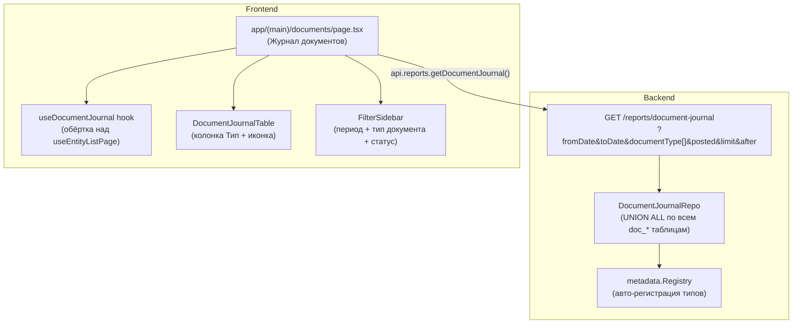

Отличная задача. Прежде чем давать рекомендации — ключевое наблюдение из кода: в `frontend/lib/api.ts` уже есть `getDocumentJournal`, а директория `frontend/app/(main)/documents/[routePrefix]` зарезервирована но пустая. Значит фундамент заложен, нужно его достроить.

---

## ERP-анализ: Журнал документов

```
💡 ERP Insight: Журнал документов (cross-type list)
┌─────────────────────────────────────────────────────
│ 1С:      "Журнал документов" — специальный объект метаданных.
│          Объединяет несколько типов документов в одном списке.
│          Хранит общие реквизиты (Дата, Номер, Организация) в
│          отдельной таблице _DocumentJournal. Каждый документ
│          при записи автоматически пишет строку в журнал.
│          Фильтр по типу документа — встроенный.
│
│ ERPNext: Нет прямого аналога. Используют List View с фильтром
│          по doctype. Или кастомный Query Report с UNION ALL.
│          Нет единого "журнала" — каждый DocType живёт отдельно.
│
│ SAP:     "Document Journal" (FB03/MR51) — отдельный отчёт.
│          Данные хранятся в BKPF/BSEG (FI) или MKPF/MSEG (MM).
│          Fiori: Analytical List Page с CDS View + UNION.
│          Variant Management для сохранения фильтров.
│
│ Odoo:    Нет единого журнала. Используют ir.actions.act_window
│          с domain-фильтром по model. Или кастомный SQL View.
│          account.move — единая таблица для всех типов проводок.
│ ─────────────────────────────────────────────────────
│ Лучшее:  1С — концептуально правильно (единая таблица журнала).
│          SAP — правильный UX (Analytical List Page + фильтры).
│          Odoo account.move — правильная идея единой таблицы,
│          но реализована только для бухгалтерии.
│
│ Metapus: Два варианта реализации — выбор зависит от требований.
│          Рекомендация ниже.
└─────────────────────────────────────────────────────
```

---

## Два архитектурных варианта

### Вариант A: Backend UNION ALL (уже начат)

В `api.ts` уже есть `getDocumentJournal` → `/reports/document-journal`. [1](#0-0) 

Это правильный путь. Бэкенд делает `UNION ALL` по всем таблицам документов и возвращает унифицированные строки.

**Схема ответа** (уже типизирована в `@/types/reports`):
```go
// internal/domain/reports/document_journal.go

type DocumentJournalRow struct {
    ID           id.ID     `json:"id"`
    DocumentType string    `json:"documentType"`   // "GoodsReceipt", "GoodsIssue"
    RoutePrefix  string    `json:"routePrefix"`    // "goods-receipts", "goods-issues"
    Number       string    `json:"number"`
    Date         time.Time `json:"date"`
    Posted       bool      `json:"posted"`
    DeletionMark bool      `json:"deletionMark"`
    // Общие реквизиты (NULL если нет у типа)
    OrganizationID   *id.ID  `json:"organizationId,omitempty"`
    OrganizationName *string `json:"organizationName,omitempty"`
    CounterpartyID   *id.ID  `json:"counterpartyId,omitempty"`
    CounterpartyName *string `json:"counterpartyName,omitempty"`
    Amount           *int64  `json:"amount,omitempty"` // MinorUnits
    CurrencyCode     *string `json:"currencyCode,omitempty"`
    // Метка типа для UI
    TypeLabel string `json:"typeLabel"` // "Поступление товаров"
}
```

**SQL-запрос** (пример для двух типов):
```sql
SELECT
    id, 'GoodsReceipt' AS document_type, 'goods-receipts' AS route_prefix,
    number, date, posted, deletion_mark,
    organization_id, supplier_id AS counterparty_id, total_amount AS amount
FROM doc_goods_receipts
WHERE deletion_mark = false
  AND ($1::date IS NULL OR date >= $1)
  AND ($2::date IS NULL OR date <= $2)

UNION ALL

SELECT
    id, 'GoodsIssue' AS document_type, 'goods-issues' AS route_prefix,
    number, date, posted, deletion_mark,
    organization_id, customer_id AS counterparty_id, total_amount AS amount
FROM doc_goods_issues
WHERE deletion_mark = false
  AND ($1::date IS NULL OR date >= $1)
  AND ($2::date IS NULL OR date <= $2)

ORDER BY date DESC, id DESC
LIMIT $3
```

**Проблема UNION ALL + cursor pagination**: keyset-пагинация по `(date, id)` работает корректно только если `id` уникален глобально. В Metapus `id.ID` — это UUID, поэтому коллизий нет. Но нужно добавить `document_type` в курсор, чтобы при одинаковых `(date, id)` не было дублей.

```
⚠️ ERP Anti-Pattern: UNION ALL без type-discriminator в курсоре
┌─────────────────────────────────────────────────────
│ Проблема: При cursor-пагинации UNION ALL без type в курсоре
│           возможны дубли на границах страниц если два документа
│           разных типов имеют одинаковую дату и близкие UUID.
│ Система:  ERPNext (Query Report без пагинации вообще)
│ Причина:  UUID v4 не гарантирует уникальность в рамках одной
│           миллисекунды при высокой нагрузке.
│ Metapus:  Курсор = base64(date + "|" + id + "|" + doc_type).
│           WHERE (date, id) < (cursor_date, cursor_id) — UUID
│           глобально уникален, дублей не будет. Но добавить
│           doc_type в курсор — хорошая практика для отладки.
└─────────────────────────────────────────────────────
```

### Вариант B: Metadata-driven federated (альтернатива)

Фронтенд читает `/meta/entities` (все `TypeDocument`), параллельно запрашивает каждый тип, объединяет на клиенте. **Не рекомендуется** — нет единой сортировки, нет единой пагинации, N+1 запросов.

---

## Архитектура: что нужно построить



---

## Регистрация типов документов в журнале

Ключевое преимущество Metapus: `metadata.Registry` уже знает все документы. Каждый `DocumentRegistration` регистрирует `EntityDef` с `Type: TypeDocument`. [2](#0-1) 

`DocumentJournalRepo` должен читать из реестра список таблиц и строить UNION динамически:

```go
// internal/infrastructure/storage/postgres/document_journal_repo.go

type DocumentJournalRepo struct {
    // Список зарегистрированных типов документов
    // Заполняется при старте из metadata.Registry
    docTypes []DocumentJournalSource
}

type DocumentJournalSource struct {
    EntityName   string // "GoodsReceipt"
    RoutePrefix  string // "goods-receipts"
    TableName    string // "doc_goods_receipts"
    TypeLabel    string // "Поступление товаров"
    // Маппинг общих полей → колонки таблицы
    OrgColumn          string // "organization_id"
    CounterpartyColumn string // "supplier_id" (может быть пустым)
    AmountColumn       string // "total_amount" (может быть пустым)
}
```

Регистрация через интерфейс на `DocumentRegistration`:

```go
// internal/platform/journal.go

// JournalSource — опциональный интерфейс для DocumentRegistration.
// Если реализован — тип документа включается в журнал.
type JournalSource interface {
    JournalTableName() string
    JournalOrgColumn() string
    JournalCounterpartyColumn() string // "" если нет
    JournalAmountColumn() string       // "" если нет
}
```

Это паттерн **opt-in**: не все документы обязаны быть в журнале. Аналог 1С — документ включается в журнал только если явно указан в свойствах объекта метаданных. [3](#0-2) 

---

## UX-рекомендации

```
🎨 UX Insight: Журнал документов
┌─────────────────────────────────────────────────────
│ 1С:      Колонка "Вид документа" с иконкой типа.
│          Двойной клик → открывает форму документа.
│          Быстрый отбор по периоду (шапка списка).
│          Группировка по дате или типу.
│
│ Fiori:   Analytical List Page. Smart Filter Bar сверху.
│          Колонка "Document Type" с иконкой + цветовой маркер.
│          Variant Management (сохранённые наборы фильтров).
│          Responsive Table с адаптивными колонками.
│
│ ERPNext: Нет единого журнала. List View с фильтром по doctype.
│          Kanban view по статусу (Draft/Submitted/Cancelled).
│
│ Odoo:    Нет. Только account.move для бухгалтерии.
│          Pivot view для аналитики.
│ ─────────────────────────────────────────────────────
│ Лучшее:  1С — правильная концепция (единый журнал).
│          SAP Fiori — лучший UX (Smart Filter Bar + variants).
│
│ Metapus: 
│  1. Колонка "Тип" с цветным Badge (shadcn Badge variant).
│     Цвет берётся из map[documentType]→tailwind-color.
│  2. FilterSidebar: период (date range) + чекбоксы типов
│     документов (список из /meta/entities?type=document).
│  3. Клик по строке → router.push(`/documents/${routePrefix}/${id}`)
│  4. Статус: иконка (проведён/черновик/помечен).
│  5. Сохранение фильтров через useUserPrefsStore (как в
│     useEntityListPage — entityKey: "document_journal").
└─────────────────────────────────────────────────────
```

---

## Конкретная структура файлов

### Backend

```
internal/
  domain/reports/
    document_journal.go          # типы: Row, Filter, Response
    document_journal_service.go  # бизнес-логика + RLS
  infrastructure/storage/postgres/
    document_journal_repo.go     # UNION ALL запрос
  infrastructure/http/v1/handlers/
    document_journal_handler.go  # GET /reports/document-journal
  platform/
    journal.go                   # интерфейс JournalSource
  content/
    document_registrations.go    # добавить JournalSource к GoodsReceipt/GoodsIssue
```

### Frontend

```
frontend/
  app/(main)/documents/
    page.tsx                     # Журнал документов (НОВЫЙ)
  hooks/
    useDocumentJournal.ts        # обёртка над api.reports.getDocumentJournal
  types/reports.ts               # DocumentJournalRow, DocumentJournalResponse
  lib/
    document-journal-columns.tsx # конфигурация колонок таблицы
```

---

## Страница журнала: ключевые решения

**1. Маршрут**: `frontend/app/(main)/documents/page.tsx` — это `index` страница раздела Documents. Сейчас её нет (есть только `goods-receipts/` и `goods-issues/`). Журнал логично разместить именно здесь.

**2. Колонки таблицы**:

| Колонка | Источник | Примечание |
|---------|----------|------------|
| Тип | `typeLabel` + Badge | Цвет по типу |
| Номер | `number` | Ссылка на документ |
| Дата | `date` | Формат dd.MM.yyyy |
| Статус | `posted` + `deletionMark` | Иконка |
| Организация | `organizationName` | Может быть null |
| Контрагент | `counterpartyName` | Может быть null |
| Сумма | `amount` + `currencyCode` | `fromMinorUnits()` |

**3. Навигация**: клик по строке открывает форму конкретного типа документа через `routePrefix`:

```tsx
// Клик по строке журнала
router.push(`/documents/${row.routePrefix}/${row.id}`)
```

**4. Фильтр по типу документа**: список типов берётся из `useMetadataStore` (уже загружен при старте), фильтруется по `type === "document"`:

```tsx
// frontend/app/(main)/documents/page.tsx
const allEntities = useMetadataStore(s => s.entities)
const documentTypes = useMemo(
  () => allEntities.filter(e => e.type === "document"),
  [allEntities]
)
```

Это уже используется в `NewAutomationRulePage` для аналогичной задачи. [4](#0-3) 

**5. RLS в журнале**: `DocumentJournalRepo` должен применять `DataScope` к каждой ветке UNION. Это сложнее чем в обычном репо — нужно инжектировать WHERE в каждый SELECT перед UNION:

```go
// Для каждого source применяем RLS-условия
for _, src := range r.docTypes {
    subQ := buildSubQuery(src, filter)
    // Применяем DataScope к src.OrgColumn
    if filter.DataScope != nil {
        dims := map[string]string{"organization": src.OrgColumn}
        rlsConds := filter.DataScope.ApplyConditions(src.EntityName, dims)
        for _, cond := range rlsConds {
            subQ = subQ.Where(cond)
        }
    }
    parts = append(parts, subQ)
}
```

---

## Что уже есть vs что нужно добавить

| Компонент | Статус | Файл |
|-----------|--------|------|
| `api.reports.getDocumentJournal()` | **Есть** | `frontend/lib/api.ts:599` |
| `DocumentJournalResponse` тип | Нужно проверить | `@/types/reports` |
| `/reports/document-journal` endpoint | **Нет** (нет в router.go) | Нужно добавить |
| `DocumentJournalRepo` | **Нет** | Нужно создать |
| `app/(main)/documents/page.tsx` | **Нет** | Нужно создать |
| `metadata.Registry` с TypeDocument | **Есть** | `internal/metadata/registry.go:14` |
| `useMetadataStore` с entities | **Есть** | Используется в automation |
| `useEntityListPage` | **Есть** | `frontend/hooks/useEntityListPage.ts` | [1](#0-0) [5](#0-4) [6](#0-5) [7](#0-6) 

---

## Главный архитектурный вывод

Metapus уже имеет все строительные блоки. Журнал документов — это **не новая концепция**, а **сборка из существующих**:

1. `metadata.Registry` → список типов документов (CODE IS METADATA)
2. `DocumentJournalRepo` → UNION ALL с динамическим построением из реестра
3. `useEntityListPage` → уже умеет всё нужное (фильтры, пагинация, сортировка)
4. `useMetadataStore` → список типов для фильтра на фронтенде

Единственное новое — интерфейс `JournalSource` на `DocumentRegistration` (opt-in регистрация в журнале) и сам `DocumentJournalRepo` с UNION ALL логикой. Это превосходит 1С, где журнал — отдельный объект метаданных с ручной настройкой: в Metapus регистрация в журнале происходит автоматически через реализацию интерфейса.

### Citations

**File:** frontend/lib/api.ts (L599-608)
```typescript
        getDocumentJournal: (params?: { fromDate?: string; toDate?: string; documentType?: string[]; posted?: boolean; limit?: number }) => {
            const entries: [string, string][] = []
            if (params?.fromDate) entries.push(["fromDate", params.fromDate])
            if (params?.toDate) entries.push(["toDate", params.toDate])
            if (params?.documentType) params.documentType.forEach((t) => entries.push(["documentType", t]))
            if (params?.posted !== undefined) entries.push(["posted", String(params.posted)])
            if (params?.limit) entries.push(["limit", String(params.limit)])
            const qs = entries.length > 0 ? "?" + new URLSearchParams(entries).toString() : ""
            return apiFetch<import("@/types/reports").DocumentJournalResponse>(`/reports/document-journal${qs}`)
        },
```

**File:** internal/infrastructure/http/v1/router.go (L367-385)
```go
	for _, factory := range factoryReg.Documents() {
		handler := factory.Build(deps)
		RegisterDocumentRoutes(docsGroup.Group("/"+factory.RoutePrefix()), handler, factory.Permission())

		// Auto-register metadata (optional: Inspectable, Presentable)
		var def metadata.EntityDef
		if insp, ok := factory.(platform.Inspectable); ok {
			def = metadata.Inspect(insp.EntityStruct(), factory.EntityName(), metadata.TypeDocument)
		} else {
			def = metadata.EntityDef{Name: factory.EntityName(), Type: metadata.TypeDocument}
		}
		if pres, ok := factory.(platform.Presentable); ok {
			def.Presentation = pres.EntityPresentation()
		}
		def.Key = deriveEntityKey(factory.Permission())
		def.RoutePrefix = factory.RoutePrefix()
		def.SetRefEndpoints(refEndpoints)
		reg.Register(def)
	}
```

**File:** internal/content/document_registrations.go (L20-57)
```go
type GoodsReceiptRegistration struct{}

func (r *GoodsReceiptRegistration) RoutePrefix() string { return "goods-receipt" }
func (r *GoodsReceiptRegistration) Permission() string  { return "document:goods_receipt" }
func (r *GoodsReceiptRegistration) EntityName() string  { return "GoodsReceipt" }
func (r *GoodsReceiptRegistration) EntityLabel() string { return "Поступление товаров" }
func (r *GoodsReceiptRegistration) EntityPresentation() metadata.Presentation {
	return metadata.Presentation{
		Singular: "Поступление товаров",
		Plural:   "Поступления товаров",
		NewLabel: "Новое поступление",
		Genitive: "поступления товаров",
	}
}
func (r *GoodsReceiptRegistration) EntityStruct() interface{} { return goods_receipt.GoodsReceipt{} }

func (r *GoodsReceiptRegistration) Build(deps v1.DocumentDeps) v1.DocumentRouteHandler {
	repo := document_repo.NewGoodsReceiptRepo()
	service := goods_receipt.NewService(repo, deps.PostingEngine, deps.Numerator, nil, deps.CurrencyResolver)
	service.SetPolicyEngine(deps.PolicyEngine)

	service.Hooks().OnBeforeCreate(func(ctx context.Context, doc *goods_receipt.GoodsReceipt) error {
		audit.EnrichCreatedByDirect(ctx, &doc.CreatedBy, &doc.UpdatedBy)
		return nil
	})
	service.Hooks().OnBeforeUpdate(func(ctx context.Context, doc *goods_receipt.GoodsReceipt) error {
		audit.EnrichUpdatedByDirect(ctx, &doc.UpdatedBy)
		return nil
	})

	decorated := domain.Chain[*goods_receipt.GoodsReceipt](
		domain.WithLogging[*goods_receipt.GoodsReceipt]("goods-receipt"),
		domain.WithEventLog[*goods_receipt.GoodsReceipt]("goods_receipt", deps.EventWriter),
		domain.WithOutboxEvents[*goods_receipt.GoodsReceipt]("goods_receipt", deps.OutboxPublisher),
	)(service)

	return handlers.NewGoodsReceiptHandler(deps.BaseHandler, decorated, deps.PrintRegistry, deps.PrintRenderer, deps.RelatedDocFinder, deps.MovementProviders, deps.MovementRefResolver, deps.SettingsRepo)
}
```

**File:** frontend/app/(main)/settings/automation-rules/new/page.tsx (L42-43)
```typescript
  const allEntities = useMetadataStore(s => s.entities)
  const documentEntities = useMemo(() => allEntities.filter(e => e.type === "document"), [allEntities])
```

**File:** internal/metadata/registry.go (L9-15)
```go
// EntityType defines the category of the entity.
type EntityType string

const (
	TypeCatalog  EntityType = "catalog"
	TypeDocument EntityType = "document"
)
```

**File:** internal/metadata/registry.go (L54-78)
```go
// EntityDef describes a business entity.
type EntityDef struct {
	Name         string         `json:"name"`
	Key          string         `json:"key"`             // snake_case identifier, e.g. "counterparty", "goods_receipt"
	Type         EntityType     `json:"type"`
	Presentation Presentation   `json:"presentation"`          // rich display names
	RoutePrefix  string         `json:"routePrefix,omitempty"` // URL path segment, e.g. "counterparties"
	TableName    string         `json:"-"`
	Fields       []FieldDef     `json:"fields"`
	TableParts   []TablePartDef `json:"tableParts,omitempty"`

	// PreviewFields defines which fields appear in hover preview cards.
	// Auto-populated by Inspect(): all reference fields from document header
	// (except parent, organization — org is always shown via self).
	PreviewFields []PreviewFieldDef `json:"previewFields,omitempty"`

	// RefEndpoints maps referenceType → API endpoint path for filter UI.
	// E.g. "warehouse" → "/catalog/warehouses".
	// Set via SetRefEndpoints(); used by ToFilterMeta().
	RefEndpoints map[string]string `json:"-"`

	// CustomFields are dynamically-defined fields from sys_custom_field_schemas,
	// merged at runtime via MergeCustomFields(). They extend core Fields.
	CustomFields []FieldDef `json:"customFields,omitempty"`
}
```

**File:** frontend/hooks/useEntityListPage.ts (L40-50)
```typescript
interface UseEntityListPageOptions<T extends { id: string }> {
  /** Entity key for metadata & prefs (e.g. "GoodsReceipt", "nomenclature"). */
  entityKey: string
  /** API object with `list` method. */
  api: EntityListApi<T>
  /** Period field key for filter sidebar (e.g. "date"). Omit for catalogs without date filter. */
  periodField?: string
  /** Default limit for list queries. */
  limit?: number
}

```
