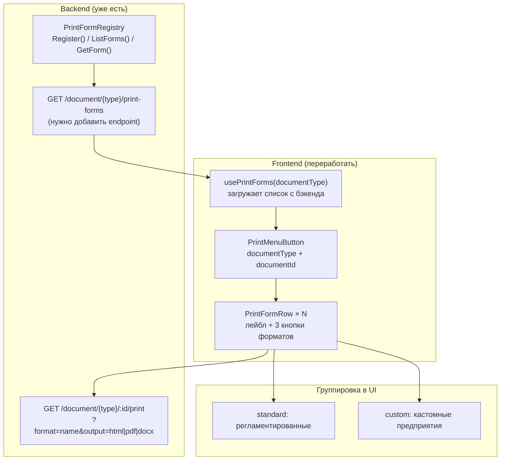

## Диагноз текущей реализации

Текущий `PrintMenuButton` жёстко захардкожен на **одну форму** с тремя форматами: [1](#0-0) 

`PrintMenuConfig` принимает `formLabel` — строку, а не список форм. При этом `fetchPrint` вообще не передаёт параметр `format` в URL, всегда используя дефолтную форму: [2](#0-1) 

Backend уже имеет правильную архитектуру — `PrintFormRegistry.ListForms()` и `PrintFormSummary` — но frontend их не использует: [3](#0-2) 

---

## 🎨 UX Insight: Печатные формы при 10+ вариантах

```
┌─────────────────────────────────────────────────────
│ 1С:      Кнопка "Печать" → выпадающий список форм (сгруппированных).
│          При выборе формы — диалог "Печать / Сохранить как PDF / Excel".
│          Регламентированные и кастомные формы в одном списке.
│
│ Fiori:   Split Button: левая часть = дефолтная форма (PDF),
│          правая стрелка = полный список форм в Popover.
│          Fiori Design Guideline: "Print" action в Object Page toolbar.
│
│ ERPNext: Print Format selector прямо в форме документа (dropdown над
│          кнопкой Print). Кнопки Print / PDF / Email рядом.
│
│ Odoo:    Кнопка "Print" → список форм в dropdown, каждая форма
│          сразу скачивает PDF. Нет выбора формата — только PDF.
│ ─────────────────────────────────────────────────────
│ Лучшее:  1С + Fiori: двухуровневый выбор (форма → формат) +
│          быстрый доступ к дефолтной форме без лишних кликов.
│
│ Metapus: Split Button + диалог выбора форм (см. ниже).
└─────────────────────────────────────────────────────
```

---

## 💡 ERP Insight: Архитектура реестра форм

```
┌─────────────────────────────────────────────────────
│ 1С:      Макеты хранятся в конфигурации (CODE IS METADATA).
│          Группировка: "Регламентированные" (платформенные) vs
│          "Пользовательские" (добавленные в конфигураторе).
│
│ ERPNext: Print Format — DocType в БД (METADATA IN DB — антипаттерн!).
│          Кастомные форматы через Jinja2 в браузере.
│
│ SAP:     Adobe Forms / SmartForms — отдельные объекты с транспортом.
│          Категории: System / Customer / Partner.
│
│ Odoo:    ir.actions.report — записи в БД (тоже антипаттерн).
│          QWeb templates в XML-файлах модулей.
│ ─────────────────────────────────────────────────────
│ Лучшее:  1С: CODE IS METADATA — шаблоны в файлах, реестр в коде.
│          Metapus уже следует этому принципу ✓
│
│ Metapus: Добавить Category в PrintFormDef для группировки в UI.
│          Кастомные формы регистрируются через тот же Register() —
│          никакой БД, никакого Jinja в браузере.
└─────────────────────────────────────────────────────
```

---

## Рекомендуемое решение

### Уровень 1: Backend — минимальные изменения

**Добавить `Category` в `PrintFormDef`:**

```go
// internal/domain/printing/registry.go
type PrintFormCategory string

const (
    CategoryStandard PrintFormCategory = "standard"  // регламентированные
    CategoryCustom   PrintFormCategory = "custom"    // кастомные предприятия
)

type PrintFormDef struct {
    Name      string
    Label     string
    Template  string
    PaperSize string
    Category  PrintFormCategory // NEW
    SortOrder int               // NEW — для стабильного порядка
}

type PrintFormSummary struct {
    Name     string            `json:"name"`
    Label    string            `json:"label"`
    Category PrintFormCategory `json:"category"`
}
```

**Добавить HTTP endpoint для листинга** (в `route_helpers.go` уже есть заготовка):

```
GET /api/v1/document/{type}/print-forms
→ []PrintFormSummary
``` [4](#0-3) 

---

### Уровень 2: Frontend — новый хук

```ts
// frontend/hooks/usePrintForms.ts
export interface PrintFormSummary {
  name: string
  label: string
  category: "standard" | "custom"
}

export function usePrintForms(documentType: string) {
  const [forms, setForms] = useState<PrintFormSummary[]>([])
  const [loading, setLoading] = useState(true)

  useEffect(() => {
    apiFetch<PrintFormSummary[]>(
      `/document/${documentType}/print-forms`
    ).then(setForms).finally(() => setLoading(false))
  }, [documentType])

  const standard = forms.filter(f => f.category === "standard")
  const custom = forms.filter(f => f.category === "custom")

  return { forms, standard, custom, loading }
}
```

---

### Уровень 3: Frontend — новый `PrintMenuButton`

**Паттерн: Split Button + двухуровневое меню с группировкой**

```
┌──────────────────────────────────────────────────────┐
│  [🖨 Печать ▾]                                        │
└──────────────────────────────────────────────────────┘
         ↓ клик на стрелку
┌──────────────────────────────────────────────────────┐
│  РЕГЛАМЕНТИРОВАННЫЕ                                   │
│  ├─ Поступление товаров (ТОРГ-12)  [🖨] [PDF] [DOC]  │
│  └─ Счёт-фактура                  [🖨] [PDF] [DOC]  │
│  ─────────────────────────────────────────────────── │
│  КАСТОМНЫЕ                                            │
│  ├─ Накладная предприятия         [🖨] [PDF] [DOC]  │
│  └─ Акт приёмки (форма ООО "X")  [🖨] [PDF] [DOC]  │
└──────────────────────────────────────────────────────┘
```

Каждая строка — это форма с тремя inline-кнопками форматов. Это решает проблему масштабирования: 10 форм × 3 формата = 30 действий, но они **структурированы**, а не свалены в один список.

```tsx
// frontend/components/shared/print-menu-button.tsx (новая версия)
export function PrintMenuButton({ documentType, documentId }: {
  documentType: string
  documentId: string
}) {
  const { standard, custom, loading: formsLoading } = usePrintForms(documentType)
  const [loadingKey, setLoadingKey] = useState<string | null>(null)

  const handlePrint = async (formName: string, output: "html"|"pdf"|"docx") => {
    const key = `${formName}:${output}`
    setLoadingKey(key)
    try {
      await executePrint(documentType, documentId, formName, output)
    } finally {
      setLoadingKey(null)
    }
  }

  return (
    <DropdownMenu>
      <DropdownMenuTrigger asChild>
        <Button variant="outline" size="sm" className="px-2.5" disabled={formsLoading}>
          <Printer className="h-3.5 w-3.5" />
          <ChevronDown className="ml-1.5 h-3.5 w-3.5 opacity-70" />
        </Button>
      </DropdownMenuTrigger>
      <DropdownMenuContent align="end" className="w-72">
        {standard.length > 0 && (
          <>
            <DropdownMenuLabel className="text-[10px] uppercase tracking-wider text-muted-foreground">
              Регламентированные
            </DropdownMenuLabel>
            {standard.map(form => (
              <PrintFormRow
                key={form.name}
                form={form}
                loadingKey={loadingKey}
                onPrint={handlePrint}
              />
            ))}
          </>
        )}
        {custom.length > 0 && (
          <>
            {standard.length > 0 && <DropdownMenuSeparator />}
            <DropdownMenuLabel className="text-[10px] uppercase tracking-wider text-muted-foreground">
              Кастомные
            </DropdownMenuLabel>
            {custom.map(form => (
              <PrintFormRow
                key={form.name}
                form={form}
                loadingKey={loadingKey}
                onPrint={handlePrint}
              />
            ))}
          </>
        )}
      </DropdownMenuContent>
    </DropdownMenu>
  )
}

// Строка формы с тремя кнопками форматов
function PrintFormRow({ form, loadingKey, onPrint }: {
  form: PrintFormSummary
  loadingKey: string | null
  onPrint: (name: string, output: "html"|"pdf"|"docx") => void
}) {
  return (
    <div className="flex items-center justify-between px-2 py-1.5 hover:bg-accent rounded-sm">
      <span className="text-sm flex-1 truncate mr-2">{form.label}</span>
      <div className="flex items-center gap-0.5 shrink-0">
        <FormatButton
          icon={<Printer className="h-3 w-3" />}
          title="Открыть для печати"
          loading={loadingKey === `${form.name}:html`}
          onClick={() => onPrint(form.name, "html")}
        />
        <FormatButton
          icon={<FileDown className="h-3 w-3" />}
          title="Скачать PDF"
          loading={loadingKey === `${form.name}:pdf`}
          onClick={() => onPrint(form.name, "pdf")}
        />
        <FormatButton
          icon={<FileText className="h-3 w-3" />}
          title="Скачать Word"
          loading={loadingKey === `${form.name}:docx`}
          onClick={() => onPrint(form.name, "docx")}
        />
      </div>
    </div>
  )
}
```

---

### Изменения в `FormToolbar`

`printMenu` prop остаётся, но теперь `PrintMenuButton` принимает `documentType` + `documentId` вместо `PrintMenuConfig`:

```tsx
// Было:
<PrintMenuButton config={{ formLabel: grLabel, documentId: params.id, documentType: "goods-receipt" }} />

// Стало:
<PrintMenuButton documentType="goods-receipt" documentId={params.id} />
``` [5](#0-4) 

---

## ⚠️ ERP Anti-Pattern: Не повторять

```
┌─────────────────────────────────────────────────────
│ Проблема: ERPNext хранит Print Format в БД как DocType.
│           При 50+ кастомных форматах — медленные запросы,
│           сложные миграции, рассинхронизация между тенантами.
│ Система:  ERPNext / Odoo (ir.actions.report)
│ Причина:  "Гибкость" через БД = потеря типобезопасности и
│           невозможность code review кастомных шаблонов.
│ Metapus:  CODE IS METADATA — шаблоны в .gohtml файлах,
│           реестр в Go-коде через Register(). Кастомные формы
│           предприятия добавляются через тот же Register() в
│           отдельном пакете content/custom/, не в БД.
└─────────────────────────────────────────────────────
```

---

## Итоговая схема



Ключевое изменение: `PrintMenuButton` перестаёт быть "тупым" компонентом с захардкоженными 3 пунктами и становится **metadata-driven** — он сам знает, какие формы доступны, через `usePrintForms`. Это соответствует принципу `useEntityFiltersMeta()` и `useMetadataStore` уже применяемому в Metapus. [6](#0-5)

### Citations

**File:** frontend/components/shared/print-menu-button.tsx (L17-24)
```typescript
export interface PrintMenuConfig {
  /** Print form display name, e.g. "Goods Receipt" */
  formLabel: string
  /** Document ID (UUID) */
  documentId: string
  /** Backend document type slug, e.g. "goods-receipt" */
  documentType: string
}
```

**File:** frontend/components/shared/print-menu-button.tsx (L34-34)
```typescript
  const url = `${base}/document/${documentType}/${documentId}/print?output=${output}`
```

**File:** internal/domain/printing/registry.go (L22-53)
```go
type PrintFormRegistry struct {
	mu    sync.RWMutex
	forms map[string][]PrintFormDef // docType → []PrintFormDef (ordered, first = default)
}

// NewPrintFormRegistry creates a registry with the built-in standard forms.
func NewPrintFormRegistry() *PrintFormRegistry {
	r := &PrintFormRegistry{
		forms: make(map[string][]PrintFormDef),
	}
	r.Register("goods_receipt", PrintFormDef{
		Name:      "standard",
		Label:     "Поступление товаров",
		Template:  "goods_receipt.gohtml",
		PaperSize: "A4",
	})
	r.Register("goods_issue", PrintFormDef{
		Name:      "standard",
		Label:     "Реализация товаров",
		Template:  "goods_issue.gohtml",
		PaperSize: "A4",
	})
	return r
}

// Register adds a print form definition for a document type.
// Documents types are keyed by their snake_case name, e.g. "goods_receipt".
func (r *PrintFormRegistry) Register(docType string, def PrintFormDef) {
	r.mu.Lock()
	defer r.mu.Unlock()
	r.forms[docType] = append(r.forms[docType], def)
}
```

**File:** internal/domain/printing/registry.go (L83-92)
```go
func (r *PrintFormRegistry) ListForms(docType string) []PrintFormSummary {
	r.mu.RLock()
	defer r.mu.RUnlock()
	forms := r.forms[docType]
	out := make([]PrintFormSummary, len(forms))
	for i, f := range forms {
		out[i] = PrintFormSummary{Name: f.Name, Label: f.Label}
	}
	return out
}
```

**File:** internal/infrastructure/http/v1/route_helpers.go (L1-7)
```go
// Package v1 provides HTTP API version 1.
package v1

import (
	"metapus/internal/infrastructure/http/v1/middleware"

	"github.com/gin-gonic/gin"
```

**File:** frontend/app/(main)/documents/goods-receipts/[id]/page.tsx (L308-316)
```typescript
        printMenu={
          <PrintMenuButton
            config={{
              formLabel: grLabel || "Поступление товаров",
              documentId: params.id,
              documentType: "goods-receipt",
            }}
          />
        }
```
