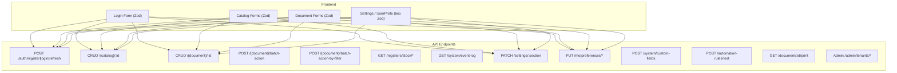

Ниже — полный аудит всех точек входа пользовательских данных в проекте с оценкой каждого из 7 критериев безопасности.

---

## Карта точек входа



---

## 1. Zod / серверная валидация

### ✅ Хорошо

- **Auth DTOs** (`dto/auth.go`): `binding:"required,email"`, `binding:"required,min=8"`, `binding:"required,uuid"` — полная валидация через Gin validator. [1](#0-0) 

- **Catalog/Document DTOs**: большинство полей имеют `binding:"required"` теги. [2](#0-1) 

- **BatchAction**: `binding:"required,min=1,max=500"` и `binding:"required,oneof=post unpost setDeletionMark clearDeletionMark"`. [3](#0-2) 

- **Filter JSON**: `domainFilter.ValidateItems(advFilters)` вызывается перед использованием. [4](#0-3) 

- **Frontend**: Login, Nomenclature, Organization, Warehouse, GoodsReceipt, GoodsIssue формы используют `zodResolver`. [5](#0-4) 

### ❌ Проблемы

| Точка входа | Проблема |
|---|---|
| `PATCH /settings/:section` | `data: json.RawMessage` — принимается любая структура без схемы |
| `PUT /me/preferences/list-filters/:entityType` | Только `json.Valid()`, нет схемы |
| `PUT /me/preferences/list-columns/:entityType` | Только `json.Valid()`, нет схемы |
| `PUT /me/preferences/dashboard-layout` | Только `json.Valid()`, нет схемы |
| `POST /system/custom-fields` | `ValidationRules map[string]any`, `DefaultValue any` — произвольная структура |
| `POST /automation-rules/test` | `Payload map[string]any` — без валидации |
| `PUT /me/preferences/interface` | `InterfacePrefs.Theme`, `AccentColor`, `Language` — строки без whitelist | [6](#0-5) [7](#0-6) [8](#0-7) [9](#0-8) 

---

## 2. SQL-запросы: параметризация vs конкатенация

### ✅ Хорошо

- `BaseCatalogRepo` и `BaseDocumentRepo` используют `squirrel` с `PlaceholderFormat(squirrel.Dollar)` — все значения передаются как `$N` параметры. [10](#0-9) 

- `listAround` использует `fmt.Sprintf` только для имён колонок из whitelist (`r.orderCols`), значения — параметры. [11](#0-10) 

- `RefFinderRepo` — имена таблиц и колонок берутся из metadata registry (не из пользовательского ввода). [12](#0-11) 

### ⚠️ Требует внимания

**`automation_history_repo.go`** — `LIMIT` и `OFFSET` вставляются через `%d` в строку запроса:

```go
dataQuery := fmt.Sprintf(`... LIMIT %d OFFSET %d`, limit, offset)
```

Значения `limit` и `offset` — целые числа (SQL-инъекция невозможна), но паттерн небезопасен и `offset` не имеет верхней границы. [13](#0-12) 

**`custom_field_repo.go` Update** — динамический SET-клауз строится через `fmt.Sprintf("%s = $%d", col, argIdx)`, где `col` — хардкоженные имена колонок. SQL-инъекция невозможна, но паттерн хрупкий. [14](#0-13) 

---

## 3. HTML-вывод: dangerouslySetInnerHTML

### ✅ Безопасно

Единственное использование `dangerouslySetInnerHTML` — в `layout.tsx` для инлайн-скрипта темы. Содержимое — **хардкоженная константа** `themeScript`, не пользовательские данные. [15](#0-14) 

Других использований `dangerouslySetInnerHTML` в проекте не найдено.

---

## 4. Загрузка файлов

**Загрузка файлов в проекте отсутствует** — `FormFile`, `multipart.File`, `SaveUploadedFile` не найдены ни в одном Go-файле. Эндпоинт `/print` генерирует файлы (PDF, DOCX), но не принимает их.

---

## 5. Redirect URL валидация

**Open redirect отсутствует** — параметры `callbackUrl`, `returnUrl`, `redirectTo` не найдены. После логина используется хардкоженный `router.push("/")`. [16](#0-15) 

---

## 6. JSON/JSONB поля: схема валидации

### ❌ Проблемы

| Поле | Тип | Проблема |
|---|---|---|
| `CustomFieldRecord.ValidationRules` | `map[string]any` | Произвольная структура, нет схемы |
| `CustomFieldRecord.DefaultValue` | `any` | Любое значение |
| `UserPreferences.ListFilters` | `json.RawMessage` | Только `json.Valid()` |
| `UserPreferences.ListColumns` | `json.RawMessage` | Только `json.Valid()` |
| `UserPreferences.DashboardLayout` | `json.RawMessage` | Только `json.Valid()` |
| `Settings.data` (PATCH) | `json.RawMessage` | Нет схемы per-section |
| `Attributes` (entity) | `map[string]any` | Произвольный JSONB |
| `AutomationRule.TestPayload` | `map[string]any` | Нет валидации | [17](#0-16) [18](#0-17) 

---

## 7. Числовые параметры: верхние границы

### ✅ Хорошо

- `AutomationHistoryHandler.List`: `limit` ограничен `<= 100`. [19](#0-18) 

- `SecurityProfileHandler.GetAuditHistory`: `if limit > 200 { limit = 200 }`. [20](#0-19) 

- `BatchAction.IDs`: `binding:"required,min=1,max=500"`. [21](#0-20) 

### ❌ Проблемы

| Параметр | Место | Проблема |
|---|---|---|
| `limit` (query) | `ParseListFilter` → все каталоги и документы | **Нет верхней границы** — `ParseIntQuery(c, "limit", 50)` без cap |
| `limit` (query) | `StockHandler.GetMovements` | `ParseIntQuery(c, "limit", 100)` без cap |
| `offset` (query) | `AutomationHistoryHandler.List` | Только `>= 0`, нет максимума |
| `limit` (query) | `EventLogHandler.List` | Зависит от `eventlog.DefaultFilter()`, не проверено в handler | [22](#0-21) [23](#0-22) [24](#0-23) 

---

## Дополнительные находки

### ⚠️ `section` параметр в Settings без whitelist

`c.Param("section")` передаётся напрямую в `repo.UpdateSection` без проверки допустимых значений (`performance`, `notifications` и т.д.). [25](#0-24) 

### ⚠️ `entityType` в UserPrefs без whitelist

`c.Param("entityType")` используется как ключ в JSONB без проверки допустимых значений. [26](#0-25) 

### ⚠️ `status` в AutomationHistory без enum-валидации

`automations.HistoryStatus(status)` — приведение типа без проверки допустимых значений перед передачей в БД. [27](#0-26) 

### ⚠️ `traceId` в EventLog без UUID-валидации

`traceID := c.Param("traceId")` используется без проверки формата перед передачей в `reader.GetByTraceID`. [28](#0-27) 

---

## Сводная таблица приоритетов

| Приоритет | Проблема | Файл |
|---|---|---|
| 🔴 Высокий | `limit` без верхней границы во всех List-эндпоинтах | `handlers/base.go:130` |
| 🔴 Высокий | JSONB поля (`ValidationRules`, `DefaultValue`) без схемы | `custom_field_repo.go`, `handlers/custom_field.go` |
| 🟡 Средний | `section` и `entityType` без whitelist | `handlers/settings.go`, `handlers/user_prefs.go` |
| 🟡 Средний | `InterfacePrefs` строковые поля без enum-валидации | `domain/userpref/model.go` |
| 🟡 Средний | `status` в AutomationHistory без enum-валидации | `handlers/automation_history.go` |
| 🟡 Средний | `traceId` без UUID-валидации | `handlers/event_log.go` |
| 🟢 Низкий | `LIMIT %d OFFSET %d` через `fmt.Sprintf` (не SQL-инъекция, но паттерн) | `automation_history_repo.go:105` |
| 🟢 Низкий | Frontend формы Settings/UserPrefs/AutomationRules без Zod | `frontend/app/(main)/settings/` |

### Citations

**File:** internal/infrastructure/http/v1/dto/auth.go (L13-18)
```go
type RegisterRequest struct {
	Email     string `json:"email" binding:"required,email"`
	Password  string `json:"password" binding:"required,min=8"`
	FirstName string `json:"firstName,omitempty"`
	LastName  string `json:"lastName,omitempty"`
}
```

**File:** internal/infrastructure/http/v1/handlers/base.go (L29-35)
```go
func (h *BaseHandler) BindJSON(c *gin.Context, obj any) bool {
	if err := c.ShouldBindJSON(obj); err != nil {
		h.Error(c, apperror.NewValidation("invalid request body").WithDetail("error", err.Error()))
		return false
	}
	return true
}
```

**File:** internal/infrastructure/http/v1/handlers/base.go (L59-69)
```go
func (h *BaseHandler) ParseIntQuery(c *gin.Context, key string, defaultVal int) int {
	val := c.Query(key)
	if val == "" {
		return defaultVal
	}
	parsed, err := strconv.Atoi(val)
	if err != nil {
		return defaultVal
	}
	return parsed
}
```

**File:** internal/infrastructure/http/v1/handlers/base.go (L130-131)
```go
	filter.Limit = h.ParseIntQuery(c, "limit", 50)
	filter.OrderBy = c.DefaultQuery("orderBy", defaultOrderBy)
```

**File:** internal/infrastructure/http/v1/handlers/base.go (L156-161)
```go
		}
		if err := domainFilter.ValidateItems(advFilters); err != nil {
			return filter, apperror.NewValidation("invalid filter").
				WithDetail("error", err.Error())
		}
		filter.AdvancedFilters = advFilters
```

**File:** internal/infrastructure/http/v1/handlers/document.go (L483-485)
```go
	IDs    []string `json:"ids" binding:"required,min=1,max=500"`
	Action string   `json:"action" binding:"required,oneof=post unpost setDeletionMark clearDeletionMark"`
}
```

**File:** frontend/components/auth/login-form.tsx (L25-33)
```typescript
const loginSchema = z.object({
  email: z
    .string()
    .min(1, "Введите адрес электронной почты")
    .email("Некорректный адрес электронной почты"),
  password: z
    .string()
    .min(1, "Введите пароль"),
})
```

**File:** frontend/components/auth/login-form.tsx (L65-65)
```typescript
      router.push("/")
```

**File:** internal/infrastructure/http/v1/handlers/settings.go (L41-74)
```go
// updateSectionRequest is the request body for PATCH /settings/:section.
type updateSectionRequest struct {
	Data    json.RawMessage `json:"data"    binding:"required"`
	Version int             `json:"version" binding:"required"`
}

// UpdateSection handles PATCH /settings/:section — updates a single section with optimistic locking.
func (h *SettingsHandler) UpdateSection(c *gin.Context) {
	ctx := c.Request.Context()

	section := c.Param("section")
	if section == "" {
		h.Error(c, apperror.NewValidation("section parameter is required"))
		return
	}

	body, err := io.ReadAll(c.Request.Body)
	if err != nil {
		h.Error(c, apperror.NewValidation("failed to read request body"))
		return
	}

	var req updateSectionRequest
	if err := json.Unmarshal(body, &req); err != nil {
		h.Error(c, apperror.NewValidation("invalid request body: "+err.Error()))
		return
	}

	if len(req.Data) == 0 {
		h.Error(c, apperror.NewValidation("data field is required"))
		return
	}

	updated, err := h.repo.UpdateSection(ctx, section, req.Data, req.Version)
```

**File:** internal/infrastructure/http/v1/handlers/user_prefs.go (L78-80)
```go
	entityType := c.Param("entityType")
	if entityType == "" {
		h.Error(c, apperror.NewValidation("entityType is required"))
```

**File:** internal/infrastructure/http/v1/handlers/user_prefs.go (L84-96)
```go
	body, err := io.ReadAll(c.Request.Body)
	if err != nil {
		h.Error(c, apperror.NewValidation("failed to read request body"))
		return
	}

	// Validate that body is valid JSON
	if !json.Valid(body) {
		h.Error(c, apperror.NewValidation("request body must be valid JSON"))
		return
	}

	if err := h.repo.SaveListFilters(ctx, userID, entityType, json.RawMessage(body)); err != nil {
```

**File:** internal/infrastructure/http/v1/handlers/custom_field.go (L31-44)
```go
type CreateCustomFieldRequest struct {
	EntityType      string         `json:"entityType" binding:"required"`
	FieldName       string         `json:"fieldName" binding:"required"`
	FieldType       string         `json:"fieldType" binding:"required"`
	DisplayName     string         `json:"displayName" binding:"required"`
	Description     string         `json:"description"`
	IsRequired      bool           `json:"isRequired"`
	IsIndexed       bool           `json:"isIndexed"`
	DefaultValue    any            `json:"defaultValue"`
	ValidationRules map[string]any `json:"validationRules"`
	ReferenceType   string         `json:"referenceType"`
	EnumValues      []string       `json:"enumValues"`
	SortOrder       int            `json:"sortOrder"`
}
```

**File:** internal/domain/userpref/model.go (L15-26)
```go
type InterfacePrefs struct {
	Theme            string `json:"theme,omitempty"`       // "light"|"dark"|"system"
	AccentColor      string `json:"accentColor,omitempty"` // "yellow"|"neutral"|"blue"
	Language         string `json:"language,omitempty"`
	DateFormat       string `json:"dateFormat,omitempty"`
	NumberFormat     string `json:"numberFormat,omitempty"`
	ShowTooltips     *bool  `json:"showTooltips,omitempty"`
	CompactMode      *bool  `json:"compactMode,omitempty"`
	SidebarCollapsed *bool  `json:"sidebarCollapsed,omitempty"`
	// Per-entity toggle: show deletion-marked items in list views. Key = entity type (e.g. "GoodsReceipt").
	ShowDeletedEntities map[string]bool `json:"showDeletedEntities,omitempty"`
}
```

**File:** internal/domain/userpref/model.go (L32-35)
```go
	ListFilters     json.RawMessage `db:"list_filters"      json:"listFilters"`     // opaque JSON, frontend owns schema
	ListColumns     json.RawMessage `db:"list_columns"      json:"listColumns"`     // opaque JSON
	DashboardLayout json.RawMessage `db:"dashboard_layout"  json:"dashboardLayout"` // opaque JSON, frontend owns schema
	UpdatedAt       time.Time       `db:"updated_at"        json:"updatedAt"`
```

**File:** internal/infrastructure/storage/postgres/catalog_repo/base.go (L109-112)
```go
// Builder returns a new squirrel builder with PostgreSQL placeholder format.
func (r *BaseCatalogRepo[T]) Builder() squirrel.StatementBuilderType {
	return squirrel.StatementBuilder.PlaceholderFormat(squirrel.Dollar)
}
```

**File:** internal/infrastructure/storage/postgres/catalog_repo/base.go (L516-518)
```go
	var sortValue any
	lookupSQL := fmt.Sprintf("SELECT %s FROM %s WHERE id = $1", spec.Field, r.tableName)
	if err := querier.QueryRow(ctx, lookupSQL, targetID).Scan(&sortValue); err != nil {
```

**File:** internal/infrastructure/storage/postgres/ref_finder_repo.go (L306-320)
```go
	if spec.isTypedRef {
		sql = fmt.Sprintf(
			`SELECT DISTINCT %s FROM %s WHERE ref_type = $1 AND ref_id = $2 LIMIT 100`,
			selectCol, spec.tableName,
		)
		args = []any{req.EntityName, req.EntityID}
	} else {
		sql = fmt.Sprintf(
			`SELECT DISTINCT %s FROM %s WHERE %s = $1 LIMIT 100`,
			selectCol, spec.tableName, spec.dbColumn,
		)
		args = []any{req.EntityID}
	}

	return sql, args
```

**File:** internal/infrastructure/storage/postgres/automation_history_repo.go (L104-111)
```go

	dataQuery := fmt.Sprintf(`
		SELECT %s
		FROM sys_automation_history %s
		ORDER BY created_at DESC
		LIMIT %d OFFSET %d
	`, historySelectCols, where, limit, offset)

```

**File:** internal/infrastructure/storage/postgres/custom_field_repo.go (L162-210)
```go
	addClause := func(col string, val any) {
		setClauses = append(setClauses, fmt.Sprintf("%s = $%d", col, argIdx))
		args = append(args, val)
		argIdx++
	}

	if upd.DisplayName != nil {
		addClause("display_name", *upd.DisplayName)
	}
	if upd.Description != nil {
		addClause("description", *upd.Description)
	}
	if upd.IsRequired != nil {
		addClause("is_required", *upd.IsRequired)
	}
	if upd.IsIndexed != nil {
		addClause("is_indexed", *upd.IsIndexed)
	}
	if upd.DefaultValue != nil {
		b, _ := json.Marshal(upd.DefaultValue)
		addClause("default_value", b)
	}
	if upd.ValidationRules != nil {
		b, _ := json.Marshal(upd.ValidationRules)
		addClause("validation_rules", b)
	}
	if upd.EnumValues != nil {
		addClause("enum_values", upd.EnumValues)
	}
	if upd.SortOrder != nil {
		addClause("sort_order", *upd.SortOrder)
	}
	if upd.IsActive != nil {
		addClause("is_active", *upd.IsActive)
	}

	if len(setClauses) == 0 {
		return nil // nothing to update
	}

	query := "UPDATE sys_custom_field_schemas SET "
	for i, clause := range setClauses {
		if i > 0 {
			query += ", "
		}
		query += clause
	}
	query += fmt.Sprintf(" WHERE id = $%d", argIdx)
	args = append(args, id)
```

**File:** frontend/app/layout.tsx (L30-65)
```typescript
const themeScript = `
(function(){
  try {
    var raw = localStorage.getItem('metapus-user-prefs');
    if (!raw) return;
    var parsed = JSON.parse(raw);
    var iface = parsed && parsed.state && parsed.state.interface;
    if (!iface) return;
    var theme = iface.theme;
    if (theme === 'dark') {
      document.documentElement.classList.add('dark');
    } else if (theme === 'system') {
      if (window.matchMedia('(prefers-color-scheme: dark)').matches) {
        document.documentElement.classList.add('dark');
      }
    }
    var accent = iface.accentColor;
    if (accent && accent !== 'yellow') {
      document.documentElement.setAttribute('data-accent', accent);
    }
    if (iface.compactMode) {
      document.documentElement.setAttribute('data-compact', '');
    }
  } catch(e) {}
})();
`

export default function RootLayout({
  children,
}: {
  children: React.ReactNode
}) {
  return (
    <html lang="ru" suppressHydrationWarning>
      <head>
        <script dangerouslySetInnerHTML={{ __html: themeScript }} />
```

**File:** internal/core/entity/attributes.go (L18-18)
```go
type Attributes map[string]any
```

**File:** internal/infrastructure/http/v1/handlers/automation_history.go (L37-39)
```go
	if l := c.Query("limit"); l != "" {
		if parsed, err := strconv.Atoi(l); err == nil && parsed > 0 && parsed <= 100 {
			filter.Limit = parsed
```

**File:** internal/infrastructure/http/v1/handlers/automation_history.go (L53-55)
```go
	if status := c.Query("status"); status != "" {
		s := automations.HistoryStatus(status)
		filter.Status = &s
```

**File:** internal/infrastructure/http/v1/handlers/security_profile.go (L300-303)
```go
	limit := h.ParseIntQuery(c, "limit", 50)
	if limit > 200 {
		limit = 200
	}
```

**File:** internal/infrastructure/http/v1/handlers/stock.go (L113-115)
```go
	filter := stock.MovementFilter{
		Limit:  h.ParseIntQuery(c, "limit", 100),
		Offset: h.ParseIntQuery(c, "offset", 0),
```

**File:** internal/infrastructure/http/v1/handlers/event_log.go (L163-169)
```go
	traceID := c.Param("traceId")
	if traceID == "" {
		h.Error(c, apperror.NewValidation("traceId is required"))
		return
	}

	events, err := h.reader.GetByTraceID(ctx, traceID)
```
