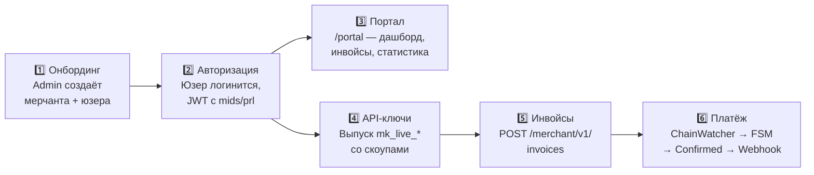
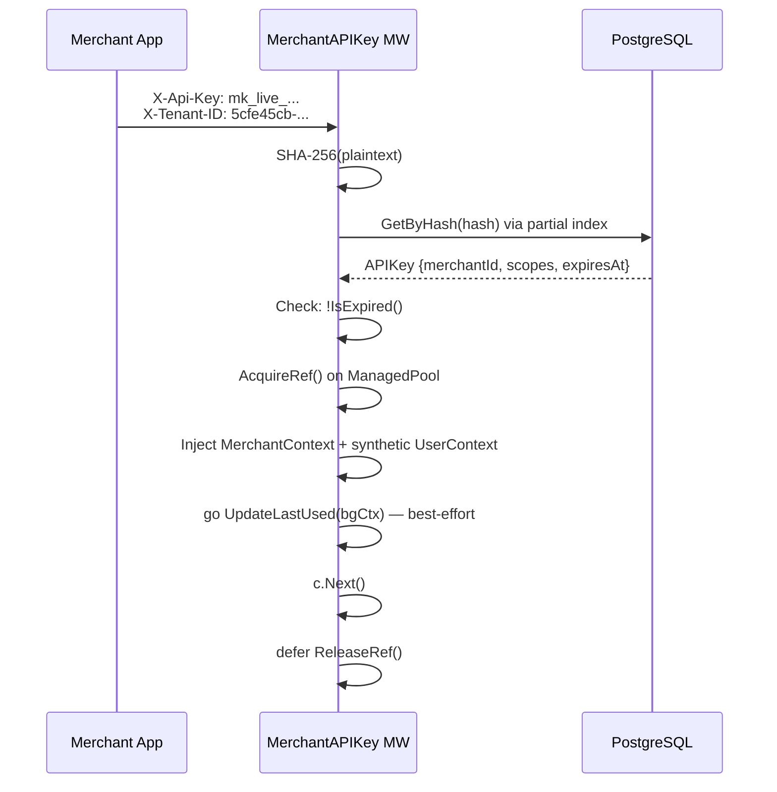
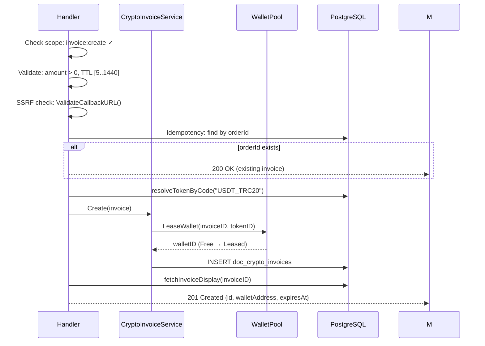
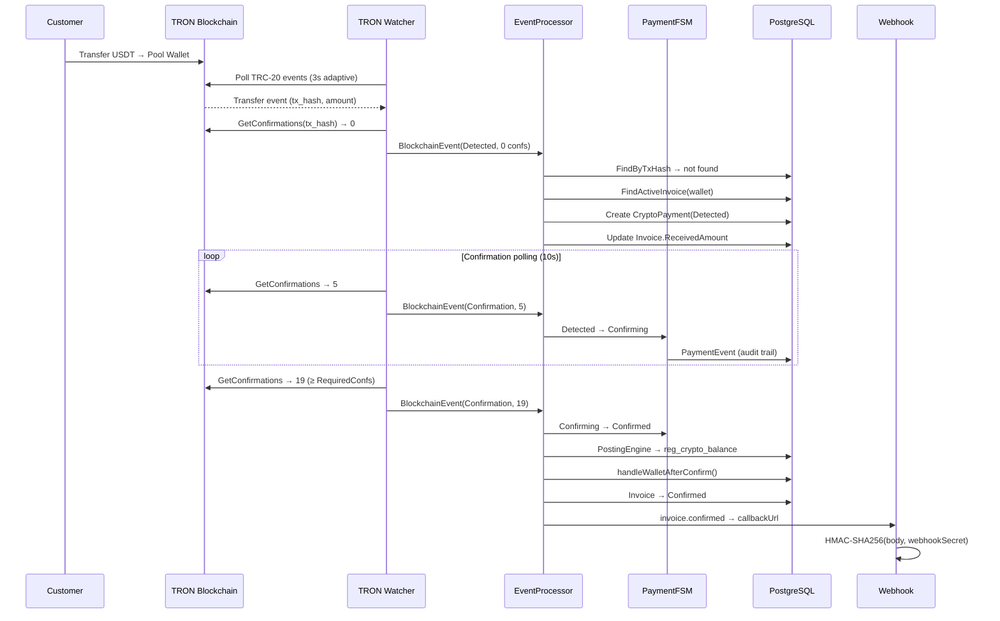

# Бизнес-процесс криптопроцессинга Metapus

> Полное описание реализованного E2E потока: от создания мерчанта администратором ERP до получения подтверждённого платежа.

---

## Обзор: 6 фаз бизнес-процесса



---

## Фаза 1: Онбординг мерчанта (ERP Admin)

**Актор:** Администратор ERP-системы

### 1.1. Создание справочника «Мерчант»

Админ через ERP-интерфейс (или API `POST /api/v1/catalog/merchants`) создаёт запись в `cat_merchants`.

**Модель:** [model.go](file:///c:/Users/user/go/src/metapus/internal/domain/catalogs/merchant/model.go)

| Поле | Назначение |
|------|-----------|
| `Code` / `Name` | Идентификатор и наименование |
| `LegalName` | Юридическое наименование |
| `WebhookURL` | URL для callback-уведомлений |
| `CommissionRate` | Комиссия в basis points (100 = 1%) |
| `IsActive` | Флаг активности |
| `KYBStatus` | Статус верификации: `pending` → `approved` → `rejected` |

### 1.2. Создание пользователя-мерчанта

Админ создаёт пользователя через `POST /api/v1/auth/users` (`CreateUserByAdmin` в [service.go](file:///c:/Users/user/go/src/metapus/internal/domain/auth/service.go#L392-L462)).

### 1.3. Привязка пользователя к мерчанту

Админ через `POST /api/v1/merchant-admin/merchants/:merchantId/users` связывает пользователя с мерчантом в junction-таблице `sys_merchant_users`.

**Handler:** [merchant_users.go](file:///c:/Users/user/go/src/metapus/internal/infrastructure/http/v1/handlers/merchant_users.go#L49-L86)

**Роли (MerchantRole):**

| Роль | Значение | Доступ |
|------|----------|--------|
| `Owner` (1) | Владелец | Полный доступ + управление ключами |
| `Manager` (2) | Менеджер | Операции без настроек |
| `Viewer` (3) | Наблюдатель | Только чтение |

**Middleware защита:** `RequireMerchantAccess` ([merchant_access.go](file:///c:/Users/user/go/src/metapus/internal/infrastructure/http/v1/middleware/merchant_access.go)) — проверяет BOLA (CWE-639): пользователь должен иметь ассоциацию с мерчантом уровня Manager+. Глобальные админы обходят проверку.

### Итог фазы 1

```
cat_merchants:       Мерчант "Demo Shop" (is_active=true, kyb_status=pending)
auth_users:          merchant@example.com (is_active=true)
sys_merchant_users:  user_id ↔ merchant_id (role=1, Owner)
```

---

## Фаза 2: Аутентификация мерчанта

**Актор:** Пользователь-мерчант

### 2.1. Логин

`POST /api/v1/auth/login` → [service.go Login()](file:///c:/Users/user/go/src/metapus/internal/domain/auth/service.go#L168-L223)

### 2.2. Обогащение JWT claims мерчант-данными

При генерации токена (`generateTokenPair`, [service.go:704-780](file:///c:/Users/user/go/src/metapus/internal/domain/auth/service.go#L704-L780)):

1. `merchantUserRepo.ListByUser(userID)` → загружает все ассоциации из `sys_merchant_users`
2. Собирает `merchantIDs []string` — UUID всех мерчантов пользователя
3. Определяет `portalRole` — наивысшая привилегия (минимальный int: Owner=1)
4. Встраивает в JWT claims:

**JWT Claims:** [jwt.go](file:///c:/Users/user/go/src/metapus/internal/domain/auth/jwt.go#L30-L40)

```json
{
  "uid": "user-uuid",
  "tid": "tenant-uuid",
  "email": "merchant@example.com",
  "mids": ["019e0879-ce5b-774f-93ec-b613e24ba32d"],
  "prl": 1,
  "roles": ["user"],
  "perms": ["merchant_api_keys:create", "merchant_api_keys:read", ...]
}
```

### 2.3. Frontend роутинг по роли

**Layout:** [layout.tsx](file:///c:/Users/user/go/src/metapus/frontend/app/(portal)/layout.tsx)

```
Login response → user.merchantIds?
  ├── merchantIds.length > 0 → redirect /portal (Merchant Portal)
  └── merchantIds.length === 0 → redirect / (ERP Dashboard)
```

Portal layout проверяет `user.merchantIds` — если пуст, редиректит обратно на `/`.

---

## Фаза 3: Merchant Portal (веб-интерфейс)

**Актор:** Пользователь-мерчант (через браузер)

### 3.1. Архитектура портала

**Backend middleware chain:**
```
TenantDB → Auth(JWT) → RequireActiveTenant → MerchantPortal
```

`MerchantPortal` middleware ([merchant_portal.go](file:///c:/Users/user/go/src/metapus/internal/infrastructure/http/v1/middleware/merchant_portal.go)):
1. Извлекает `MerchantIDs` и `PortalRole` из JWT `UserContext`
2. Парсит UUID, валидирует наличие хотя бы одного
3. Инжектирует `MerchantScope{MerchantIDs, Role}` в context
4. **Все запросы автоматически фильтруются** по `scope.MerchantIDs`

**Frontend:**

| Компонент | Файл | Назначение |
|-----------|------|-----------|
| Portal Layout | [(portal)/layout.tsx](file:///c:/Users/user/go/src/metapus/frontend/app/(portal)/layout.tsx) | Auth guard + загрузка мерчантов |
| Portal Shell | [portal-shell.tsx](file:///c:/Users/user/go/src/metapus/frontend/components/portal/portal-shell.tsx) | Sidebar, навигация |
| Merchant Switcher | [merchant-switcher.tsx](file:///c:/Users/user/go/src/metapus/frontend/components/portal/merchant-switcher.tsx) | Переключатель между мерчантами |
| Zustand Store | [usePortalStore.ts](file:///c:/Users/user/go/src/metapus/frontend/stores/usePortalStore.ts) | `activeMerchantId`, persist |

### 3.2. Дашборд (`/portal`)

**Страница:** [page.tsx](file:///c:/Users/user/go/src/metapus/frontend/app/(portal)/portal/page.tsx)

4 виджета:

| Виджет | API | Данные |
|--------|-----|--------|
| Balance Summary | `GET /portal/v1/dashboard/summary` | totalInvoices, paidInvoices, totalMinorUnits, change24hPct |
| Currency Breakdown | `GET /portal/v1/dashboard/currencies` | symbol, network, count, totalMinor, sharePct |
| Volume Chart | `GET /portal/v1/dashboard/chart?period=30d` | day → deposits (bar chart) |
| Recent Invoices | `GET /portal/v1/invoices?limit=5` | Последние 5 инвойсов |

**Handler:** [portal_handler.go](file:///c:/Users/user/go/src/metapus/internal/infrastructure/http/v1/handlers/portal_handler.go)

Каждый эндпоинт принимает опциональный `?merchant_id=` — если указан, валидирует принадлежность к scope.

### 3.3. Список инвойсов (`/portal/invoices`)

**Страница:** [invoices/page.tsx](file:///c:/Users/user/go/src/metapus/frontend/app/(portal)/portal/invoices/page.tsx)

- Пагинированная таблица (limit=20)
- Фильтр по статусу: `created`, `confirmed`, `expired`
- Колонки: Номер, Статус (Badge), Токен+Сеть, Сумма, Получено, Дата
- `BigInt`-арифметика для корректного отображения minor units

**API:** `GET /portal/v1/invoices?merchant_id=...&status=...&limit=20&offset=0`

---

## Фаза 4: Выпуск API-ключей

**Актор:** Пользователь-мерчант (Owner/Manager) через ERP Admin UI

### 4.1. Создание ключа

`POST /api/v1/merchant-admin/merchants/:merchantId/api-keys`

**Handler:** [merchant_invoice.go CreateKey()](file:///c:/Users/user/go/src/metapus/internal/infrastructure/http/v1/handlers/merchant_invoice.go#L240-L292)

**Процесс генерации** ([api_key.go GenerateKey()](file:///c:/Users/user/go/src/metapus/internal/domain/catalogs/merchant/api_key.go#L138-L179)):

```
1. rand.Read(32 bytes)           → 256 бит энтропии
2. base32.Encode(raw).toLower()  → URL-safe строка
3. plaintext = "mk_" + encoded   → mk_6xq4f7k2n9j3m5p8...
4. keyHash = SHA-256(plaintext)   → hex digest для БД
5. keyPrefix = "mk_" + first8    → mk_6xq4f7k2 (для UI)
```

> [!WARNING]
> Plaintext-ключ показывается мерчанту **только один раз** при создании. В БД хранится только SHA-256 хэш.

### 4.2. Скоупы (whitelist)

| Скоуп | Описание |
|-------|----------|
| `invoice:create` | Создание инвойсов |
| `invoice:read` | Чтение инвойсов |

Whitelist определён в `_allowedScopes` ([api_key.go](file:///c:/Users/user/go/src/metapus/internal/domain/catalogs/merchant/api_key.go#L28-L31)). `Validate()` отклонит любой незарегистрированный скоуп — **privilege escalation prevention**.

### 4.3. Управление ключами

| Операция | Метод | Маршрут |
|----------|-------|---------|
| Создать | POST | `/merchants/:merchantId/api-keys` |
| Список | GET | `/merchants/:merchantId/api-keys` |
| Отозвать | DELETE | `/merchants/:merchantId/api-keys/:keyId` |

Аудит: `created_by_user_id` фиксирует, кто выпустил ключ.

---

## Фаза 5: Создание инвойсов через Merchant API

**Актор:** Сервис мерчанта (M2M интеграция)

### 5.1. Аутентификация по API-ключу

`POST /merchant/v1/invoices` с заголовком `X-Api-Key: mk_live_...`

**Middleware:** [merchant_auth.go MerchantAPIKey()](file:///c:/Users/user/go/src/metapus/internal/infrastructure/http/v1/middleware/merchant_auth.go#L62-L186)



### 5.2. Создание инвойса

**Handler:** [merchant_invoice.go CreateInvoice()](file:///c:/Users/user/go/src/metapus/internal/infrastructure/http/v1/handlers/merchant_invoice.go#L61-L173)



**Ответ:**
```json
{
  "id": "019e17b9-...",
  "status": "created",
  "amount": "10500000",
  "currency": "USDT_TRC20",
  "network": "TRON Shasta Testnet",
  "walletAddress": "TLfG3MEDv4...",
  "expiresAt": "2026-05-12T11:00:00Z",
  "orderId": "order-abc-123"
}
```

### 5.3. Получение инвойса

`GET /merchant/v1/invoices/:id` — требует `invoice:read`. Проверяет ownership: `inv.MerchantID == mc.MerchantID`.

### 5.4. Страница оплаты (Customer-facing)

Мерчант перенаправляет покупателя на `GET /pay/:invoiceId`.

**Embedded HTML:** [payment_page.go](file:///c:/Users/user/go/src/metapus/internal/infrastructure/http/v1/payment_page.go) — статическая HTML-страница, встроенная через `embed.FS`.

**API для страницы:** `GET /api/v1/pay/:invoiceId` ([payment_page.go handler](file:///c:/Users/user/go/src/metapus/internal/infrastructure/http/v1/handlers/payment_page.go)) — **публичный** (без auth), возвращает:
- Адрес кошелька + QR-код (base64 PNG)
- Ожидаемую/полученную сумму (human-readable)
- Токен, сеть, обозреватель блоков
- Имя мерчанта, описание, orderId
- Текущие/требуемые подтверждения

**Polling статуса:** `GET /api/v1/pay/:invoiceId/status` — легковесный эндпоинт (status + confirmations).

---

## Фаза 6: Обработка платежа (автоматическая)

**Актор:** Система (Worker + ChainWatcher)

### 6.1. Архитектура обработки



### 6.2. FSM переходов платежа

```
Detected ──→ Confirming     (confs ≥ 1)
Confirming ──→ Confirmed    (confs ≥ RequiredConfs)
Confirming ──→ Reorged      (chain reorg)
Confirmed ──→ Settled       (settlement complete)
Reorged ──→ Detected        (re-detect)
```

Каждый переход → запись `PaymentEvent` (audit trail). Если запись не удалась — транзакция откатывается.

### 6.3. FSM переходов инвойса

```
Created → PartiallyPaid → Paid → Confirmed
Created → Expired (TTL)
Created → Cancelled (мерчантом)
```

### 6.4. Фоновые процессы (CryptoProcessor)

| Процесс | Интервал | Назначение |
|---------|----------|-----------|
| ChainWatcher | 3–30s adaptive | Polling блокчейн-событий |
| Event consumer | realtime (channel) | BlockchainEvent → EventProcessor |
| Expiration loop | 60s | Истечение TTL инвойсов |
| Confirmation loop | 10s | Допросмотр подтверждений |
| Sweep evaluation | 60s | Оценка threshold для свипа |

### 6.5. Webhook-уведомления

| Событие | Когда |
|---------|-------|
| `invoice.paid` | Полная сумма получена (ждёт подтверждений) |
| `invoice.confirmed` | Платёж финализирован (**безопасно отгружать**) |
| `invoice.expired` | TTL истёк |

Заголовки: `X-Metapus-Event`, `X-Metapus-Signature` (HMAC-SHA256), `X-Metapus-Timestamp`, `X-Metapus-Delivery-ID`.

SSRF-защита: только HTTPS, блок приватных IP, блок редиректов.

### 6.6. Threshold Sweep

После подтверждения:
- `threshold = 0` → немедленный sweep (legacy)
- `threshold > 0, transient` → кошелёк возвращается в пул, sweep при накоплении
- `persistent` → кошелёк остаётся привязанным к клиенту

Конфигурация двухуровневая: `reg_merchant_token_config` (override) → `cat_tokens` (default).

---

## Сводная карта API

### Merchant Public API (`/merchant/v1/`) — X-Api-Key auth
| Метод | Маршрут | Скоуп |
|-------|---------|-------|
| POST | `/invoices` | `invoice:create` |
| GET | `/invoices/:id` | `invoice:read` |

### Portal API (`/portal/v1/`) — JWT auth + MerchantPortal MW
| Метод | Маршрут | Назначение |
|-------|---------|-----------|
| GET | `/merchants` | Список доступных мерчантов |
| GET | `/dashboard/summary` | Агрегированная статистика |
| GET | `/dashboard/currencies` | Разбивка по валютам |
| GET | `/dashboard/chart?period=30d` | График объёмов |
| GET | `/invoices` | Пагинированный список |

### Admin API (`/api/v1/merchant-admin/`) — JWT + RBAC + MerchantAccess
| Метод | Маршрут | Пермишн |
|-------|---------|---------|
| POST | `/merchants/:id/api-keys` | `merchant_api_keys:create` |
| GET | `/merchants/:id/api-keys` | `merchant_api_keys:read` |
| DELETE | `/merchants/:id/api-keys/:keyId` | `merchant_api_keys:delete` |
| GET | `/merchants/:id/users` | `merchant_users:read` |
| POST | `/merchants/:id/users` | `merchant_users:write` |
| DELETE | `/merchants/:id/users/:userId` | `merchant_users:write` |
| PATCH | `/merchants/:id/users/:userId/role` | `merchant_users:write` |

### Public Payment Page — без auth
| Метод | Маршрут | Назначение |
|-------|---------|-----------|
| GET | `/pay/:invoiceId` | HTML checkout page |
| GET | `/api/v1/pay/:invoiceId` | JSON: данные для оплаты + QR |
| GET | `/api/v1/pay/:invoiceId/status` | Polling статуса |

---

## Ключевые файлы

| Слой | Файл | Роль |
|------|------|------|
| **Domain** | `domain/catalogs/merchant/model.go` | Модель мерчанта |
| | `domain/catalogs/merchant/api_key.go` | API-ключи + генерация + скоупы |
| | `domain/catalogs/merchant/callback_url.go` | SSRF-валидация |
| | `domain/auth/jwt.go` | JWT claims (mids, prl) |
| | `domain/auth/service.go` | Login + JWT enrichment |
| | `domain/crypto/event_processor.go` | Обработка блокчейн-событий |
| | `domain/crypto/payment_fsm.go` | FSM платежей |
| | `domain/crypto/webhook.go` | Отправка webhooks |
| **Infra** | `http/v1/middleware/merchant_auth.go` | X-Api-Key middleware |
| | `http/v1/middleware/merchant_portal.go` | MerchantScope injection |
| | `http/v1/middleware/merchant_access.go` | BOLA protection |
| | `http/v1/handlers/merchant_invoice.go` | Public API handlers |
| | `http/v1/handlers/portal_handler.go` | Portal API handlers |
| | `http/v1/handlers/merchant_users.go` | User management |
| | `http/v1/handlers/payment_page.go` | Checkout page API |
| | `http/v1/router.go` | Route registration |
| | `blockchain/tron/watcher.go` | TRON ChainWatcher |
| | `crypto_worker/processor.go` | CryptoProcessor |
| **Frontend** | `app/(portal)/layout.tsx` | Portal auth guard |
| | `app/(portal)/portal/page.tsx` | Dashboard (4 widgets) |
| | `app/(portal)/portal/invoices/page.tsx` | Invoice list |
| | `components/portal/*` | UI виджеты |
| | `stores/usePortalStore.ts` | Zustand (activeMerchantId) |
