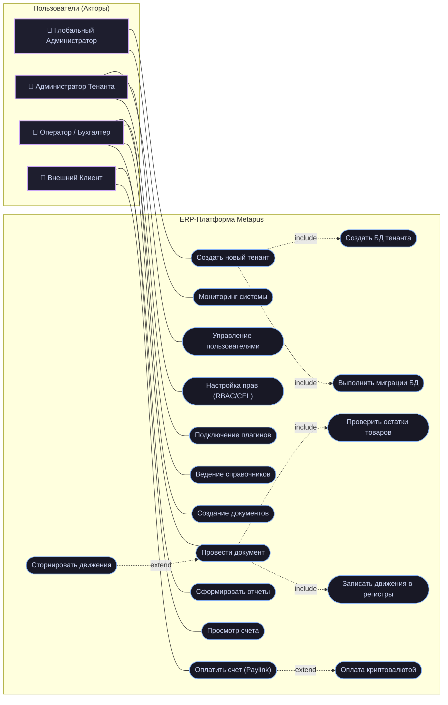
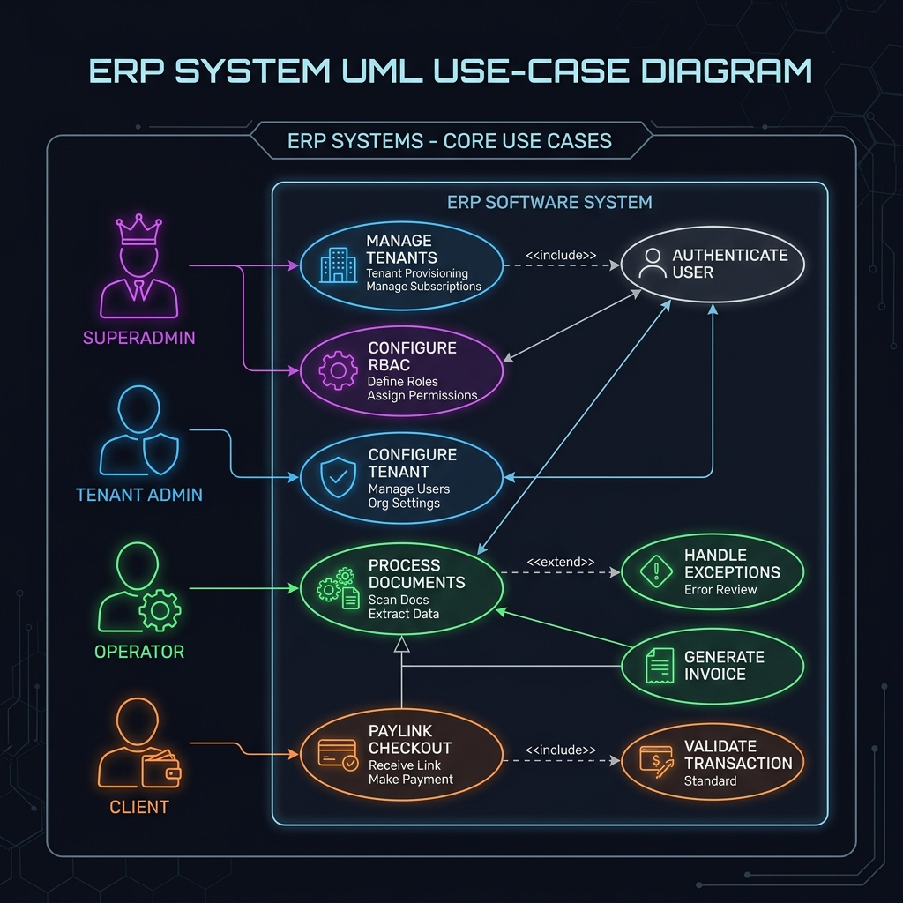

# Задание 2. Проектирование use-case диаграммы

На основе функциональных требований к ERP-системе **Metapus** разработана диаграмма вариантов использования (Use-Case Diagram) в соответствии с нотацией UML 2.5.

Диаграмма отображает действующих лиц (акторов), границы проектируемой системы, прецеденты и типы связей между ними (ассоциация, обобщение, `<<include>>`, `<<extend>>`).

---

## 1. Действующие лица (Акторы)

В системе выделено четыре роли (актора):

1. **Глобальный администратор (Superadmin):**
   * Технический специалист, управляющий инфраструктурой платформы.
   * Не имеет доступа к бизнес-данным тенантов (согласно принципу изоляции *Database-per-Tenant*).
   * Выполняет создание тенантов и запуск обновлений.

2. **Администратор организации (Tenant Admin):**
   * Пользователь организации-клиента с полными правами управления внутри своего изолированного тенанта.
   * Настраивает учетную политику, роли сотрудников и подключает внешние модули.

3. **Оператор / Бухгалтер (Operator / Accountant):**
   * Пользователь организации, выполняющий ежедневные учетные операции.
   * Работает в рамках назначенных прав доступа (CEL-политик).
   * Осуществляет ввод первичных данных, проводит документы и формирует отчеты.

4. **Внешний клиент (Merchant / Customer):**
   * Контрагент организации, взаимодействующий с системой через внешний платежный портал.
   * Выполняет просмотр и оплату выставленных счетов.

---

## 2. Варианты использования (Use-Cases) и связи

Прецеденты сгруппированы по функциональным областям:

### Глобальное администрирование:
- **Создать новый тенант:** инициализация пространства для клиента.
  - `<<include>>` **Создать базу данных тенанта:** создание изолированной БД в PostgreSQL.
  - `<<include>>` **Выполнить миграции схемы:** развертывание таблиц ядра через инструмент *Goose*.
- **Управление глобальными параметрами:** настройка системных ограничений, мониторинг состояния сервисов.

### Администрирование организации:
- **Управление пользователями:** создание и блокировка учетных записей сотрудников.
- **Настройка ролей доступа (RBAC/FLS/RLS):** определение прав на уровне таблиц, строк и полей на базе CEL.
- **Подключение модулей:** активация плагинов (например, складского учета или платежных шлюзов).

### Операционная деятельность (Core ERP):
- **Ведение справочников:** создание и редактирование карточек номенклатуры и контрагентов.
- **Создание документов:** формирование первичных документов (поступление и реализация товаров).
- **Провести документ:**
  - `<<include>>` **Проверить остатки товаров:** контроль наличия позиций на складах.
  - `<<include>>` **Записать движения в регистры:** внесение записей в таблицы регистров накопления.
  - `<<extend>>` **Сторнировать движения:** операция отмены проведения путем внесения обратных движений в случае ошибки.
- **Сформировать отчеты:** генерация ведомостей по остаткам и оборотам.

### Взаимодействие с клиентами:
- **Просмотр счета:** чтение информации о заказе и сумме к оплате.
- **Оплатить счет (Paylink):**
  - `<<extend>>` **Оплата криптовалютой:** процессинг транзакции в сети TRON (при наличии активного модуля криптопроцессинга).

---

## 3. UML-диаграмма прецедентов (Mermaid)

Диаграмма вариантов использования представлена в формате схемы Mermaid (flowchart LR):

---

## 4. Визуализация Use-Case диаграммы

Схема UML вариантов использования:

---

## 5. Заключение

Разработанная диаграмма вариантов использования описывает базовое распределение ролей в системе:
1. **Разделены зоны ответственности** между глобальным администрированием и прикладным учетом организации.
2. **Определены зависимости между операциями** через связи `<<include>>` и `<<extend>>`, что фиксирует бизнес-логику проведения и отмены документов.
3. **Отражена специфика изоляции данных** (выделение БД при создании тенанта) и неизменяемости регистров (сторнирование вместо удаления).
