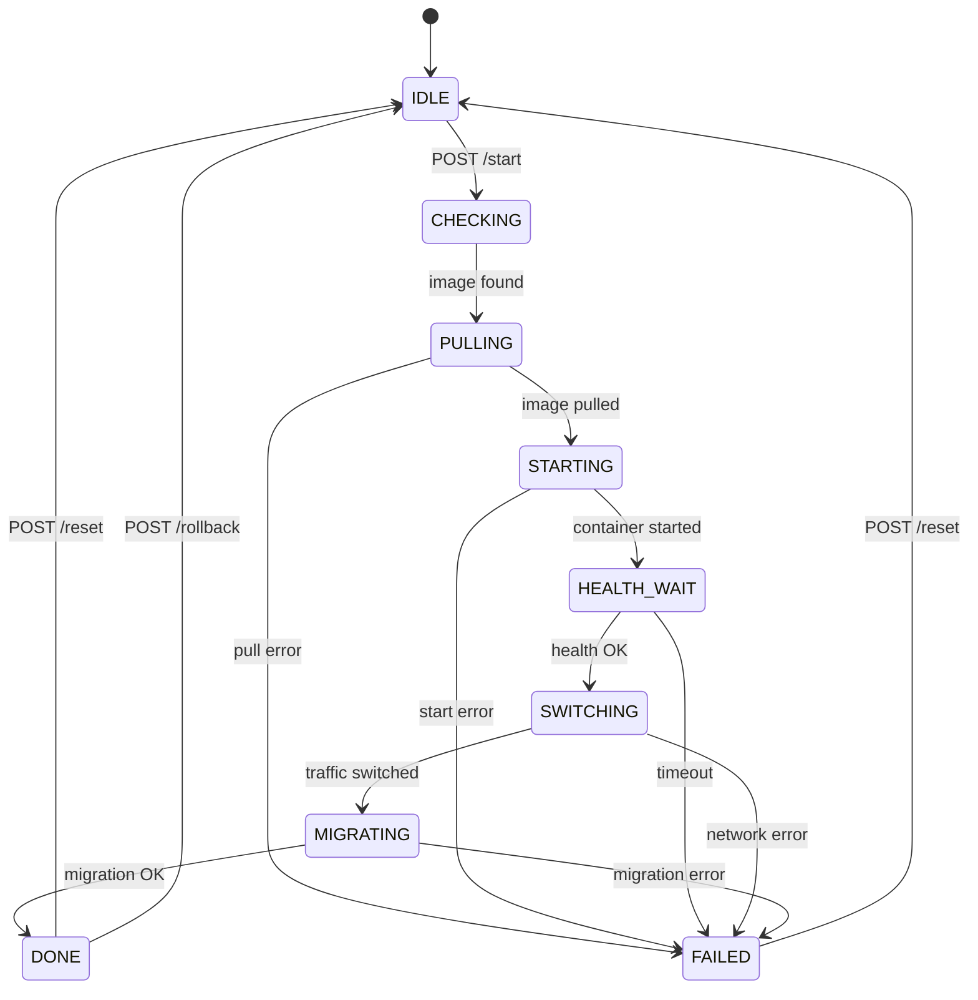

# Updater Agent: Обновление системы из UI

> Сайдкар-сервис для автоматического обновления Metapus в режиме Single Tenant.
> Выполняет blue-green deployment с near-zero downtime через Docker network alias swap.
> Автоматически обнаруживает новые версии в GHCR и показывает прогресс в реальном времени.

---

## Обзор архитектуры

```
┌──────────────────────────────────────────────────────────┐
│                      Docker Host                         │
│                                                          │
│  ┌──────────────┐  ┌──────────────┐  ┌───────────────┐  │
│  │  metapus-app │  │ metapus-app  │  │   updater     │  │
│  │  (old v1.4)  │  │ (new v1.5)   │  │   :9090       │  │
│  │  alias: app  │  │  (no alias)  │  │               │  │
│  └──────────────┘  └──────────────┘  └───────────────┘  │
│        ↑                                    │            │
│        └────── /internal/* HTTP ────────────┘            │
│                                                          │
│  ┌──────────────┐  ┌──────────────┐                      │
│  │  PostgreSQL   │  │  Frontend    │                      │
│  │  :5432        │  │  :3000       │                      │
│  └──────────────┘  └──────────────┘                      │
└──────────────────────────────────────────────────────────┘
```

### Компоненты

| Компонент | Роль |
|-----------|------|
| **Updater Agent** (`cmd/updater`) | Сайдкар, управляет Docker-контейнерами, :9090 |
| **Metapus Server** (`cmd/server`) | Основной сервер, предоставляет `/internal/*` эндпоинты |
| **Docker Socket** | Агент управляет контейнерами через `/var/run/docker.sock` |
| **state.json** | WAL-файл для crash recovery |

---

## State Machine



### Фазы

| # | Фаза | Действие | PhaseDetail | Rollback |
|---|-------|----------|-------------|----------|
| 1 | `CHECKING` | Валидация target image | — | Reset to IDLE |
| 2 | `PULLING` | `docker pull` нового образа | `Скачано 45.2 MB / 120.0 MB` | Reset to IDLE |
| 3 | `STARTING` | `docker create + start` без host ports | — | Remove new container |
| 4 | `HEALTH_WAIT` | Poll `/health` нового контейнера | `Ожидание ответа от нового контейнера...` | Remove new container |
| 5 | `SWITCHING` | Connect-first alias swap | — | Restore old alias |
| 6 | `MIGRATING` | `POST /internal/tenants/:id/trigger-update` | `Выполняется миграция... (12s)` | DB rollback + restore old |
| 7 | `DONE` | Stop old → recreate new WITH host port bindings | — | Full rollback |

### Connect-First Alias Swap

Ключевой механизм near-zero downtime:

1. **Connect** нового контейнера с alias `metapus-app` (оба контейнера отвечают)
2. **Disconnect** старого контейнера (трафик идёт только на новый)
3. **Migration** — миграция БД через API нового контейнера
4. **Stop** старого контейнера (graceful drain)
5. **Recreate** нового контейнера с host port bindings (наследует от старого)

```go
docker.NetworkConnect(network, newID, "metapus-app")  // both respond
docker.NetworkDisconnect(network, oldID)              // new only
triggerMigration(ctx)                                  // migrate DB
docker.StopContainer(oldID, 30*time.Second)           // cleanup
recreateWithPorts(newID, image, env, oldInfo)          // inherit host ports
```

> **Почему recreate?** Новый контейнер сначала стартует **без** host port bindings
> (порт 8080 ещё занят старым контейнером). После остановки старого,
> новый пересоздаётся с `0.0.0.0:8080→8080` и healthcheck.

---

## REST API

| Метод | Эндпоинт | Описание |
|-------|----------|----------|
| `GET` | `/updater/status` | Текущее состояние (фаза, прогресс, phaseDetail, ошибки) |
| `GET` | `/updater/available` | Текущая и последняя доступная версия (semver comparison) |
| `POST` | `/updater/start` | Запуск обновления `{ "tag": "v1.5.0" }` |
| `POST` | `/updater/rollback` | Откат к предыдущему контейнеру |
| `POST` | `/updater/reset` | Сброс состояния в IDLE (из `done` или `failed`) |
| `GET` | `/updater/log` | SSE-стрим лога обновления |
| `GET` | `/health` | Healthcheck агента |

### GET /updater/status

```json
{
  "phase": "pulling",
  "phaseDetail": "Скачано 64.0 MB / 128.0 MB",
  "targetImage": "ghcr.io/alex-bogatiuk/metapus:v1.5.0",
  "targetTag": "v1.5.0",
  "oldContainerId": "abc123def456",
  "newContainerId": "",
  "startedAt": "2026-04-01T10:00:00Z",
  "lastError": "",
  "pullCurrent": 67108864,
  "pullTotal": 134217728,
  "logLength": 5
}
```

`phaseDetail` — человеко-читаемое описание текущего действия внутри фазы. Обновляется в реальном времени для `pulling`, `health_wait` и `migrating`.

### GET /updater/available

```json
{
  "available": true,
  "currentImage": "ghcr.io/alex-bogatiuk/metapus:v1.6.0",
  "currentVersion": "v1.6.0",
  "latestImage": "ghcr.io/alex-bogatiuk/metapus:v1.7.0",
  "latestVersion": "v1.7.0"
}
```

`available` вычисляется через **semver-сравнение** `currentVersion` vs `latestVersion`. Если `currentVersion` не является semver (например `dev`), любой валидный тег считается обновлением.

### POST /updater/start

```bash
curl -X POST http://localhost:9090/updater/start \
  -H "Content-Type: application/json" \
  -d '{"tag": "v1.5.0"}'
```

Response (`202 Accepted`):
```json
{
  "message": "update started",
  "target": "ghcr.io/alex-bogatiuk/metapus:v1.5.0",
  "phase": "checking"
}
```

---

## Crash Recovery

При старте агент проверяет `state.json` (WAL):

| Прерванная фаза | Действие |
|-----------------|----------|
| `PULLING` / `CHECKING` | Сброс в IDLE (безопасно) |
| `STARTING` / `HEALTH_WAIT` | Удаление нового контейнера → FAILED |
| `SWITCHING` | Восстановление alias старого контейнера → FAILED |
| `MIGRATING` | Отметка FAILED, ручное вмешательство |

---

## Конфигурация

| Переменная | По умолчанию | Описание |
|------------|-------------|----------|
| `UPDATER_PORT` | `9090` | Порт HTTP API |
| `SERVER_URL` | `http://metapus-app:8080` | URL основного сервера |
| `TENANT_ID` | *(обязательно)* | UUID тенанта |
| `REGISTRY_IMAGE` | `ghcr.io/alex-bogatiuk/metapus` | Образ в registry |
| `REGISTRY_TOKEN` | *(опционально)* | GHCR auth token |
| `DOCKER_NETWORK` | `metapus-net` | Docker network |
| `CONTAINER_NAME` | `metapus-app` | Имя/alias контейнера |
| `STATE_FILE` | `/data/state.json` | Путь к WAL-файлу |
| `HEALTH_TIMEOUT` | `60s` | Таймаут health check |
| `DRAIN_TIMEOUT` | `30s` | Время на graceful drain |

---

## Docker Compose

См. [deployments/single-tenant/docker-compose.yml](../../deployments/single-tenant/docker-compose.yml)

```bash
# Запуск
TENANT_ID=<uuid> JWT_SECRET=<secret> docker compose up -d

# Обновление
curl -X POST http://localhost:9090/updater/start -d '{"tag":"v1.5.0"}'

# Статус
curl http://localhost:9090/updater/status | jq .

# Откат
curl -X POST http://localhost:9090/updater/rollback
```

---

## Troubleshooting

### Агент не видит Docker

```
ERROR: create docker client: Cannot connect to the Docker daemon
```

**Решение:** Убедитесь, что Docker socket смонтирован:
```yaml
volumes:
  - /var/run/docker.sock:/var/run/docker.sock:ro
```

### Health check timeout

```
ERROR: health check timeout after 60s
```

**Решение:**
- Увеличьте `HEALTH_TIMEOUT`
- Проверьте, что в образе есть HEALTHCHECK instruction в Dockerfile
- Проверьте логи нового контейнера: `docker logs <new-container-id>`

### Migration failed

При ошибке миграции:
1. Агент переходит в `FAILED`
2. Новый контейнер остаётся запущен, но тенант в статусе `migration_failed`
3. Варианты:
   - `POST /updater/rollback` — откатить контейнер и миграцию
   - Исправить миграцию, пересобрать образ, повторить

---

## Связанные документы

- [22-cloud-deployment.md](22-cloud-deployment.md) — Cloud (multi-version) deployment
- [23-operational-modes.md](23-operational-modes.md) — Режимы работы
- [17-migration-status.md](17-migration-status.md) — Миграции и CLI
