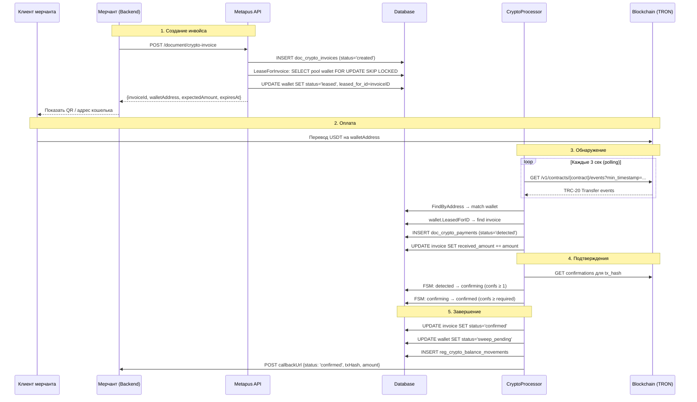
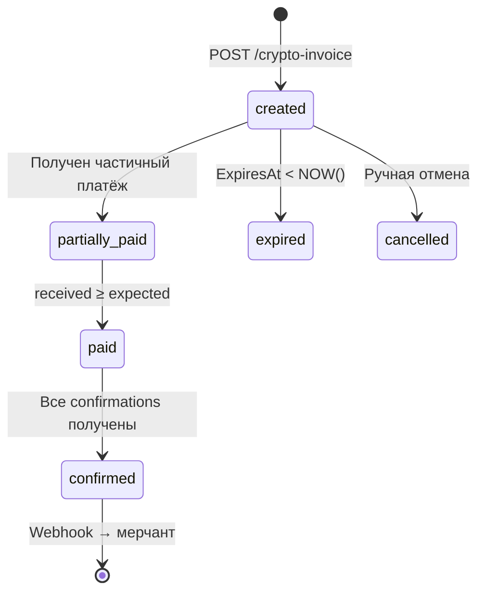
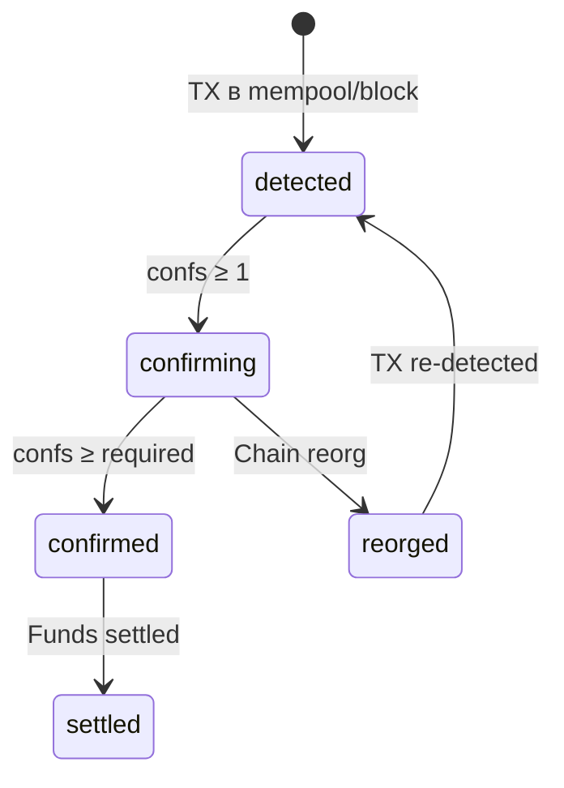

# Бизнес-процесс криптопроцессинга Metapus

## Общая архитектура

Криптопроцессинг Metapus — это **acquiring-сервис** для приёма криптовалютных платежей. Мерчант интегрируется через REST API, получает адрес для оплаты, а система автоматически отслеживает блокчейн и подтверждает получение средств.

## Полный цикл приёма платежа



## Ключевые сущности

### Справочники
| Сущность | Назначение |
|----------|-----------|
| **Merchant** | Мерчант-клиент сервиса. Имеет `kybStatus` (pending/approved/rejected), `commissionRate` |
| **Wallet** | Крипто-кошелёк. Tier: pool/hot/warm/cold. Status: free/leased/sweep_pending/frozen |
| **Token** | Криптовалюта (USDT-TRC20). Хранит `contract_address`, `decimal_places` |
| **BlockchainNetwork** | Сеть (TRON, ETH). Хранит `confirmations_needed` |

### Документы
| Документ | Назначение |
|----------|-----------|
| **CryptoInvoice** | Счёт на оплату. FSM: created → partially_paid → paid → confirmed → expired/cancelled |
| **CryptoPayment** | Зафиксированная транзакция. FSM: detected → confirming → confirmed → settled / reorged |
| **CryptoWithdrawal** | Вывод средств мерчантом. FSM: created → signed → broadcast → confirmed / failed |
| **CryptoSweep** | Консолидация средств из pool → hot wallet. Системный документ |

## FSM статусы инвойса



## FSM статусы платежа



## Wallet Leasing (Пул адресов)

Ключевой механизм — **pool wallets**:

1. При создании инвойса система атомарно «арендует» свободный pool-кошелёк:
   ```sql
   SELECT id FROM cat_wallets
   WHERE network_id = $1 AND status = 'free' AND tier = 'pool'
   FOR UPDATE SKIP LOCKED  -- lock-free concurrency
   LIMIT 1
   ```
2. Кошелёк переходит в `status = 'leased'`, `leased_for_id = invoiceID`
3. Клиент мерчанта видит **уникальный адрес** для оплаты
4. После подтверждения: `status = 'sweep_pending'` → CryptoSweep перемещает средства в hot wallet
5. После sweep: wallet возвращается в `status = 'free'`

## Мониторинг блокчейна

[CryptoProcessor](file:///c:/Users/user/go/src/metapus/internal/infrastructure/crypto_worker/processor.go) запускается **per-tenant** в Worker:

- **TRON Watcher** — polling TronGrid API каждые 3 сек
- **Adaptive polling** — ускоряется при обнаружении событий, замедляется при простое
- **Checkpoint** — состояние сохраняется в `sys_watcher_state` (crash recovery)
- **EventProcessor** — chain-agnostic бизнес-логика (можно добавить ETH, TON)

## Текущий статус реализации

> [!WARNING]
> ### Wallet Leasing НЕ подключен к CreateInvoice
> 
> `LeaseForInvoice()` **реализован** в repo и service, но **не вызывается** при создании инвойса.
> В `CryptoInvoiceRegistration.Build()` нет hook'а `OnBeforeCreate` для автоматического lease'а.
> 
> **Без этого цикл не работает**: созданный инвойс не имеет wallet'а → watcher не может связать входящую транзакцию с инвойсом.
> 
> Это критический gap — нужно решить, подключать ли lease автоматически через hook или через отдельный API endpoint.

## Можно ли протестировать полный цикл?

**Нет, полноценно в текущем состоянии нельзя**, по нескольким причинам:

1. **Wallet leasing не подключен** — инвойс создаётся без привязки к кошельку
2. **TRON Shasta testnet** — нужен реальный перевод USDT на тестовом контракте
3. **Worker должен быть запущен** с правильным `TRON_RPC_URL` и `TRON_API_KEY`

### Что можно проверить через API:
- ✅ CRUD инвойсов, мерчантов, кошельков
- ✅ Фильтры с enum-dropdown'ами (результат текущей миграции)
- ✅ Metadata inspector возвращает `enumValues` для статусов/tier'ов
