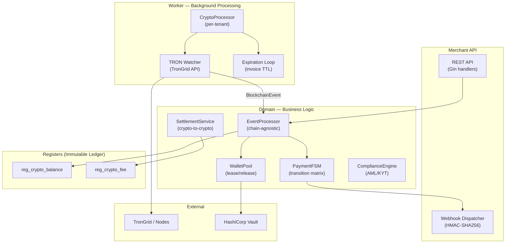
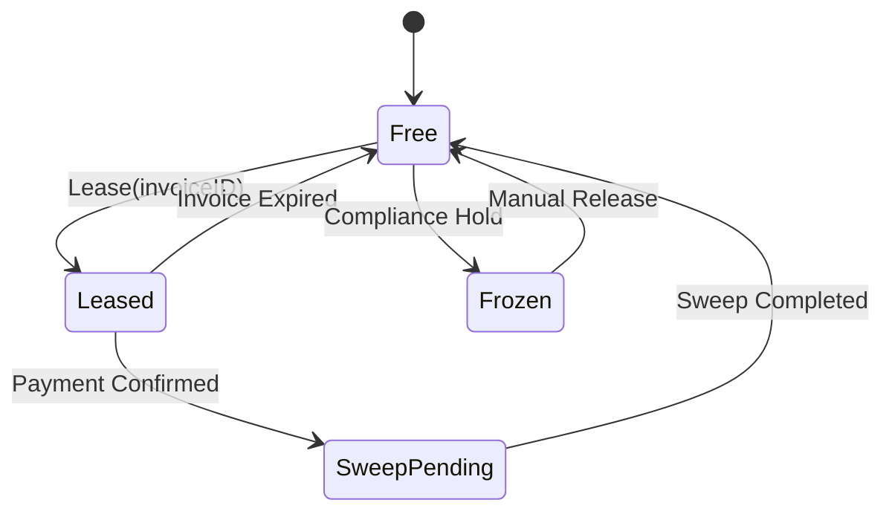
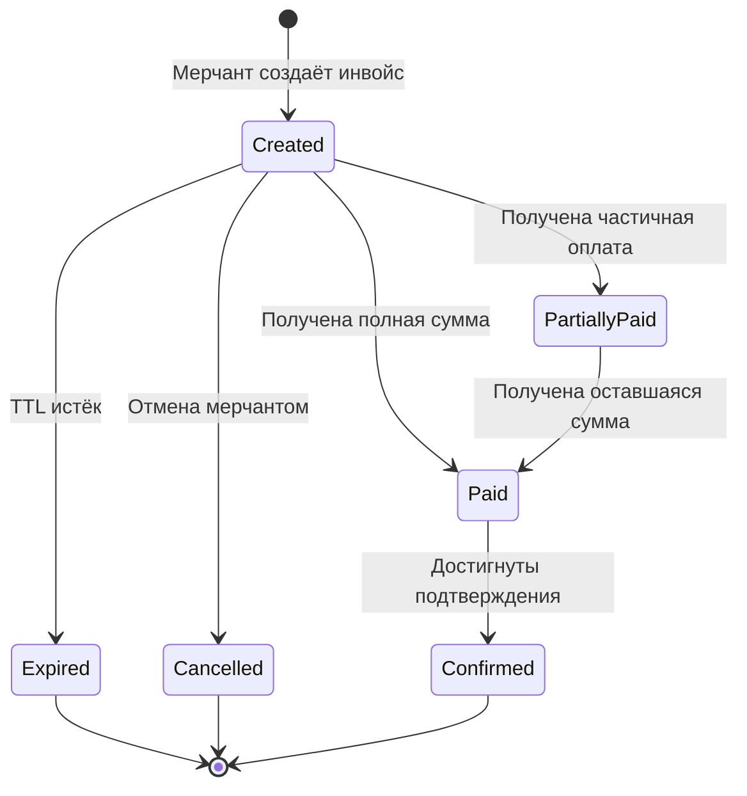
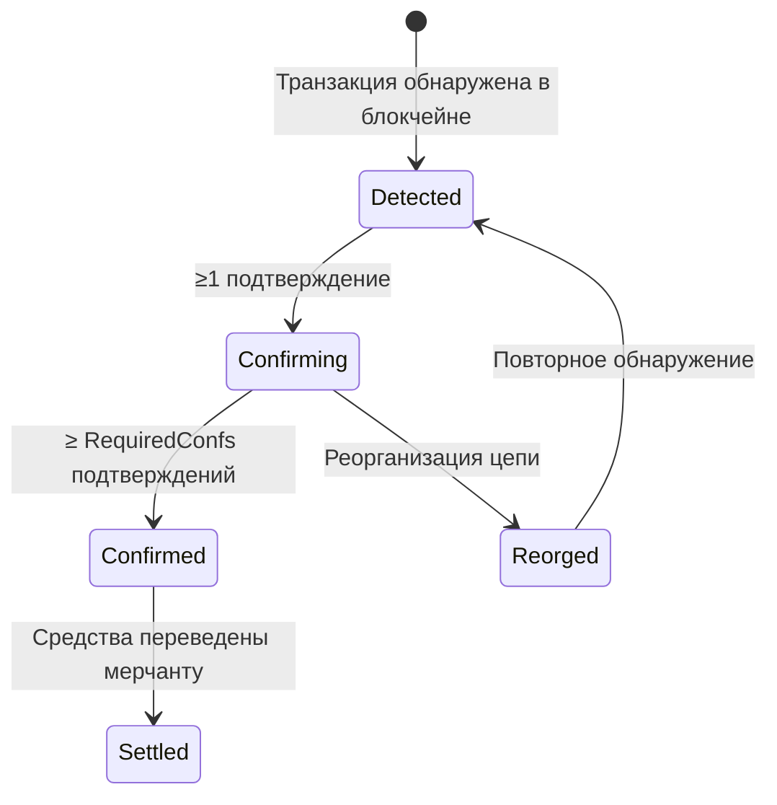
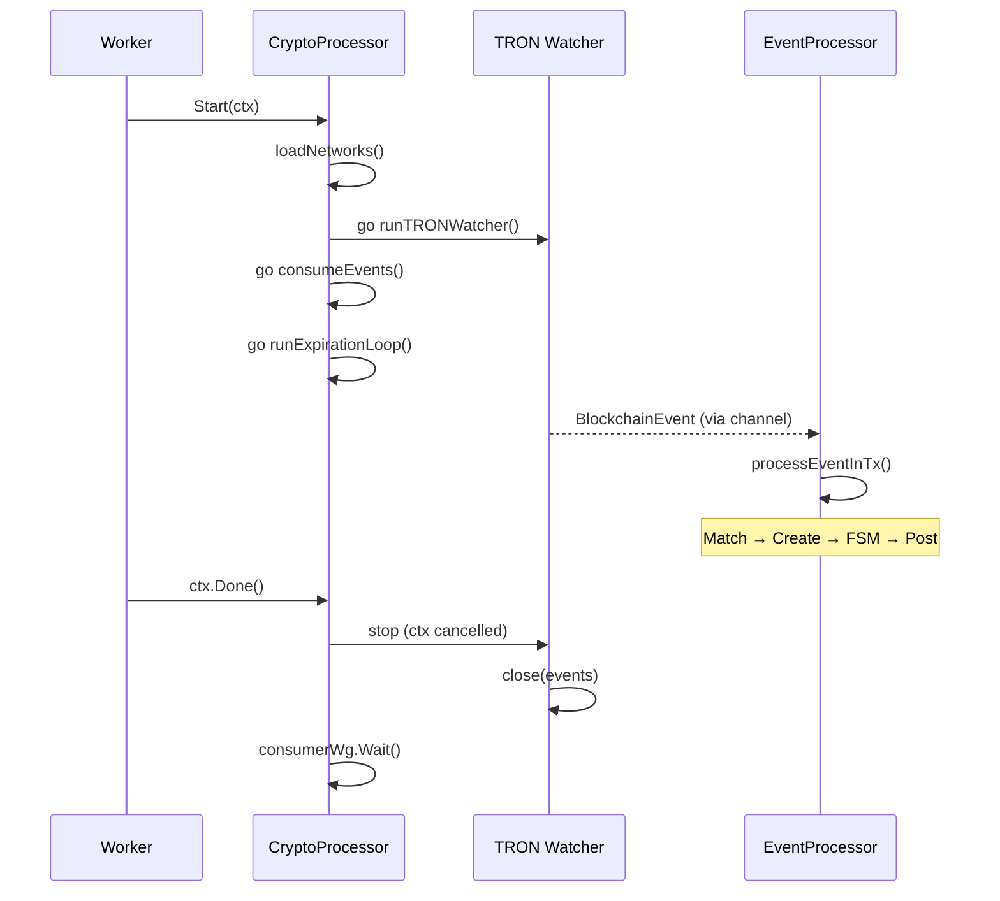
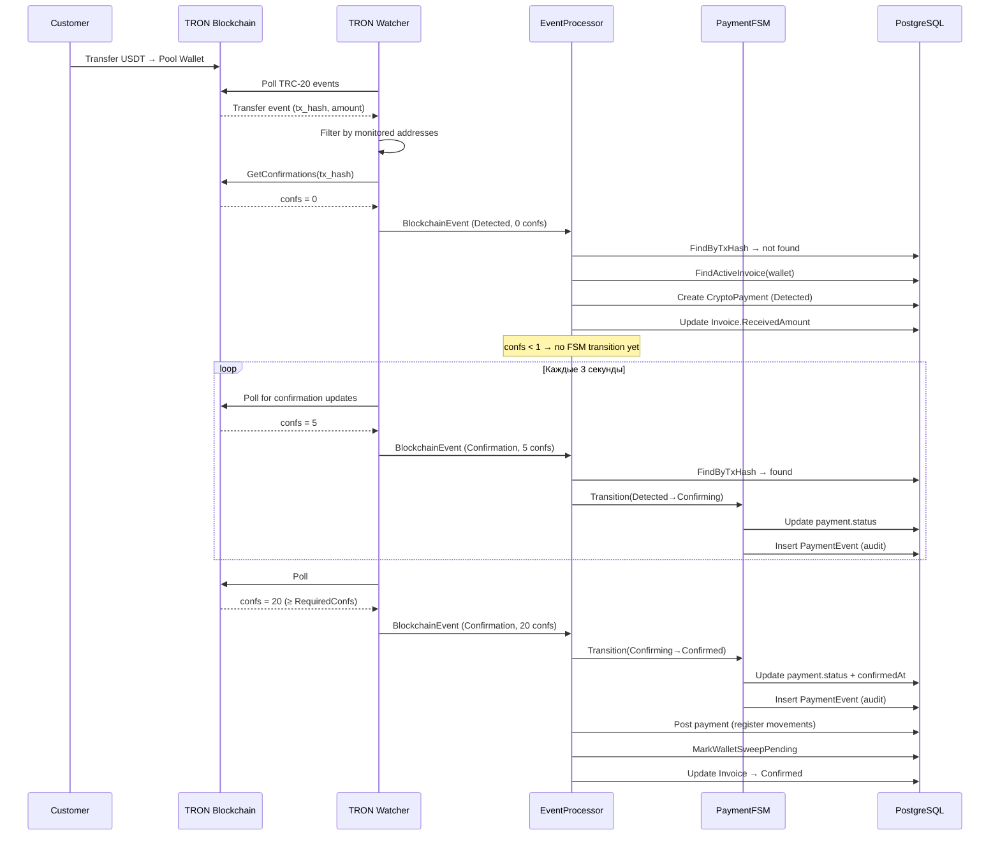

# Криптопроцессинг

> **TL;DR:** Описание подсистемы приёма и обработки криптоплатежей: архитектура, модели, FSM, chain watchers, event processing, compliance и settlement.

> **Тип:** System Documentation
> **Аудитория:** Developer
> **Связанные:** [posting-engine.md](posting-engine.md), [multi-tenancy.md](multi-tenancy.md), [new-document.md](../howto/new-document.md)

---

## 1. Обзор архитектуры

Криптопроцессинг Metapus — это подсистема приёма, подтверждения и учёта криптоплатежей, интегрированная в существующий Clean Architecture стек. Ключевой принцип — **максимальное переиспользование** существующих абстракций (PostingEngine, Worker, BaseDocumentService) вместо создания параллельной инфраструктуры.

### Архитектурные слои



### Что переиспользуется

| Существующий компонент | Роль в криптопроцессинге |
|---|---|
| `PostingEngine` + Visitor + Recorder | Крипто-регистры: `CryptoBalanceMovement`, `CryptoFeeMovement` |
| `BaseDocumentService[T, L]` | Базовый сервис для `CryptoInvoice`, `CryptoPayment` |
| `CatalogService[T]` | Справочники: `BlockchainNetwork`, `Token`, `Wallet`, `Merchant` |
| `types.CryptoAmount` (big.Int) | Суммы для 18+ decimals (ETH wei, TRON sun) |
| `Worker` (per-tenant goroutines) | Хост для `CryptoProcessor` + `ChainWatcher` |
| `entity.MovementBase` | Immutable ledger для крипто-остатков |

---

## 2. Справочники (Catalogs)

### 2.1. BlockchainNetwork

Определяет поддерживаемые блокчейн-сети и их параметры.

| Поле | Тип | Описание |
|------|-----|----------|
| `ChainID` | string | Уникальный идентификатор сети (`"tron"`, `"ethereum"`) |
| `NativeTokenSymbol` | string | Символ нативной монеты (`"TRX"`, `"ETH"`) |
| `NativeDecimals` | int | Количество десятичных знаков нативного токена |
| `ConfirmationsNeeded` | int | Минимальное число подтверждений для финальности |
| `BlockTimeSeconds` | int | Среднее время блока (для UI-отображения) |
| `RPCEndpoint` | string | URL ноды/API (зашифрован AES) |
| `ExplorerURL` | string | Шаблон URL обозревателя блоков |

**Ключевой инвариант:** `ConfirmationsNeeded` — единственный источник требуемых подтверждений. Никогда не хардкодить.

### 2.2. Token

Криптовалюты и токены, привязанные к сети.

| Поле | Тип | Описание |
|------|-----|----------|
| `NetworkID` | FK → BlockchainNetwork | Сеть, в которой выпущен токен |
| `ContractAddress` | string | Адрес смарт-контракта (`""` для нативных) |
| `Symbol` | string | `"USDT"`, `"ETH"`, `"BTC"` |
| `DecimalPlaces` | int | **Никогда не хардкодить!** (6 для USDT-TRC20, 18 для ETH) |
| `TokenStandard` | string | `"TRC-20"`, `"ERC-20"`, `"native"` |

### 2.3. Wallet

Блокчейн-адреса под управлением платформы. Организованы по уровням (tier) и состояниям (status).

**Уровни (Tier):**

| Tier | Назначение |
|------|-----------|
| `Pool` | Клиентские адреса (HD-derived). Арендуются инвойсами для приёма платежей |
| `Hot` | Целевой кошелёк для sweep. Высокочастотные операции |
| `Warm` | Буфер для settlement. Средняя ликвидность |
| `Cold` | Холодное хранилище. Долгосрочное хранение |

**Состояния (Status):**



**Lease-механизм:** при создании `CryptoInvoice` свободный `Pool`-кошелёк арендуется (`Leased`) на время TTL инвойса. Адрес кошелька выдаётся клиенту для оплаты. По истечении TTL или подтверждении платежа кошелёк возвращается в пул.

### 2.4. Merchant

Мерчанты — бизнес-клиенты, принимающие платежи. Содержат API-ключи, тарифы комиссий и webhook-настройки.

---

## 3. Документы (Documents)

### 3.1. CryptoInvoice — Запрос на оплату

Создаётся мерчантом через API. Представляет запрос на оплату с ожидаемой суммой.

**Жизненный цикл:**



**Ключевые поля:**

| Поле | Тип | Описание |
|------|-----|----------|
| `MerchantID` | FK | Мерчант-создатель |
| `TokenID` | FK | Токен для оплаты |
| `WalletID` | FK (nullable) | Арендованный кошелёк |
| `ExpectedAmount` | CryptoAmount | Ожидаемая сумма (minor units) |
| `ReceivedAmount` | CryptoAmount | Фактически полученная сумма |
| `Status` | InvoiceStatus | Текущий статус FSM |
| `ExpiresAt` | time.Time | Время истечения (default 30 min) |
| `CallbackURL` | string | Webhook URL для уведомлений |
| `ExternalID` | string | Idempotency key мерчанта |

**Связь с Posting Engine:** при подтверждении (`Confirmed`) инвойс проводится — записывается `CryptoBalanceMovement` (приход на кошелёк).

### 3.2. CryptoPayment — Зафиксированный платёж

Создаётся **автоматически** chain watcher'ом при обнаружении входящей транзакции. Не редактируется вручную.

**FSM:**



**Матрица переходов (compile-time):**

```go
var _allowedTransitions = map[PaymentStatus][]PaymentStatus{
    PaymentStatusDetected:   {PaymentStatusConfirming},
    PaymentStatusConfirming: {PaymentStatusConfirmed, PaymentStatusReorged},
    PaymentStatusConfirmed:  {PaymentStatusSettled},
    PaymentStatusReorged:    {PaymentStatusDetected},
}
```

**Каждый переход записывается** в `reg_crypto_payment_events` — полный audit trail для финансовой трассируемости.

### 3.3. CryptoSweep — Сбор средств

Sweep переводит средства с пул-кошельков на горячий кошелёк. Создаётся автоматически после подтверждения платежа.

### 3.4. CryptoWithdrawal — Вывод средств

Вывод средств мерчантом с платформы. Инициируется через API.

---

## 4. Обработка событий блокчейна

### 4.1. BlockchainEvent

Нормализованная структура события от любого chain watcher'а. **Chain-agnostic** — EventProcessor не знает о конкретной сети.

```go
type BlockchainEvent struct {
    Network       string            // "tron_mainnet", "ethereum"
    NetworkID     id.ID             // resolved UUID
    TxHash        string            // blockchain tx hash
    FromAddress   string            // sender
    ToAddress     string            // recipient (matched against wallets)
    TokenContract string            // token contract ("" for native)
    Amount        types.CryptoAmount // minor units
    BlockNumber   int64
    Confirmations int
    RequiredConfs int               // from BlockchainNetwork
    EventType     EventType         // Transfer | Confirmation | Reorg
    Timestamp     time.Time
}
```

### 4.2. ChainWatcher (Interface)

Адаптер для конкретной блокчейн-сети. Каждая сеть реализует свой watcher.

```go
type ChainWatcher interface {
    NetworkCode() string
    Start(ctx context.Context, addresses []string, events chan<- BlockchainEvent) error
    GetConfirmations(ctx context.Context, txHash string) (int, error)
}
```

**Текущие реализации:** TRON (через TronGrid API).

### 4.3. TRON Watcher

Реализация `ChainWatcher` для TRON/Shasta.

**Механизм polling:**

1. Загружает checkpoint из `reg_crypto_watcher_state` (last_block, fingerprint)
2. Запрашивает TRC-20 Transfer events через TronGrid API
3. Фильтрует: только транзакции к нашим мониторимым кошелькам
4. Для каждого события запрашивает текущее число подтверждений
5. Эмитирует `BlockchainEvent` в канал
6. Сохраняет checkpoint

**Adaptive polling:**
- Base interval: 3s (время блока TRON)
- При обнаружении событий: сброс к base
- При idle: постепенное замедление до 30s
- При ошибках: экспоненциальный backoff (×2, ceiling 30s)

**Retry:** 3 попытки с экспоненциальным backoff (500ms → 1s → 2s).

### 4.4. EventProcessor

Центральный компонент бизнес-логики — **chain-agnostic**. Оркестрирует полный цикл обработки события.

**Алгоритм `ProcessEvent()`:**

```
1. Guard         → Reject non-positive amounts (zero-value events)
2. Dust Guard    → Reject amounts below dust threshold (default 1000 minor units)
3. Match         → event.ToAddress → find Wallet → find active CryptoInvoice
4. Idempotency   → check CryptoPayment.TxHash — if exists → update confirmations
5. Reorg         → if EventTypeReorg → FSM transition to Reorged
6. Create        → new CryptoPayment(Detected)
7. Invoice       → update ReceivedAmount, recalculate Status
8. Confirmations → Detected→Confirming (≥1), Confirming→Confirmed (≥required)
9. Post          → on Confirmed: posting engine records register movements
10. Sweep        → on Confirmed: mark wallet as SweepPending
11. Invoice      → on Confirmed: update invoice status to Confirmed
```

**Каждый шаг выполняется внутри транзакции** (`txManager.RunInTransaction`).

**Защита от дублей:** если `CryptoPayment` с таким `TxHash` уже существует — обновляем только `Confirmations` и проверяем FSM-переходы.

---

## 5. Worker Integration

### CryptoProcessor

Per-tenant фоновый процессор, запускаемый внутри Worker'а. Управляет:

- Загрузкой blockchain networks и wallet addresses из БД
- Запуском ChainWatcher goroutine для каждой сети
- Потреблением `BlockchainEvent` из канала → `EventProcessor`
- Invoice expiration ticker (каждые 60 секунд)

**Lifecycle:**



**Конфигурация (env vars):**

| Переменная | Описание |
|-----------|----------|
| `TRON_RPC_URL` | TronGrid API endpoint (e.g., `https://api.shasta.trongrid.io`) |
| `TRON_API_KEY` | API key для повышенных rate limits |

---

## 6. PaymentFSM — Конечный автомат платежей

FSM обеспечивает строгую валидацию переходов между статусами платежа. Каждый переход атомарен и записывается в audit trail.

### Переходы

```
Detected ──→ Confirming     (first_confirmation, confs ≥ 1)
Confirming ──→ Confirmed    (confirmed, confs ≥ RequiredConfs)
Confirming ──→ Reorged      (chain_reorg)
Confirmed ──→ Settled       (settlement_complete)
Reorged ──→ Detected        (re-detect after reorg)
```

### Audit Trail

Каждый переход создаёт запись `PaymentEvent`:

```go
type PaymentEvent struct {
    ID         id.ID
    PaymentID  id.ID
    FromStatus PaymentStatus
    ToStatus   PaymentStatus
    EventType  string              // "first_confirmation", "confirmed", "chain_reorg"
    Metadata   TransitionMetadata  // {Confirmations, RequiredConfs, BlockNumber, TxHash}
    CreatedAt  time.Time
}
```

**Если запись FSM-события не удалась — вся транзакция откатывается.** Audit trail обязателен для финансовой трассируемости.

---

## 7. Webhooks

Уведомления мерчанту о событиях инвойса. Каждый webhook подписан HMAC-SHA256.

### Типы событий

| Event | Когда |
|-------|-------|
| `invoice.paid` | Получена полная оплата (ожидает подтверждений) |
| `invoice.confirmed` | Платёж подтверждён (finalised) |
| `invoice.expired` | TTL инвойса истёк без оплаты |
| `withdrawal.confirmed` | Вывод средств подтверждён |

### Формат запроса

```
POST {callbackURL}
Content-Type: application/json
X-Metapus-Event: invoice.confirmed
X-Metapus-Signature: HMAC-SHA256(body, webhookSecret)
X-Metapus-Timestamp: 2026-05-04T10:00:00Z
X-Metapus-Delivery-ID: unique-uuid
```

### SSRF-защита

`ValidateWebhookURL()` применяется при создании мерчанта **и** при каждой отправке (defence-in-depth):
- Только HTTPS
- Блокировка приватных IP (10.x, 172.16.x, 192.168.x)
- Блокировка loopback (127.0.0.1, ::1)
- Блокировка cloud metadata (169.254.169.254)
- Блокировка `*.internal`, `localhost`
- **Блокировка всех HTTP-редиректов** (`CheckRedirect → http.ErrUseLastResponse`) — предотвращает SSRF bypass через redirect chains

---

## 8. Compliance (AML/KYT)

Интерфейс `ComplianceEngine` предоставляет скрининг адресов и транзакций.

```go
type ComplianceEngine interface {
    ScreenAddress(ctx context.Context, address string) (RiskScore, error)
    ScreenTransaction(ctx context.Context, txHash string) (RiskScore, error)
}
```

**Текущая реализация:** `NoopComplianceEngine` — всегда возвращает `low risk`. Для продакшена необходимо подключить Chainalysis, Elliptic или Crystal.

**Risk Levels:** `low` (0–25) → `medium` (26–50) → `high` (51–75) → `critical` (76–100).

---

## 9. Settlement

Механизм расчётов с мерчантами.

**v1 — Crypto-to-Crypto:** средства переводятся в том же токене. `CryptoWithdrawal` = settlement документ.

**Будущее — Crypto-to-Fiat:** интеграция с OTC desk / биржей для конвертации в фиат.

```go
type SettlementStrategy interface {
    Settle(ctx context.Context, merchantID id.ID, amount CryptoAmount, tokenID id.ID) error
}
```

---

## 10. Типы данных

### CryptoAmount

`int64` (`MinorUnits`) **не подходит** для крипто: ETH имеет 18 decimals, max `int64` = 9.2 × 10¹⁸ = ~9.2 ETH в wei.

**Решение:** обёртка над `math/big.Int`:

```go
type CryptoAmount struct {
    val *big.Int // minor units (satoshi, wei, sun, lamport)
}
```

- Сериализация в JSON: строка (`"1000000"`)
- Хранение в Postgres: `NUMERIC` (arbitrary precision)
- Defensive copy при создании и извлечении
- Arithmetics: `Add()`, `Sub()`, `Cmp()`, `IsZero()`, `IsPositive()`

---

## 11. Файловая карта

```
Backend:
  internal/core/types/crypto_amount.go               — CryptoAmount (big.Int wrapper)
  internal/core/entity/crypto_register.go             — CryptoBalanceMovement, CryptoFeeMovement
  internal/domain/crypto/
  ├── blockchain_event.go                             — BlockchainEvent, ChainWatcher interface
  ├── event_processor.go                              — EventProcessor (центральная логика)
  ├── payment_fsm.go                                  — PaymentFSM + PaymentEvent
  ├── webhook.go                                      — WebhookDispatcher + SSRF protection
  ├── compliance.go                                   — ComplianceEngine + NoopComplianceEngine
  ├── settlement.go                                   — SettlementStrategy + SettlementService
  └── signer.go                                       — VaultSigner interface
  internal/domain/catalogs/
  ├── blockchain_network/model.go                     — BlockchainNetwork
  ├── token/model.go                                  — Token
  ├── wallet/model.go                                 — Wallet (status FSM, tier, lease)
  └── merchant/model.go                               — Merchant
  internal/domain/documents/
  ├── crypto_invoice/model.go                         — CryptoInvoice
  ├── crypto_payment/model.go                         — CryptoPayment (FSM-driven)
  ├── crypto_sweep/model.go                           — CryptoSweep
  └── crypto_withdrawal/model.go                      — CryptoWithdrawal
  internal/infrastructure/blockchain/tron/
  ├── client.go                                       — TronGrid HTTP client (retry, backoff)
  └── watcher.go                                      — TRON ChainWatcher (polling, checkpoint)
  internal/infrastructure/crypto_worker/
  └── processor.go                                    — CryptoProcessor (per-tenant orchestrator)
  internal/infrastructure/storage/postgres/crypto_repo/
  ├── payment_event_repo.go                           — PaymentEvent persistence
  └── watcher_state_repo.go                           — Watcher checkpoint persistence
```

---

## 12. Сквозной поток: от транзакции до подтверждения



---

## 13. Архитектурные решения и trade-offs

| Решение | Альтернатива | Обоснование |
|---------|-------------|-------------|
| **Монолит** (не микросервисы) | Hellgate/Fistful/Shumway отдельно | Ранний этап. Monolith-first. Микросервисы при >100k tx/day |
| **`big.Int`** для сумм | `decimal.Decimal` / `int64` | int64 переполняется при 18 decimals. Decimal медленнее для pure integer ops |
| **NUMERIC** в Postgres | BIGINT | Arbitrary precision, native support для big.Int |
| **Worker** как watcher host | Отдельный процесс (NBXplorer) | Переиспользуем tenant lifecycle, pool management, ctx.Done() |
| **Polling** (не WebSocket) | Node WebSocket subscription | TronGrid не поддерживает WS для events. Polling + adaptive interval |
| **Event log** (не event sourcing) | Full event sourcing + replay | Достаточно для audit. Full ES — при необходимости replay |
| **Vault** для ключей | In-process crypto libs | Ключи не покидают Vault. Zero-knowledge signing |
| **Fingerprint pagination** | Offset-based | TronGrid API uses fingerprint. Immutable — safe for concurrent polling |

---

## 14. Известные ограничения и технический долг

> [!WARNING]
> **Следующие задачи требуют решения перед production-деплоем.**

| # | Задача | Severity | Статус |
|---|--------|----------|--------|
| ~~1~~ | ~~Wallet pool leak~~ | ~~HIGH~~ | ✅ Исправлено — `ExpireOverdue()` CTE atomically releases wallets |
| ~~2~~ | ~~SSRF CheckRedirect~~ | ~~MEDIUM~~ | ✅ Исправлено — `CheckRedirect` → `http.ErrUseLastResponse` |
| 3 | Concurrent payments | MEDIUM | By design — один инвойс может иметь N платежей |
| 4 | NoopComplianceEngine | HIGH | Заменить на Chainalysis / Elliptic перед продакшеном |
| ~~5~~ | ~~Dust spam protection~~ | ~~MEDIUM~~ | ✅ Исправлено — `dustThreshold` в EventProcessor (default 1000 minor units) |
| 6 | Hex→Base58 конвертация | LOW | `ConvertTronAddress` — заглушка, нужна полная реализация |
| 7 | Fee calculation | MEDIUM | `GenerateCryptoFeeMovements` возвращает пустой слайс |

---

## 15. Конфигурация и запуск

### Environment Variables

```bash
# Worker (cmd/worker)
TRON_RPC_URL=https://api.shasta.trongrid.io   # Shasta testnet
TRON_API_KEY=c9c9646e-0626-4035-857b-911c6aba25cc  # TronGrid API key

# Server (cmd/server)
AUTOMATION_ENCRYPTION_KEY=test-encryption-key-32chars!!!!!  # AES key для RPC endpoints
```

### Seed Data

Крипто-данные сидируются через `cmd/seed/main.go` → `seedCryptoData()`:
- 1 blockchain network (TRON Shasta Testnet)
- 1 token (USDT TRC-20)
- 1 merchant (Demo Merchant)
- 4 pool wallets + 1 hot wallet

### Проверка работоспособности

```bash
# Backend
go build ./... && golangci-lint run ./...

# Frontend
cd frontend && npx tsc --noEmit && npm run lint

# Worker logs — должны появиться:
# "crypto processor started" networks=1
# "starting TRON watcher" addresses=4
```
