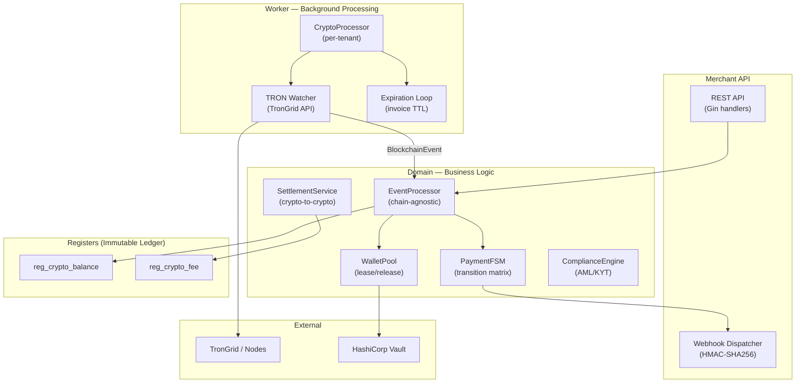
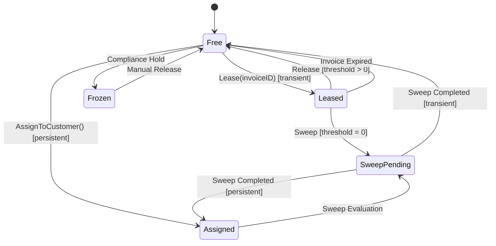
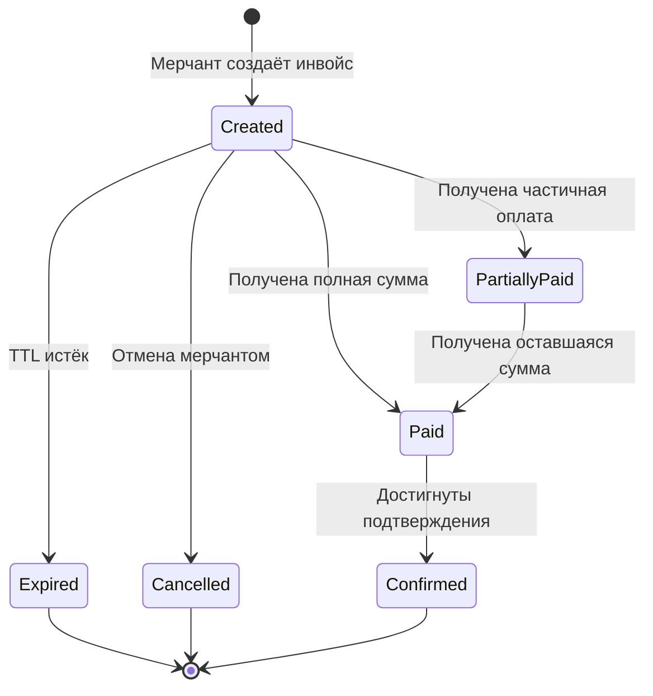
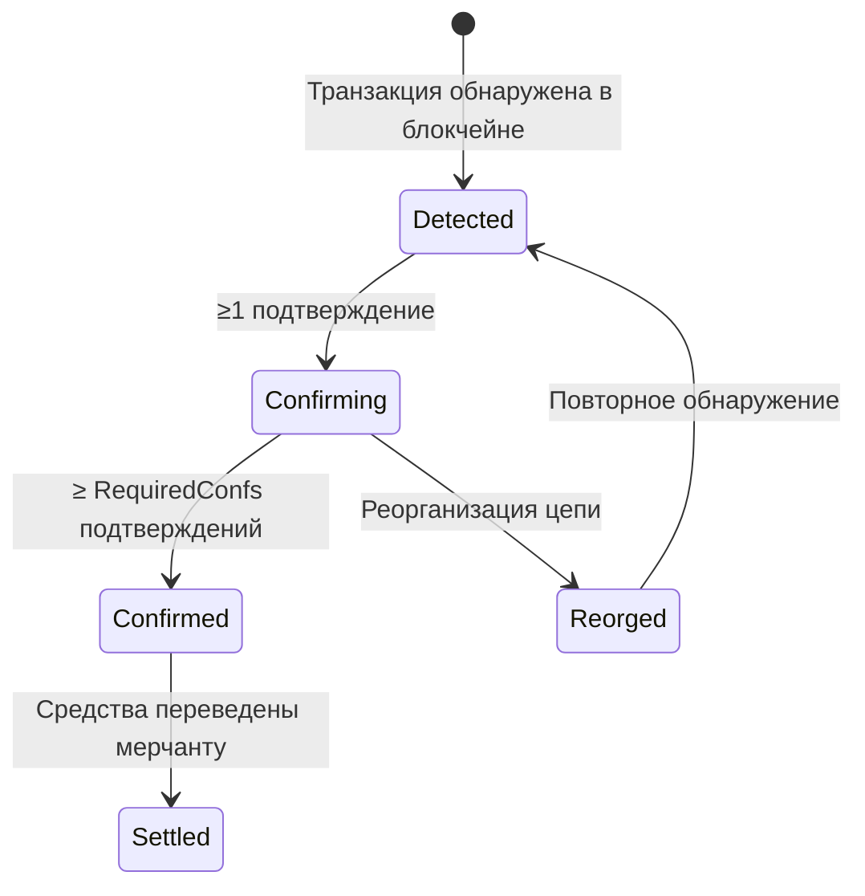
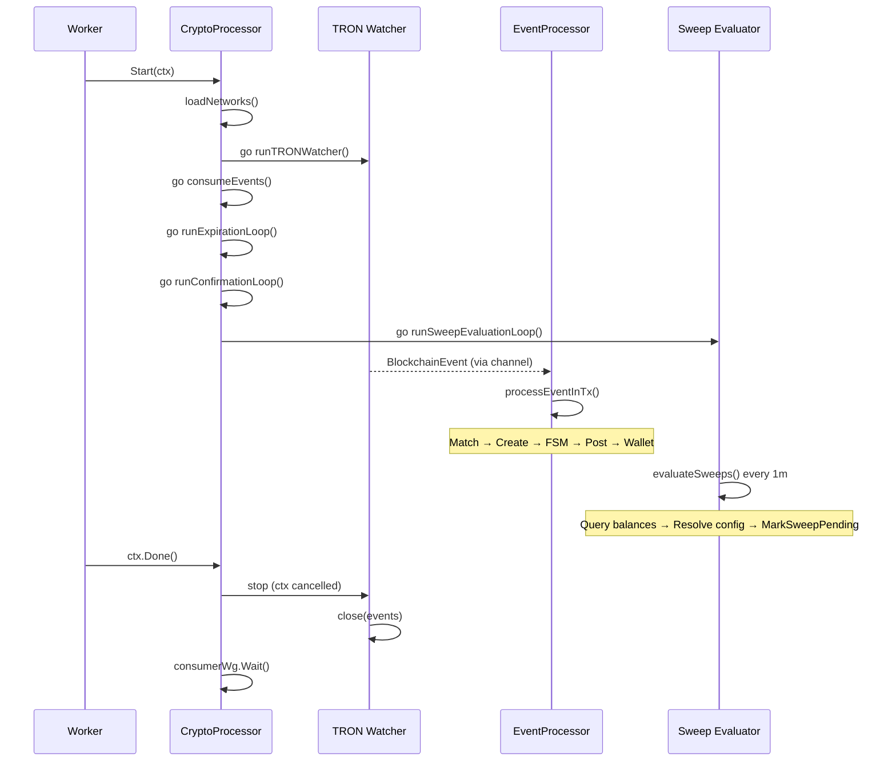
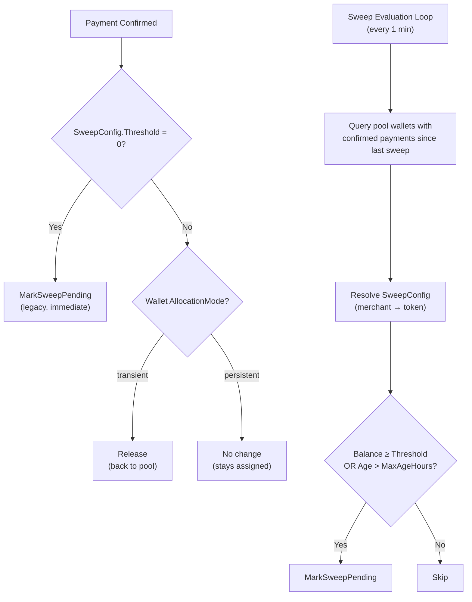
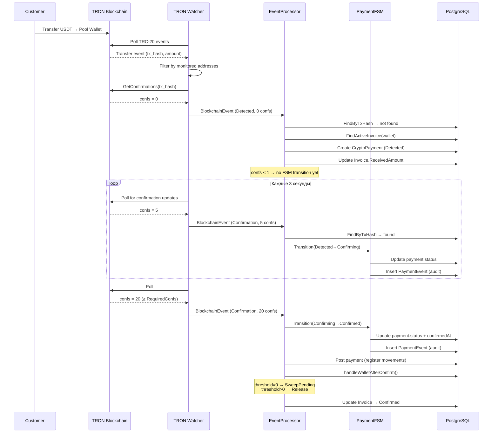
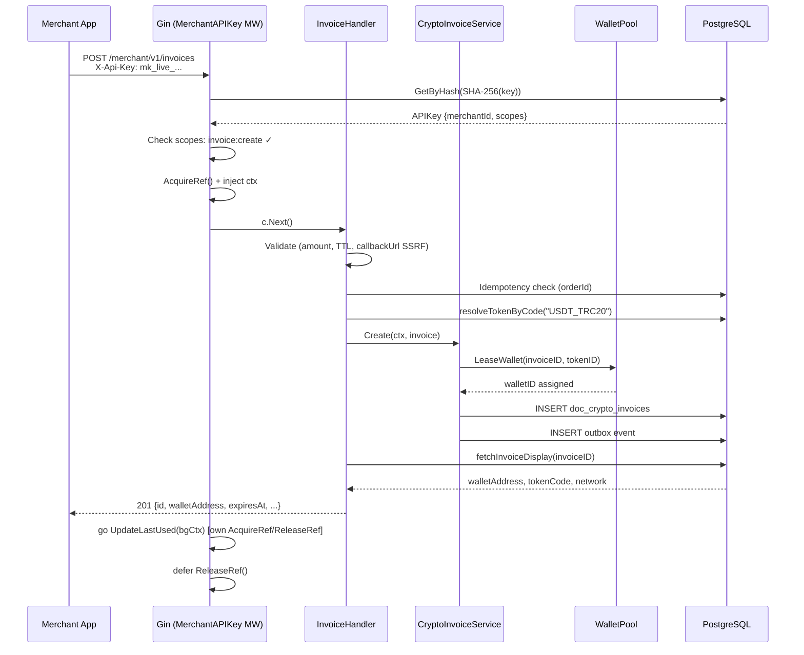

# Криптопроцессинг

> **TL;DR:** Описание подсистемы приёма и обработки криптоплатежей: архитектура, модели, FSM, chain watchers, event processing, compliance и settlement.

> **Тип:** System Documentation
> **Аудитория:** Developer
> **Связанные:** [posting-engine.md](posting-engine.md), [multi-tenancy.md](multi-tenancy.md), [exchange-rates.md](exchange-rates.md), [new-document.md](../howto/new-document.md)

---

## 1. Обзор архитектуры

Криптопроцессинг Metapus — это подсистема приёма, подтверждения и учёта криптоплатежей, интегрированная в существующий Clean Architecture стек. Ключевой принцип — **максимальное переиспользование** существующих абстракций (PostingEngine, Worker, BaseDocumentService) вместо создания параллельной инфраструктуры.

### Архитектурные слои



### Что переиспользуется

| Существующий компонент | Роль в криптопроцессинге |
|---|---|
| `PostingEngine` + Visitor + Recorder | Крипто-регистры: `CryptoBalanceMovement`, `CryptoFeeMovement` |
| `BaseDocumentService[T, L]` | Базовый сервис для `CryptoInvoice`, `CryptoPayment` |
| `CatalogService[T]` | Справочники: `BlockchainNetwork`, `Token`, `Wallet`, `Merchant` |
| `types.CryptoAmount` (big.Int) | Суммы для 18+ decimals (ETH wei, TRON sun) |
| `Worker` (per-tenant goroutines) | Хост для `CryptoProcessor` + `ChainWatcher` |
| `entity.MovementBase` | Immutable ledger для крипто-остатков |

---

## 2. Справочники (Catalogs)

### 2.1. BlockchainNetwork

Определяет поддерживаемые блокчейн-сети и их параметры.

| Поле | Тип | Описание |
|------|-----|----------|
| `ChainID` | string | Уникальный идентификатор сети (`"tron"`, `"ethereum"`) |
| `NativeTokenSymbol` | string | Символ нативной монеты (`"TRX"`, `"ETH"`) |
| `NativeDecimals` | int | Количество десятичных знаков нативного токена |
| `ConfirmationsNeeded` | int | Минимальное число подтверждений для финальности |
| `BlockTimeSeconds` | int | Среднее время блока (для UI-отображения) |
| `RPCEndpoint` | string | URL ноды/API (зашифрован AES) |
| `ExplorerURL` | string | Шаблон URL обозревателя блоков |

**Ключевой инвариант:** `ConfirmationsNeeded` — единственный источник требуемых подтверждений. Никогда не хардкодить.

### 2.2. Token

Криптовалюты и токены, привязанные к сети.

| Поле | Тип | Описание |
|------|-----|----------|
| `NetworkID` | FK → BlockchainNetwork | Сеть, в которой выпущен токен |
| `ContractAddress` | string | Адрес смарт-контракта (`""` для нативных) |
| `Symbol` | string | `"USDT"`, `"ETH"`, `"BTC"` |
| `DecimalPlaces` | int | **Никогда не хардкодить!** (6 для USDT-TRC20, 18 для ETH) |
| `TokenStandard` | string | `"TRC-20"`, `"ERC-20"`, `"native"` |
| `SweepThreshold` | CryptoAmount | Мин. баланс для свипа (minor units). 0 = свип после каждого платежа |
| `SweepMaxAgeHours` | int | Макс. часов до принудительного свипа. 0 = отключено |

> [!NOTE]
> `SweepThreshold` и `SweepMaxAgeHours` — **дефолтные** значения. Мерчант может переопределить их через `reg_merchant_token_config`.

### 2.3. Wallet

Блокчейн-адреса под управлением платформы. Организованы по уровням (tier), режимам аллокации (allocation mode) и состояниям (status).

**Уровни (Tier):**

| Tier | Назначение |
|------|-----------|
| `Pool` | Клиентские адреса (HD-derived). Арендуются инвойсами для приёма платежей |
| `Hot` | Целевой кошелёк для sweep. Высокочастотные операции |
| `Warm` | Буфер для settlement. Средняя ликвидность |
| `Cold` | Холодное хранилище. Долгосрочное хранение |

**Режим аллокации (Allocation Mode):**

| Mode | Описание |
|------|-----------|
| `transient` | Кошелёк арендуется под конкретный инвойс, возвращается после оплаты. **По умолчанию.** |
| `persistent` | Кошелёк привязан к клиенту (`CustomerRef`) на постоянной основе. Не возвращается в пул. |

**Состояния (Status):**



**Новые поля:**

| Поле | Тип | Описание |
|------|-----|----------|
| `AllocationMode` | string | `transient` или `persistent` |
| `CustomerRef` | string | Внешний ID клиента (для persistent) |
| `LastSweptAt` | *time.Time | Время последнего свипа |

**Lease-механизм:** при создании `CryptoInvoice` свободный `Pool`-кошелёк с `allocation_mode = 'transient'` арендуется (`Leased`) на время TTL инвойса. При threshold > 0 кошелёк **возвращается в пул** после подтверждения, а свип выполняется фоновым job'ом.

### 2.4. Merchant

Мерчанты — бизнес-клиенты, принимающие платежи. Содержат API-ключи, тарифы комиссий и webhook-настройки.

### 2.5. MerchantTokenConfig (Регистр сведений)

Таблица `reg_merchant_token_config` — **регистр сведений** для per-merchant переопределения крипто-настроек. `NULL` = использовать дефолт из `cat_tokens`.

| Поле | Тип | Описание |
|------|-----|----------|
| `MerchantID` | FK → Merchant | Мерчант (часть PK) |
| `TokenID` | FK → Token | Токен (часть PK) |
| `SweepThreshold` | NUMERIC (nullable) | Переопределение порога свипа. NULL = дефолт токена |
| `SweepMaxAgeHours` | INT (nullable) | Переопределение макс. возраста. NULL = дефолт токена |

**Резолвинг (NULL-coalescing):** `SweepConfigResolver` применяет приоритет:

```
Мерчант override (reg_merchant_token_config) → Token default (cat_tokens)
```

---

## 3. Документы (Documents)

### 3.1. CryptoInvoice — Запрос на оплату

Создаётся мерчантом через API. Представляет запрос на оплату с ожидаемой суммой.

**Жизненный цикл:**



**Ключевые поля:**

| Поле | Тип | Описание |
|------|-----|----------|
| `MerchantID` | FK | Мерчант-создатель |
| `TokenID` | FK | Токен для оплаты |
| `WalletID` | FK (nullable) | Арендованный кошелёк |
| `ExpectedAmount` | CryptoAmount | Ожидаемая сумма (minor units) |
| `ReceivedAmount` | CryptoAmount | Фактически полученная сумма |
| `Status` | InvoiceStatus | Текущий статус FSM |
| `ExpiresAt` | time.Time | Время истечения (default 30 min) |
| `CallbackURL` | string | Webhook URL для уведомлений |
| `ExternalID` | string | Idempotency key мерчанта |

**Связь с Posting Engine:** при подтверждении (`Confirmed`) инвойс проводится — записывается `CryptoBalanceMovement` (приход на кошелёк).

### 3.2. CryptoPayment — Зафиксированный платёж

Создаётся **автоматически** chain watcher'ом при обнаружении входящей транзакции. Не редактируется вручную.

**FSM:**



**Матрица переходов (compile-time):**

```go
var _allowedTransitions = map[PaymentStatus][]PaymentStatus{
    PaymentStatusDetected:   {PaymentStatusConfirming},
    PaymentStatusConfirming: {PaymentStatusConfirmed, PaymentStatusReorged},
    PaymentStatusConfirmed:  {PaymentStatusSettled},
    PaymentStatusReorged:    {PaymentStatusDetected},
}
```

**Каждый переход записывается** в `reg_crypto_payment_events` — полный audit trail для финансовой трассируемости.

### 3.3. CryptoSweep — Сбор средств

Sweep переводит средства с пул-кошельков на горячий кошелёк. Создаётся автоматически после подтверждения платежа.

### 3.4. CryptoWithdrawal — Вывод средств

Вывод средств мерчантом с платформы. Инициируется через API.

---

## 4. Обработка событий блокчейна

### 4.1. BlockchainEvent

Нормализованная структура события от любого chain watcher'а. **Chain-agnostic** — EventProcessor не знает о конкретной сети.

```go
type BlockchainEvent struct {
    Network       string            // "tron_mainnet", "ethereum"
    NetworkID     id.ID             // resolved UUID
    TxHash        string            // blockchain tx hash
    FromAddress   string            // sender
    ToAddress     string            // recipient (matched against wallets)
    TokenContract string            // token contract ("" for native)
    Amount        types.CryptoAmount // minor units
    BlockNumber   int64
    Confirmations int
    RequiredConfs int               // from BlockchainNetwork
    EventType     EventType         // Transfer | Confirmation | Reorg
    Timestamp     time.Time
}
```

### 4.2. ChainWatcher (Interface)

Адаптер для конкретной блокчейн-сети. Каждая сеть реализует свой watcher.

```go
type ChainWatcher interface {
    NetworkCode() string
    Start(ctx context.Context, addresses []string, events chan<- BlockchainEvent) error
    GetConfirmations(ctx context.Context, txHash string) (int, error)
}
```

**Текущие реализации:** TRON (через TronGrid API).

### 4.3. TRON Watcher

Реализация `ChainWatcher` для TRON/Shasta.

**Механизм polling (Time-Boxing):**

1. Загружает checkpoint из `reg_crypto_watcher_state` (`last_block`, `last_timestamp`).
2. Вычисляет окно сканирования: от `last_timestamp` до `maxTimestamp` (максимум +1 час, но не больше текущего времени). Это фиксирует данные на серверах TronGrid, предотвращая инвалидацию курсоров (`fingerprint`) от новых блоков.
3. Запрашивает TRC-20 Transfer events через TronGrid API.
4. Фильтрует: только транзакции к нашим мониторимым кошелькам.
5. Для каждого события запрашивает текущее число подтверждений.
6. Эмитирует `BlockchainEvent` в канал.
7. После успешной обработки сдвигает `last_timestamp` на конец окна и сохраняет checkpoint.

**Устойчивость к сбоям (Graceful Recovery):**
Если курсор пагинации `fingerprint` всё же протух (например, из-за огромного окна), клиент возвращает ошибку `IsFingerprintError`. Воркер **не ретраит** такие запросы, а безопасно прерывает текущий poll, фиксирует уже обработанные события и начинает следующий poll с чистого листа (`fingerprint=""`).

**Adaptive polling & Catch-up Mode:**
- **Catch-up Mode:** Если воркер отстал от сети более чем на 1 минуту, включается турбо-режим (`500ms`), чтобы быстро нагнать историю порциями по 1 часу.
- **Real-time Mode:** Когда воркер догнал сеть, он переходит на базовый интервал (3s — среднее время блока TRON).
- **Idle:** Постепенное замедление интервала поллинга при отсутствии активности до потолка (30s).
- **Ошибки:** Клиентские ошибки 4xx (кроме 429) не ретраятся (fail-fast). Для 429 и 5xx используется экспоненциальный backoff (×2, потолок 30s) до 3 попыток.

### 4.4. EventProcessor

Центральный компонент бизнес-логики — **chain-agnostic**. Оркестрирует полный цикл обработки события.

**Алгоритм `ProcessEvent()`:**

```
1. Guard         → Reject non-positive amounts (zero-value events)
2. Dust Guard    → Reject amounts below dust threshold (default 1000 minor units)
3. Match         → event.ToAddress → find Wallet → find active CryptoInvoice
4. Idempotency   → check CryptoPayment.TxHash — if exists → update confirmations
5. Reorg         → if EventTypeReorg → FSM transition to Reorged
6. Create        → new CryptoPayment(Detected)
7. Invoice       → update ReceivedAmount, recalculate Status
8. Confirmations → Detected→Confirming (≥1), Confirming→Confirmed (≥required)
9. Post          → on Confirmed: posting engine records register movements
10. Wallet       → on Confirmed: handleWalletAfterConfirm()
                    threshold=0 → MarkSweepPending (legacy)
                    threshold>0, transient → Release (back to pool)
                    persistent → no change (stays assigned)
11. Invoice      → on Confirmed: update invoice status to Confirmed
```

**Каждый шаг выполняется внутри транзакции** (`txManager.RunInTransaction`).

**Защита от дублей:** если `CryptoPayment` с таким `TxHash` уже существует — обновляем только `Confirmations` и проверяем FSM-переходы.

---

## 5. Worker Integration

### CryptoProcessor

Per-tenant фоновый процессор, запускаемый внутри Worker'а. Управляет:

- Загрузкой blockchain networks и wallet addresses из БД
- Запуском ChainWatcher goroutine для каждой сети
- Потреблением `BlockchainEvent` из канала → `EventProcessor`
- Invoice expiration ticker (каждые 60 секунд)
- Confirmation poll loop (каждые 10 секунд)
- **Sweep evaluation loop** (каждые 60 секунд)

**Lifecycle:**



**Конфигурация (env vars):**

| Переменная | Описание |
|-----------|----------|
| `TRON_RPC_URL` | TronGrid API endpoint (e.g., `https://api.shasta.trongrid.io`) |
| `TRON_API_KEY` | API key для повышенных rate limits |

---

## 6. PaymentFSM — Конечный автомат платежей

FSM обеспечивает строгую валидацию переходов между статусами платежа. Каждый переход атомарен и записывается в audit trail.

### Переходы

```
Detected ──→ Confirming     (first_confirmation, confs ≥ 1)
Confirming ──→ Confirmed    (confirmed, confs ≥ RequiredConfs)
Confirming ──→ Reorged      (chain_reorg)
Confirmed ──→ Settled       (settlement_complete)
Reorged ──→ Detected        (re-detect after reorg)
```

### Audit Trail

Каждый переход создаёт запись `PaymentEvent`:

```go
type PaymentEvent struct {
    ID         id.ID
    PaymentID  id.ID
    FromStatus PaymentStatus
    ToStatus   PaymentStatus
    EventType  string              // "first_confirmation", "confirmed", "chain_reorg"
    Metadata   TransitionMetadata  // {Confirmations, RequiredConfs, BlockNumber, TxHash}
    CreatedAt  time.Time
}
```

**Если запись FSM-события не удалась — вся транзакция откатывается.** Audit trail обязателен для финансовой трассируемости.

---

## 7. Webhooks

Уведомления мерчанту о событиях инвойса. Каждый webhook подписан HMAC-SHA256.

### Типы событий

| Event | Когда |
|-------|-------|
| `invoice.paid` | Получена полная оплата (ожидает подтверждений) |
| `invoice.confirmed` | Платёж подтверждён (finalised) |
| `invoice.expired` | TTL инвойса истёк без оплаты |
| `withdrawal.confirmed` | Вывод средств подтверждён |

### Формат запроса

```
POST {callbackURL}
Content-Type: application/json
X-Metapus-Event: invoice.confirmed
X-Metapus-Signature: HMAC-SHA256(body, webhookSecret)
X-Metapus-Timestamp: 2026-05-04T10:00:00Z
X-Metapus-Delivery-ID: unique-uuid
```

### SSRF-защита

`ValidateWebhookURL()` применяется при создании мерчанта **и** при каждой отправке (defence-in-depth):
- Только HTTPS
- Блокировка приватных IP (10.x, 172.16.x, 192.168.x)
- Блокировка loopback (127.0.0.1, ::1)
- Блокировка cloud metadata (169.254.169.254)
- Блокировка `*.internal`, `localhost`
- **Блокировка всех HTTP-редиректов** (`CheckRedirect → http.ErrUseLastResponse`) — предотвращает SSRF bypass через redirect chains

---

## 8. Compliance (AML/KYT)

Интерфейс `ComplianceEngine` предоставляет скрининг адресов и транзакций.

```go
type ComplianceEngine interface {
    ScreenAddress(ctx context.Context, address string) (RiskScore, error)
    ScreenTransaction(ctx context.Context, txHash string) (RiskScore, error)
}
```

**Текущая реализация:** `NoopComplianceEngine` — всегда возвращает `low risk`. Для продакшена необходимо подключить Chainalysis, Elliptic или Crystal.

**Risk Levels:** `low` (0–25) → `medium` (26–50) → `high` (51–75) → `critical` (76–100).

---

## 9. Settlement

Механизм расчётов с мерчантами.

**v1 — Crypto-to-Crypto:** средства переводятся в том же токене. `CryptoWithdrawal` = settlement документ.

**Будущее — Crypto-to-Fiat:** интеграция с OTC desk / биржей для конвертации в фиат.

```go
type SettlementStrategy interface {
    Settle(ctx context.Context, merchantID id.ID, amount CryptoAmount, tokenID id.ID) error
}
```

---

## 10. Threshold Sweep

Механизм накопительного свипа — переводит средства с пул-кошельков на горячий кошелёк при достижении порогового баланса, экономя на комиссиях за транзакции.

### Мотивация

При каждом платеже делать sweep невыгодно — комиссия за перевод TRC-20 составляет ~14 TRX (~$2). При мелких платежах (например, $5) комиссия съедает 40% суммы. Threshold sweep позволяет накопить баланс и выполнить один sweep вместо множества мелких.

### Конфигурация

Двухуровневая система настроек:

```
 Приоритет                           Хранилище
┌────────────────────────────────┐   ┌─────────────────────────────┐
│ 1. Merchant override (nullable)│ → │ reg_merchant_token_config   │
│ 2. Token default (required)    │ → │ cat_tokens                  │
└────────────────────────────────┘   └─────────────────────────────┘
```

**SweepConfig** — результат резолвинга:

| Поле | Описание | Пример |
|------|----------|--------|
| `Threshold` | Мин. баланс для свипа (minor units) | 10000000 = 10 USDT |
| `MaxAgeHours` | Макс. время без свипа (принудительный) | 24 = 1 день |

**Особые случаи:**
- `Threshold = 0` → **Legacy mode**: sweep сразу после подтверждения платежа (backward compatible)
- `MaxAgeHours = 0` → Нет принудительного свипа по времени, только по порогу

### Поток обработки



### Sweep Evaluation Loop

Фоновый тикер в `CryptoProcessor`, запускается каждые 60 секунд:

1. **Query** — находит pool-кошельки (`free`/`assigned`) с непросвипленными confirmed-платежами
2. **Aggregate** — суммирует `amount` из `doc_crypto_payments` с `confirmed_at > last_swept_at`
3. **Resolve** — для каждого кошелька резолвит `SweepConfig` через `SweepConfigResolver`
4. **Evaluate** — проверяет: `balance ≥ threshold` ИЛИ `time.Since(lastSweptAt) > maxAgeHours`
5. **Mark** — вызывает `walletSvc.MarkSweepPending()` для кандидатов

```sql
-- Ключевой запрос evaluation loop
SELECT w.id, w.merchant_id, w.last_swept_at, p.token_id,
       COALESCE(SUM(p.amount), 0) AS balance
FROM cat_wallets w
INNER JOIN doc_crypto_payments p ON p.wallet_id = w.id
WHERE w.tier = 'pool'
  AND w.status IN ('free', 'assigned')
  AND p.status = 'confirmed'
  AND p.confirmed_at > COALESCE(w.last_swept_at, '1970-01-01'::timestamptz)
GROUP BY w.id, w.merchant_id, w.last_swept_at, p.token_id
HAVING COALESCE(SUM(p.amount), 0) > 0
```

### SweepConfigResolver

```go
// NULL-coalescing: merchant override → token default
func (r *SweepConfigResolver) Resolve(ctx, merchantID, tokenID) SweepConfig {
    // 1. Get token defaults (always required)
    tok := r.tokenRepo.GetByID(ctx, tokenID)
    cfg := SweepConfig{Threshold: tok.SweepThreshold, MaxAgeHours: tok.SweepMaxAgeHours}
    
    // 2. Try merchant override (optional)
    override := r.merchantConfigRepo.Get(ctx, merchantID, tokenID)
    if override != nil {
        if override.SweepThreshold != nil { cfg.Threshold = *override.SweepThreshold }
        if override.SweepMaxAgeHours != nil { cfg.MaxAgeHours = *override.SweepMaxAgeHours }
    }
    return cfg
}
```

---

## 11. Тарифы комиссий (Fee Schedule)

Подсистема комиссий (`reg_fee_schedule`) реализована по паттерну **Регистр сведений** (Information Register), позволяя гибко настраивать комиссии для различных направлений (`processing`, `withdrawal`, `payout`, `settlement`, `refund`).

### 11.1. Двухуровневая система (NULL-coalescing)

Система поддерживает глобальные настройки по умолчанию и индивидуальные переопределения для каждого мерчанта:

```
 Приоритет                           Условие в reg_fee_schedule
┌────────────────────────────────┐   ┌─────────────────────────────┐
│ 1. Переопределение мерчанта    │ → │ merchant_id = {uuid}        │
│ 2. Глобальный дефолт           │ → │ merchant_id IS NULL         │
│ 3. Нулевая комиссия            │ → │ (нет записи в БД)           │
└────────────────────────────────┘   └─────────────────────────────┘
```

Для обеспечения уникальности используется составной уникальный индекс с `COALESCE` (PostgreSQL не поддерживает выражения в PRIMARY KEY):
`CREATE UNIQUE INDEX idx_fee_schedule_pk ON reg_fee_schedule (COALESCE(merchant_id, '00000000-0000-0000-0000-000000000000'::UUID), token_id, direction)`

### 11.2. Составная формула (Compound Formula)

Комиссия вычисляется по формуле:
`clamp(fixedFee + amount × percentBP / 10000, minFee, maxFee)`

Где:
- `fixedFee`: Фиксированная часть (в минорных единицах токена)
- `percentBP`: Процент в базисных пунктах (100 б.п. = 1%)
- `minFee`: Минимальная комиссия (0 = нет нижней границы)
- `maxFee`: Максимальная комиссия (0 = нет верхней границы)

### 11.3. Инварианты регистра сведений

Таблица `reg_fee_schedule` использует измерения (Dimensions) и ресурсы (Resources).
- **Измерения (Ключ):** `merchant_id`, `token_id`, `direction`
- **Ресурсы (Значения):** `fixed_fee`, `percent_bp`, `min_fee`, `max_fee`

**Ключевой паттерн UI/API:** Измерения являются составным идентификатором записи. Поэтому при редактировании тарифа через UI поля "Токен" и "Направление" заблокированы. Изменение направления или токена — это семантически не «редактирование», а создание нового тарифа для другого направления/токена. В архитектуре ERP это означает, что старая запись удаляется, а новая (с новым ключом измерений) создаётся.

### 11.4. Snapshotting (Снимки)

При создании документа `CryptoPayment` (и других документов, подразумевающих комиссию), параметры из `reg_fee_schedule` копируются (snapshot) непосредственно в документ:
- `fee_fixed`
- `fee_percent_bp`
- `fee_min`
- `fee_max`

Это гарантирует **иммутабельность финансовой истории**: если тариф изменится завтра, старые документы сохранят те параметры комиссии, которые действовали в момент их проведения.

---

## 12. Типы данных

### CryptoAmount

`int64` (`MinorUnits`) **не подходит** для крипто: ETH имеет 18 decimals, max `int64` = 9.2 × 10¹⁸ = ~9.2 ETH в wei.

**Решение:** обёртка над `math/big.Int`:

```go
type CryptoAmount struct {
    val *big.Int // minor units (satoshi, wei, sun, lamport)
}
```

- Сериализация в JSON: строка (`"1000000"`)
- Хранение в Postgres: `NUMERIC` (arbitrary precision)
- Defensive copy при создании и извлечении
- Arithmetics: `Add()`, `Sub()`, `Cmp()`, `IsZero()`, `IsPositive()`

---

## 13. Курсы валют (Exchange Rates)

Подсистема обменных курсов — **глобальный механизм ERP**, не специфичный для криптопроцессинга. Поддерживает произвольные источники: ЦБ РФ (фиатные валюты), CoinGecko/Binance (крипто), ручной ввод.

**Подробная документация:** [exchange-rates.md](exchange-rates.md)

**Связь с криптопроцессингом:**
- `BalanceCalculator` использует курсы для конвертации крипто-остатков мерчантов в фиатную валюту (Portal Dashboard)
- Rate Feed Worker загружает крипто-курсы из CoinGecko по маппингам из `reg_rate_source_mappings`
- `reg_exchange_rates.rate_source_id` → FK на `cat_rate_sources`, обеспечивая ссылочную целостность

---

## 14. Файловая карта

```
Backend:
  internal/core/types/crypto_amount.go               — CryptoAmount (big.Int wrapper)
  internal/core/entity/crypto_register.go             — CryptoBalanceMovement, CryptoFeeMovement
  internal/domain/crypto/
  ├── blockchain_event.go                             — BlockchainEvent, ChainWatcher interface
  ├── event_processor.go                              — EventProcessor + handleWalletAfterConfirm
  ├── payment_fsm.go                                  — PaymentFSM + PaymentEvent
  ├── balance_calculator.go                           — BalanceCalculator (потребитель курсов, см. exchange-rates.md)
  ├── sweep_config.go                                 — SweepConfig, MerchantTokenConfig
  ├── sweep_resolver.go                               — SweepConfigResolver (NULL-coalescing)
  ├── webhook.go                                      — WebhookDispatcher + SSRF protection
  ├── compliance.go                                   — ComplianceEngine + NoopComplianceEngine
  ├── settlement.go                                   — SettlementStrategy + SettlementService
  └── signer.go                                       — VaultSigner interface
  internal/domain/catalogs/
  ├── blockchain_network/model.go                     — BlockchainNetwork
  ├── token/model.go                                  — Token (+SweepThreshold, +SweepMaxAgeHours)
  ├── wallet/model.go                                 — Wallet (+AllocationMode, +CustomerRef)
  └── merchant/model.go                               — Merchant
  internal/domain/documents/
  ├── crypto_invoice/model.go                         — CryptoInvoice
  ├── crypto_payment/model.go                         — CryptoPayment (FSM-driven)
  ├── crypto_sweep/model.go                           — CryptoSweep
  └── crypto_withdrawal/model.go                      — CryptoWithdrawal
  internal/infrastructure/blockchain/tron/
  ├── client.go                                       — TronGrid HTTP client (retry, backoff)
  └── watcher.go                                      — TRON ChainWatcher (polling, checkpoint)
  internal/infrastructure/crypto_worker/
  └── processor.go                                    — CryptoProcessor + Sweep Evaluation Loop
  internal/infrastructure/storage/postgres/crypto_repo/
  ├── merchant_token_config.go                        — MerchantTokenConfig repo (Get, Upsert)
  ├── payment_event_repo.go                           — PaymentEvent persistence
  └── watcher_state_repo.go                           — Watcher checkpoint persistence

  # Файлы подсистемы курсов → см. exchange-rates.md §6
```

---

## 15. Сквозной поток: от транзакции до подтверждения



---

## 16. Архитектурные решения и trade-offs

| Решение | Альтернатива | Обоснование |
|---------|-------------|-------------|
| **Монолит** (не микросервисы) | Hellgate/Fistful/Shumway отдельно | Ранний этап. Monolith-first. Микросервисы при >100k tx/day |
| **`big.Int`** для сумм | `decimal.Decimal` / `int64` | int64 переполняется при 18 decimals. Decimal медленнее для pure integer ops |
| **NUMERIC** в Postgres | BIGINT | Arbitrary precision, native support для big.Int |
| **Worker** как watcher host | Отдельный процесс (NBXplorer) | Переиспользуем tenant lifecycle, pool management, ctx.Done() |
| **Polling** (не WebSocket) | Node WebSocket subscription | TronGrid не поддерживает WS для events. Polling + adaptive interval |
| **Event log** (не event sourcing) | Full event sourcing + replay | Достаточно для audit. Full ES — при необходимости replay |
| **Vault** для ключей | In-process crypto libs | Ключи не покидают Vault. Zero-knowledge signing |
| **Fingerprint pagination** | Offset-based | TronGrid API uses fingerprint. Immutable — safe for concurrent polling |

---

## 17. Конфигурация и запуск

### Environment Variables

```bash
# Worker (cmd/worker)
TRON_RPC_URL=https://api.shasta.trongrid.io   # Shasta testnet
TRON_API_KEY=c9c9646e-0626-4035-857b-911c6aba25cc  # TronGrid API key

# Server (cmd/server)
AUTOMATION_ENCRYPTION_KEY=test-encryption-key-32chars!!!!!  # AES key для RPC endpoints
```

### Seed Data

Крипто-данные сидируются через `cmd/seed/main.go` → `seedCryptoData()` (requires `SEED_DEMO_DATA=true`):
- 1 blockchain network (TRON Shasta Testnet)
- 1 token (USDT TRC-20, sweep_threshold=10 USDT, max_age=1h)
- 1 merchant (Demo Merchant)
- 2 pool wallets (transient) + 1 hot wallet
- Курсы и источники курсов → см. [exchange-rates.md](exchange-rates.md) §7

### Проверка работоспособности

```bash
# Backend
go build ./... && golangci-lint run ./...

# Frontend
cd frontend && npx tsc --noEmit && npm run lint

# Worker logs — должны появиться:
# "crypto processor started" networks=1
# "sweep evaluation loop started"
# "starting TRON watcher" addresses=2
```

---

## 18. Merchant Public API

### Обзор

Merchant Public API (`/merchant/v1/`) — публичный REST-интерфейс для мерчантов. Полностью изолирован от внутреннего ERP API (`/api/v1/`): использует собственный механизм аутентификации (API-ключи), не требует JWT.

**Разделение ответственности:**

| Маршрут | Аудитория | Auth |
|---------|-----------|------|
| `/merchant/v1/*` | Мерчанты (внешние интеграции) | `X-Api-Key` header |
| `/api/v1/merchant-admin/*` | ERP-операторы (внутренний UI) | JWT + RBAC |

---

### 18.1. Аутентификация (MerchantAPIKey Middleware)

**Файл:** `internal/infrastructure/http/v1/middleware/merchant_auth.go`

Порядок обработки каждого запроса:

```
X-Api-Key header
    → SHA-256 hash
    → repo.GetByHash(ctx, hash)   — partial index, горячий путь
    → проверка IsExpired()
    → AcquireRef() на ManagedPool
    → inject MerchantContext + synthetic UserContext в ctx
    → go UpdateLastUsed(bgCtx)    — best-effort, не блокирует
    → c.Next()
    → defer ReleaseRef()
```

### 18.2. API-ключи (Domain)

**Файл:** `internal/domain/catalogs/merchant/api_key.go`

#### Структура

```go
type APIKey struct {
    ID         id.ID
    MerchantID id.ID
    Name       string
    KeyHash    string         // SHA-256 от plaintext ключа
    Scopes     []APIKeyScope  // whitelist скоупов
    ExpiresAt  *time.Time     // nil = бессрочный
    LastUsedAt *time.Time
    CreatedAt  time.Time
    RevokedAt  *time.Time
}
```

#### Скоупы (Whitelist)

Авторитетный whitelist определён в `_allowedScopes`:

| Скоуп | Описание |
|-------|----------|
| `invoice:create` | Создание инвойсов |
| `invoice:read` | Чтение инвойсов |
| `withdrawal:create` | Создание выводов |
| `balance:read` | Чтение балансов |

> [!IMPORTANT]
> Новые скоупы ОБЯЗАТЕЛЬНО регистрируются в `_allowedScopes` перед использованием. `Validate()` отклонит любой незарегистрированный скоуп — это предотвращает **privilege escalation** через создание произвольных скоупов.

#### Генерация ключа

```go
plaintext, key, err := merchant.GenerateKey(merchantID, name, scopes, expiresAt)
// plaintext — показывается мерчанту единственный раз
// key.KeyHash = SHA-256(plaintext) — хранится в БД
```

Ключ показывается мерчанту **только при создании**. Последующие запросы возвращают только метаданные (хэш не раскрывается).

---

### 18.3. Эндпоинты инвойсов

**Файл:** `internal/infrastructure/http/v1/handlers/merchant_invoice.go`

#### POST /merchant/v1/invoices

Создание инвойса. Требует скоуп `invoice:create`.

**Request:**

```json
{
  "amount":        "10.500000",
  "currency":      "USDT_TRC20",
  "ttlMinutes":    60,
  "orderId":       "order-123",
  "description":   "Оплата заказа #123",
  "callbackUrl":   "https://merchant.example.com/webhook",
  "customerEmail": "user@example.com"
}
```

**Response (201):**

```json
{
  "id":            "01960000-...",
  "status":        "created",
  "amount":        "10.500000",
  "currency":      "USDT_TRC20",
  "network":       "TRON Shasta Testnet",
  "walletAddress": "TXxx...",
  "expiresAt":     "2026-05-08T11:00:00Z",
  "orderId":       "order-123",
  "createdAt":     "2026-05-08T10:00:00Z"
}
```

**Idempotency:** если `orderId` указан и инвойс с таким `orderId` для этого мерчанта уже существует — возвращается существующий (HTTP 200), новый не создаётся.

**TTL ограничения:** min 1 мин, max 10080 мин (7 дней), default 60 мин.

#### GET /merchant/v1/invoices/:id

Получение инвойса по ID. Требует скоуп `invoice:read`. Доступен только инвойс, принадлежащий текущему мерчанту (проверка по `merchant_id`).

---

### 18.4. Admin API (управление API-ключами)

**Маршруты:** `/api/v1/merchant-admin/merchants/:merchantId/api-keys`


| Метод | Маршрут | Разрешение |
|-------|---------|-----------|
| POST | `/merchants/:merchantId/api-keys` | `merchant_api_keys:create` |
| GET | `/merchants/:merchantId/api-keys` | `merchant_api_keys:read` |
| DELETE | `/merchants/:merchantId/api-keys/:keyId` | `merchant_api_keys:delete` |

---

### 18.5. SSRF-защита (ValidateCallbackURL)

**Файл:** `internal/domain/catalogs/merchant/callback_url.go`

Валидация применяется при создании инвойса с `callbackUrl`. Проверки:

1. **Схема** — только `https://`
2. **Hostname** — блокировка `localhost`, `*.internal`, `metadata.google.internal`
3. **IP** — DNS-резолвинг + блокировка RFC1918 и специальных диапазонов:
   - Loopback: `127.0.0.0/8`, `::1/128`
   - Private: `10.0.0.0/8`, `172.16.0.0/12`, `192.168.0.0/16`
   - Link-local (AWS metadata): `169.254.0.0/16`, `fe80::/10`
   - ULA: `fc00::/7`

> [!NOTE]
> **DNS rebinding** — известное ограничение. Проверка выполняется в момент создания инвойса. При реализации worker'а доставки webhook необходимо повторно вызывать `ValidateCallbackURL` перед каждым HTTP-запросом (defence-in-depth).

---

### 18.6. Файловая карта

```
Backend:
  internal/domain/catalogs/merchant/
  ├── api_key.go              — APIKey model + GenerateKey() + scope whitelist
  ├── callback_url.go         — ValidateCallbackURL() (SSRF protection)
  └── model.go                — Merchant model
  internal/infrastructure/http/v1/
  ├── middleware/
  │   └── merchant_auth.go    — MerchantAPIKey middleware (auth + pool ref safety)
  ├── handlers/
  │   └── merchant_invoice.go — CreateInvoice, GetInvoice, CreateKey, ListKeys, RevokeKey
  ├── dto/
  │   └── merchant_public_api.go — Request/Response DTOs
  └── router.go
      ├── /merchant/v1/*             — MerchantAPIKey middleware
      └── /api/v1/merchant-admin/*   — JWT + RBAC middleware chain

Frontend:
  frontend/components/catalogs/
  └── merchant-api-keys-tab.tsx  — UI управления API-ключами (ERP)
```

---

### 18.7. Сквозной поток: создание инвойса через API



---

### 18.8. Архитектурные решения

| Решение | Альтернатива | Обоснование |
|---------|-------------|-------------|
| **Отдельный route group** `/merchant/v1/` | Субдомен `api.merchant.metapus.io` | Ранний этап: один сервер, минус операционная сложность |
| **API-ключи (не OAuth2)** | OAuth2 client credentials | Проще для интеграции. OAuth2 — при enterprise-запросах |
| **SHA-256 hash в БД** | bcrypt | Bcrypt даёт ~100ms на запрос. SHA-256 + partial index = <1ms |
| **X-Tenant-ID header** | Mapping table в meta-DB | Ранний этап. Phase 2: автоматический резолвинг по API-ключу |
| **SSRF на ingress** | Только на delivery | Defence-in-depth: блокируем при регистрации + повторно при доставке |
| **Scope whitelist** | Открытый список | Предотвращает privilege escalation через неизвестные скоупы |

---

## 19. Merchant Portal API

### Обзор

Merchant Portal (`/portal/v1/`) — B2B-портал для мерчантов. Позволяет просматривать дашборд, статистику платежей и историю инвойсов через веб-интерфейс.

**Отличие от Merchant Public API:**

| Свойство | Portal API (`/portal/v1/`) | Public API (`/merchant/v1/`) |
|---------|---------------------------|------------------------------|
| Аудитория | Пользователи-мерчанты (UI) | Внешние интеграции (M2M) |
| Auth | JWT + `MerchantPortal` middleware | `X-Api-Key` header |
| Назначение | Чтение дашборда, статистики | Создание инвойсов, чтение |
| Изоляция | `MerchantScope` из JWT claims | `MerchantContext` из API-ключа |

### 19.1. Аутентификация

Portal API использует стандартный JWT из ERP, расширенный полями мерчанта:

```
JWT Claims:
  mids: ["019e0879-ce5b-774f-93ec-b613e24ba32d"]   → MerchantIDs
  prl:  1                                            → PortalRole (1=viewer, 2=admin)
```

**Middleware chain:**
```
TenantDB → Auth(JWT) → RequireActiveTenant → MerchantPortal
```

`MerchantPortal` middleware:
1. Извлекает `MerchantIDs` и `PortalRole` из JWT claims
2. Проверяет, что у пользователя есть хотя бы один мерчант
3. Инжектирует `MerchantScope{MerchantIDs, PortalRole}` в context
4. Все последующие запросы фильтруются по `scope.MerchantIDs`

### 19.2. Эндпоинты

#### GET /portal/v1/merchants

Список мерчантов, доступных текущему пользователю.

```bash
curl -s http://localhost:8080/portal/v1/merchants \
  -H "Authorization: Bearer $TOKEN" \
  -H "X-Tenant-ID: $TENANT_ID"
```

**Response (200):**

```json
{
  "items": [
    {
      "id": "019e0879-ce5b-774f-93ec-b613e24ba32d",
      "name": "Test Merchant",
      "code": "TM-TEST-01"
    }
  ]
}
```

---

#### GET /portal/v1/dashboard/summary

Агрегированная статистика по инвойсам.

```bash
curl -s "http://localhost:8080/portal/v1/dashboard/summary?merchant_id=$MERCHANT_ID" \
  -H "Authorization: Bearer $TOKEN" \
  -H "X-Tenant-ID: $TENANT_ID"
```

| Параметр | Тип | Описание |
|----------|-----|----------|
| `merchant_id` | query, optional | UUID мерчанта (фильтр). Если не указан — по всем мерчантам из scope |

**Response (200):**

```json
{
  "totalInvoices": 60,
  "paidInvoices": 52,
  "pendingInvoices": 2,
  "totalMinorUnits": "1437824748",
  "change24hPct": "+100.00"
}
```

| Поле | Описание |
|------|----------|
| `totalMinorUnits` | Сумма `received_amount` confirmed-инвойсов (строка для точности) |
| `change24hPct` | Изменение объёма за последние 24ч vs предыдущие 24ч |

---

#### GET /portal/v1/dashboard/currencies

Разбивка по валютам (токенам).

```bash
curl -s "http://localhost:8080/portal/v1/dashboard/currencies?merchant_id=$MERCHANT_ID" \
  -H "Authorization: Bearer $TOKEN" \
  -H "X-Tenant-ID: $TENANT_ID"
```

**Response (200):**

```json
{
  "items": [
    {
      "symbol": "USDT",
      "network": "TRON Shasta Testnet",
      "count": 52,
      "totalMinor": "1437824748",
      "sharePct": "100.00",
      "decimalPlaces": 6
    }
  ]
}
```

---

#### GET /portal/v1/dashboard/chart

Объём депозитов по дням (bar chart data).

```bash
curl -s "http://localhost:8080/portal/v1/dashboard/chart?period=30d&merchant_id=$MERCHANT_ID" \
  -H "Authorization: Bearer $TOKEN" \
  -H "X-Tenant-ID: $TENANT_ID"
```

| Параметр | Тип | Описание |
|----------|-----|----------|
| `period` | query, required | `7d`, `30d`, `90d` |
| `merchant_id` | query, optional | UUID мерчанта |

**Response (200):**

```json
{
  "items": [
    { "day": "2026-04-12", "deposits": "45266581" },
    { "day": "2026-04-13", "deposits": "80657088" },
    { "day": "2026-04-14", "deposits": "100202081" }
  ]
}
```

> [!NOTE]
> `deposits` — строка (minor units). Для конвертации в человекочитаемый формат: `deposits / 10^decimalPlaces`. Например, `45266581 / 10^6 = 45.266581 USDT`.

---

#### GET /portal/v1/invoices

Пагинированный список инвойсов.

```bash
curl -s "http://localhost:8080/portal/v1/invoices?merchant_id=$MERCHANT_ID&status=confirmed&limit=10&offset=0" \
  -H "Authorization: Bearer $TOKEN" \
  -H "X-Tenant-ID: $TENANT_ID"
```

| Параметр | Тип | Описание |
|----------|-----|----------|
| `merchant_id` | query, optional | UUID мерчанта |
| `status` | query, optional | Фильтр по статусу: `created`, `confirmed`, `expired` |
| `limit` | query, optional | Размер страницы (1–100, default 20) |
| `offset` | query, optional | Смещение (default 0) |

**Response (200):**

```json
{
  "items": [
    {
      "id": "019e17b9-b22f-7bd8-bfd5-aad109b1410b",
      "number": "CI-2026-00005",
      "status": "confirmed",
      "amount": "1000000",
      "receivedAmount": "1000000",
      "symbol": "USDT",
      "network": "TRON Shasta Testnet",
      "decimalPlaces": 6,
      "createdAt": "2026-05-11T23:48:26+08:00"
    }
  ],
  "total": 60
}
```

### 19.3. Файловая карта

```
Backend:
  internal/infrastructure/http/v1/
  ├── handlers/portal_handler.go         — PortalHandler (thin adapter)
  ├── dto/portal_api.go                  — PortalSummaryResponse, PortalChartPoint, etc.
  └── middleware/merchant_portal.go      — MerchantPortal middleware (scope injection)
  internal/infrastructure/storage/postgres/
  └── portal_repo/dashboard.go           — DashboardRepo (read-only SQL queries)
  internal/core/context/user.go          — MerchantScope, MerchantIDs, PortalRole
  internal/domain/auth/jwt.go            — JWT claims extension (mids, prl)

Frontend:
  frontend/app/(portal)/
  ├── layout.tsx                          — Portal layout (sidebar, merchant switcher)
  └── portal/
      ├── page.tsx                        — Dashboard page (4 widgets)
      └── invoices/page.tsx               — Invoices list page
  frontend/components/portal/
  ├── balance-summary-card.tsx            — Общий баланс виджет
  ├── currency-breakdown-card.tsx         — По валютам виджет
  ├── volume-chart-card.tsx               — Объём депозитов (bar chart)
  └── recent-invoices-card.tsx            — Инвойсы виджет
  frontend/stores/usePortalStore.ts       — Zustand store (activeMerchantId)
  frontend/lib/api.ts                     — portalFetch() + api.portal.*
```

---

## 20. Интеграция с Merchant Public API

> Руководство для разработчика, интегрирующего свой сервис с криптоплатежами Metapus.

### 20.1. Предварительные условия

1. Войдите в **Merchant Portal** (`/portal`) через браузер
2. Перейдите в раздел **API-ключи** → **Создать ключ**
3. Выберите необходимые скоупы и сохраните полученный ключ

> [!IMPORTANT]
> API-ключ показывается **один раз** при создании. Сохраните его в безопасном месте (secrets manager, env variable). Повторное получение невозможно — только создание нового.

### 20.2. Аутентификация

Все запросы к `/merchant/v1/` аутентифицируются через заголовок `X-Api-Key`:

```bash
export API_URL=https://your-instance.metapus.io
export API_KEY=mk_live_AbCdEfGh...   # ключ из портала
export TENANT_ID=5cfe45cb-...         # ID тенанта (предоставляется при подключении)
```

| Заголовок | Обязательный | Описание |
|-----------|:---:|----------|
| `X-Api-Key` | ✓ | API-ключ мерчанта (`mk_live_...` или `mk_test_...`) |
| `X-Tenant-ID` | ✓ | Идентификатор тенанта |
| `Content-Type` | ✓ (POST) | `application/json` |

### 20.3. Создание инвойса

```bash
curl -s "$API_URL/merchant/v1/invoices" \
  -X POST \
  -H "X-Api-Key: $API_KEY" \
  -H "X-Tenant-ID: $TENANT_ID" \
  -H "Content-Type: application/json" \
  -d '{
    "amount":        "10.500000",
    "currency":      "USDT_TRC20",
    "ttlMinutes":    60,
    "orderId":       "order-abc-123",
    "description":   "Оплата подписки Pro",
    "callbackUrl":   "https://your-service.com/webhooks/metapus",
    "customerEmail": "customer@example.com"
  }'
```

**Ответ (201 Created):**

```json
{
  "id":            "019e17b9-b22f-7bd8-bfd5-aad109b1410b",
  "status":        "created",
  "amount":        "10500000",
  "currency":      "USDT_TRC20",
  "network":       "TRON Shasta Testnet",
  "walletAddress": "TLfG3MEDv4koUoxJnLv5k4jPiaHbRckYbz",
  "expiresAt":     "2026-05-12T11:00:00Z",
  "orderId":       "order-abc-123",
  "createdAt":     "2026-05-12T10:00:00Z"
}
```

**Параметры запроса:**

| Поле | Тип | Обязательный | Описание |
|------|-----|:---:|----------|
| `amount` | string | ✓ | Сумма в человекочитаемом формате (`"10.500000"`) |
| `currency` | string | ✓ | Код токена (`USDT_TRC20`) |
| `ttlMinutes` | int | — | Время жизни инвойса (5–1440 мин, default 60) |
| `orderId` | string | — | Ваш внешний ID заказа (idempotency key) |
| `description` | string | — | Описание платежа |
| `callbackUrl` | string | — | URL для webhook-уведомлений (только HTTPS) |
| `customerEmail` | string | — | Email плательщика |

**Требуемый скоуп:** `invoice:create`

---

### 20.4. Получение инвойса

```bash
curl -s "$API_URL/merchant/v1/invoices/019e17b9-b22f-7bd8-bfd5-aad109b1410b" \
  -H "X-Api-Key: $API_KEY" \
  -H "X-Tenant-ID: $TENANT_ID"
```

**Ответ (200 OK):** аналогичен ответу при создании, но `status` отражает текущее состояние.

**Требуемый скоуп:** `invoice:read`

---

### 20.5. Идемпотентность

Если `orderId` указан при создании — повторный запрос с тем же `orderId` **не создаёт дубликат**, а возвращает существующий инвойс:

```bash
# Первый вызов → 201 Created (новый инвойс)
curl -s -o /dev/null -w "%{http_code}" "$API_URL/merchant/v1/invoices" \
  -X POST \
  -H "X-Api-Key: $API_KEY" \
  -H "X-Tenant-ID: $TENANT_ID" \
  -H "Content-Type: application/json" \
  -d '{"amount":"10.500000","currency":"USDT_TRC20","orderId":"order-abc-123"}'
# → 201

# Повторный вызов → 200 OK (существующий инвойс)
curl -s -o /dev/null -w "%{http_code}" "$API_URL/merchant/v1/invoices" \
  -X POST \
  -H "X-Api-Key: $API_KEY" \
  -H "X-Tenant-ID: $TENANT_ID" \
  -H "Content-Type: application/json" \
  -d '{"amount":"10.500000","currency":"USDT_TRC20","orderId":"order-abc-123"}'
# → 200
```

> [!TIP]
> Всегда указывайте `orderId` в production. Это защищает от дублирования при сетевых retry и обеспечивает безопасное повторение запросов.

---

### 20.6. Жизненный цикл платежа

После создания инвойса ваша задача — перенаправить клиента на страницу оплаты и дождаться webhook-уведомления.

```
┌─────────────┐      POST /invoices       ┌──────────────┐
│  Ваш сервис │ ────────────────────────→  │   Metapus    │
│             │ ←────────────────────────  │              │
│             │   {walletAddress, id}      │              │
│             │                            │              │
│             │                            │   Blockchain │
│             │   webhook: invoice.paid    │   watcher    │
│             │ ←────────────────────────  │   detects tx │
│             │                            │              │
│             │   webhook: invoice.confirmed│             │
│             │ ←────────────────────────  │  ≥ N confs   │
└─────────────┘                            └──────────────┘
```

**Статусы инвойса:**

| Статус | Описание | Действие |
|--------|----------|----------|
| `created` | Инвойс создан, ожидает оплаты | Покажите `walletAddress` и `amount` клиенту |
| `partially_paid` | Получена частичная оплата | Ожидайте доплаты или истечения |
| `paid` | Полная сумма получена, ожидает подтверждений | Не отгружайте — ещё не финализирован |
| `confirmed` | Платёж подтверждён блокчейном | ✅ **Безопасно отгружать товар/услугу** |
| `expired` | TTL истёк без оплаты | Создайте новый инвойс |
| `cancelled` | Отменён | — |

> [!WARNING]
> **Не отгружайте** товар/услугу до получения статуса `confirmed`. Статус `paid` означает, что транзакция обнаружена, но ещё не набрала достаточно подтверждений блокчейна.

---

### 20.7. Webhook-уведомления

Если при создании инвойса указан `callbackUrl`, Metapus отправит POST-запрос при каждом изменении статуса:

```http
POST https://your-service.com/webhooks/metapus
Content-Type: application/json
X-Metapus-Event: invoice.confirmed
X-Metapus-Signature: HMAC-SHA256(body, webhookSecret)
X-Metapus-Timestamp: 2026-05-12T10:05:00Z
X-Metapus-Delivery-ID: 019e17c1-...
```

**События:**

| Событие | Когда |
|---------|-------|
| `invoice.paid` | Получена полная оплата (ожидает подтверждений) |
| `invoice.confirmed` | Платёж подтверждён — **финальное событие** |
| `invoice.expired` | TTL инвойса истёк |

**Верификация подписи (пример на Node.js):**

```javascript
const crypto = require('crypto');

function verifyWebhook(body, signature, secret) {
  const expected = crypto
    .createHmac('sha256', secret)
    .update(body)
    .digest('hex');
  return crypto.timingSafeEqual(
    Buffer.from(signature),
    Buffer.from(expected)
  );
}
```

---

### 20.8. Обработка ошибок

Все ошибки возвращаются в едином формате:

```json
{
  "code":    "VALIDATION",
  "message": "unknown currency: BTC_NATIVE",
  "details": { "field": "currency" }
}
```

**HTTP-коды:**

| Код | Описание | Типичная причина |
|-----|----------|-----------------|
| `401` | Unauthorized | Невалидный или отозванный API-ключ |
| `403` | Forbidden | Ключ не имеет нужного скоупа |
| `404` | Not Found | Инвойс не существует или принадлежит другому мерчанту |
| `422` | Validation Error | Невалидные параметры запроса |
| `429` | Too Many Requests | Превышен rate limit |

---

### 20.9. Полный пример интеграции

```bash
#!/bin/bash
# ─── Конфигурация ─────────────────────────────────────────────────────
API_URL="https://your-instance.metapus.io"
API_KEY="mk_live_..."          # из портала
TENANT_ID="5cfe45cb-..."       # ID тенанта

# ─── 1. Создать инвойс ───────────────────────────────────────────────
INVOICE=$(curl -s "$API_URL/merchant/v1/invoices" \
  -X POST \
  -H "X-Api-Key: $API_KEY" \
  -H "X-Tenant-ID: $TENANT_ID" \
  -H "Content-Type: application/json" \
  -d '{
    "amount": "25.000000",
    "currency": "USDT_TRC20",
    "ttlMinutes": 30,
    "orderId": "sub-pro-user42",
    "callbackUrl": "https://your-service.com/webhooks/metapus"
  }')

INVOICE_ID=$(echo "$INVOICE" | jq -r '.id')
WALLET=$(echo "$INVOICE" | jq -r '.walletAddress')
EXPIRES=$(echo "$INVOICE" | jq -r '.expiresAt')

echo "Инвойс: $INVOICE_ID"
echo "Адрес для оплаты: $WALLET"
echo "Истекает: $EXPIRES"

# ─── 2. Проверить статус (polling, альтернатива webhook) ─────────────
while true; do
  STATUS=$(curl -s "$API_URL/merchant/v1/invoices/$INVOICE_ID" \
    -H "X-Api-Key: $API_KEY" \
    -H "X-Tenant-ID: $TENANT_ID" | jq -r '.status')

  echo "Статус: $STATUS"

  case "$STATUS" in
    confirmed) echo "✅ Оплата подтверждена!"; break ;;
    expired)   echo "⏰ Инвойс истёк";         break ;;
    *)         sleep 10 ;;
  esac
done
```

> [!NOTE]
> Polling — запасной механизм. В production рекомендуется использовать **webhook** (`callbackUrl`) для получения мгновенных уведомлений о статусе.

### 20.10. Справочник эндпоинтов

| Метод | Маршрут | Скоуп | Описание |
|-------|---------|-------|----------|
| `POST` | `/merchant/v1/invoices` | `invoice:create` | Создать инвойс |
| `GET` | `/merchant/v1/invoices/:id` | `invoice:read` | Получить инвойс по ID |

