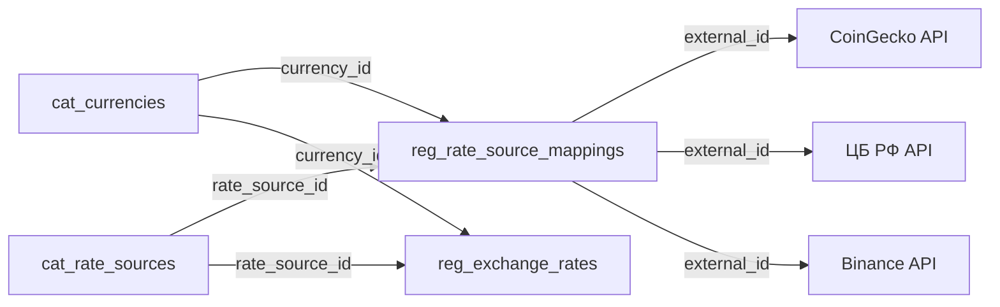
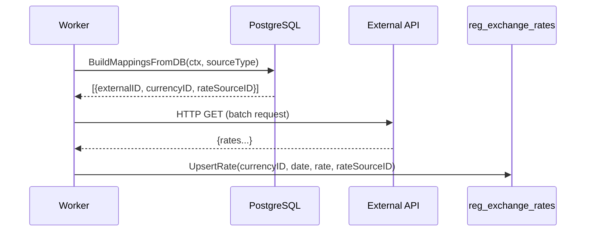

# Курсы валют и источники курсов (Exchange Rates)

> **TL;DR:** Подсистема обменных курсов — глобальный механизм ERP для загрузки, хранения и предоставления курсов любых валют (фиатных и крипто) из произвольных источников (ЦБ РФ, CoinGecko, ручной ввод).

> **Тип:** System Documentation
> **Аудитория:** Developer
> **Связанные:** [crypto-processing.md](crypto-processing.md), [core-layer.md](core-layer.md)

---

## 1. Обзор

Подсистема обменных курсов отвечает за:
- Автоматическую загрузку курсов из внешних API (ЦБ РФ, CoinGecko, Binance, ECB)
- Ручной ввод курсов через ERP-интерфейс
- Хранение исторических курсов (регистр сведений `reg_exchange_rates`)
- Конвертацию сумм между валютами в отчётах, документах и дашбордах

**Ключевой принцип:** курсы **декуплированы** от справочника валют. Привязка «валюта ↔ провайдер» хранится в отдельном регистре `reg_rate_source_mappings`, а не в колонке на `cat_currencies`.



---

## 2. Справочники и регистры

### 2.1. RateSource (Справочник источников курсов)

`cat_rate_sources` — справочник провайдеров обменных курсов. Позволяет добавлять новые источники без изменения схемы.

| Поле | Тип | Описание |
|------|-----|----------|
| `SourceType` | string (enum) | Тип интеграции |
| `BaseURL` | *string | API base URL провайдера |
| `APIKey` | *string | Зашифрованный API-ключ (никогда не возвращается в API) |
| `RateLimitRPM` | int | Лимит запросов в минуту |
| `Priority` | int | Приоритет (меньше = выше). Для fallback-логики |
| `IsActive` | bool | Включение/отключение источника |

**Enum `SourceType`:**

| Значение | Описание | Типичные валюты |
|----------|----------|-----------------|
| `cbr` | ЦБ РФ (официальные курсы) | RUB ↔ USD, EUR, CNY |
| `ecb` | Европейский ЦБ | EUR ↔ USD, GBP, JPY |
| `coingecko` | CoinGecko Free API | USDT, BTC, ETH → USD |
| `binance` | Binance Public API | Крипто-пары |
| `coinmarketcap` | CoinMarketCap API | Крипто-пары |
| `manual` | Ручной ввод через ERP-интерфейс | Любые |

> [!TIP]
> Для добавления нового провайдера достаточно: (1) создать запись в `cat_rate_sources`, (2) добавить маппинги в `reg_rate_source_mappings`, (3) реализовать fetcher-адаптер в `internal/infrastructure/rate_feed/`.

### 2.2. RateSourceMappings (Регистр маппингов)

`reg_rate_source_mappings` — связующий регистр между валютами и источниками курсов.

| Поле | Тип | Описание |
|------|-----|----------|
| `currency_id` | FK → cat_currencies | Валюта Metapus |
| `rate_source_id` | FK → cat_rate_sources | Источник курсов |
| `external_id` | string | Идентификатор валюты у провайдера |
| `is_active` | bool | Включение/отключение маппинга |

**PK:** `(currency_id, rate_source_id)` — одна валюта может иметь маппинги к нескольким провайдерам.

**Пример данных:**

| Валюта | Источник | external_id | Описание |
|--------|----------|-------------|----------|
| USD | ЦБ РФ | `R01235` | Код USD на cbr.ru |
| EUR | ЦБ РФ | `R01239` | Код EUR на cbr.ru |
| USDT | CoinGecko | `tether` | CoinGecko coin ID |
| BTC | CoinGecko | `bitcoin` | CoinGecko coin ID |
| ETH | CoinGecko | `ethereum` | CoinGecko coin ID |
| USDT | Binance | `USDTUSD` | Binance trading pair |

### 2.3. ExchangeRate (Регистр сведений — курсы валют)

`reg_exchange_rates` — периодический регистр сведений (аналог 1С «РегистрСведений.КурсыВалют»).

| Поле | Тип | Описание |
|------|-----|----------|
| `currency_id` | FK → cat_currencies | Валюта |
| `date` | DATE | Дата курса |
| `rate` | NUMERIC | Курс к базовой валюте |
| `multiplier` | int | Множитель (1 для USD, 100 для JPY) |
| `rate_source_id` | FK → cat_rate_sources | Источник курса |

**PK:** `(currency_id, date, rate_source_id)` — один курс на дату на источник.

**Формула конвертации:** `baseAmount = humanAmount × rate / multiplier`

> [!NOTE]
> Множитель `multiplier` нужен для валют с очень малым курсом (например, JPY/USD ≈ 0.0067). Хранение `rate=0.67, multiplier=100` обеспечивает точность без лишних десятичных знаков.

---

## 3. Rate Feed Worker

Фоновый воркер периодически загружает курсы из внешних API. Запускается в `cmd/worker`.

**Поток обработки:**



**`BuildMappingsFromDB(ctx, sourceType)`** — загружает активные маппинги по типу источника:

```sql
SELECT m.external_id, c.id, c.minor_multiplier, rs.id
FROM reg_rate_source_mappings m
JOIN cat_rate_sources rs ON rs.id = m.rate_source_id
JOIN cat_currencies c ON c.id = m.currency_id
WHERE rs.source_type = $1
  AND rs._deleted_at IS NULL
  AND m.is_active = TRUE
  AND c._deleted_at IS NULL
```

**Текущие адаптеры:**

| Адаптер | Файл | Интервал | Описание |
|---------|------|----------|----------|
| CoinGecko | `rate_feed/coingecko.go` | 5 мин | Крипто-курсы через `/simple/price` |

**Будущие адаптеры (запланированные):**

| Адаптер | API | Описание |
|---------|-----|----------|
| ЦБ РФ | `cbr.ru/scripts/XML_daily.asp` | Официальные курсы фиатных валют |
| ECB | `ecb.europa.eu/stats/eurofxref` | Курсы EUR |

---

## 4. BalanceCalculator (потребитель курсов)

`BalanceCalculator` — пример потребителя подсистемы курсов. Конвертирует крипто-остатки мерчантов в фиатную валюту для Portal Dashboard.

**Зависимости:**

| Интерфейс | Реализация | Назначение |
|-----------|------------|------------|
| `BalanceQueryRepo` | `portal_repo.DashboardRepo` | Загрузка остатков мерчанта из регистров |
| `exchange_rate.Service` | (injected) | Получение курса по `(currencyID, rateSourceID)` |
| `RateSourceResolver` | `portal_repo.RateSourceResolver` | Резолвинг кода источника (`"coingecko"`) → UUID |

**Fallback:** `BalanceCalculator.Calculate()` принимает `fallbackRateSourceID *id.ID` для каскадной попытки получить курс из альтернативного источника (например, `manual`).

> [!NOTE]
> `BalanceCalculator` — **криптопроцессинговый** потребитель. Подсистема курсов открыта для любых потребителей: отчёты, документы продажи, финансовые сверки.

---

## 5. Архитектурные решения

| Решение | Альтернатива | Обоснование |
|---------|-------------|-------------|
| **Отдельный справочник `cat_rate_sources`** | Enum/const в коде | Расширяемость: API-ключи, rate limits, priority — всё в БД. ЦБ РФ и CoinGecko — одинаковая абстракция |
| **`reg_rate_source_mappings` регистр** | `coingecko_id` поле на `cat_currencies` | Декуплирование: валюта не знает о провайдерах. N источников на валюту |
| **`rate_source_id` FK** в `reg_exchange_rates` | `source` string | Ссылочная целостность, JOIN-оптимизация, нет magic strings |
| **`RateSourceResolver` интерфейс** | Прямой SQL в handler | Clean Architecture: domain не знает об infrastructure |
| **Fallback по `priority`** | Один источник | Отказоустойчивость: CoinGecko down → manual rates |
| **Глобальная подсистема** | Часть криптопроцессинга | Курсы нужны не только крипто: фиатные курсы для отчётов, документов, пересчёта |

---

## 6. Файловая карта

```
Backend:
  internal/domain/catalogs/rate_source/
  └── model.go                                        — RateSource entity + SourceType enum
  internal/domain/registers/exchange_rate/
  └── service.go                                      — ExchangeRate model + Service + Repository
  internal/domain/crypto/
  └── balance_calculator.go                           — BalanceCalculator + RateSourceResolver interface
  internal/infrastructure/rate_feed/
  ├── coingecko.go                                    — CoinGeckoFetcher (HTTP + CurrencyMapping)
  └── worker.go                                       — Rate feed worker + BuildMappingsFromDB
  internal/infrastructure/storage/postgres/
  ├── catalog_repo/rate_source.go                     — RateSourceRepo (BaseCatalogRepo)
  ├── register_repo/exchange_rate.go                  — ExchangeRateRepo (Upsert, GetLatest, List)
  └── portal_repo/rate_source_resolver.go             — RateSourceResolver (code → UUID)
  internal/infrastructure/http/v1/
  └── dto/rate_source.go                              — Create/Update/Response DTOs
  internal/content/
  ├── catalog_registrations.go                        — RateSourceRegistration + SourceType enum
  └── register.go                                     — RegisterDefaults (includes RateSource)

Migrations:
  db/migrations/00036_crypto_invoice_and_register.sql — Tables: cat_rate_sources, reg_rate_source_mappings, reg_exchange_rates
```

---

## 7. Seed Data

Сидируется через `cmd/seed/main.go`:
- 2 источника курсов: CoinGecko (`priority=10`), Manual (`priority=100`)
- 3 маппинга: USDT→tether, BTC→bitcoin, ETH→ethereum (CoinGecko)
- 1 курс: USDT = 0.9997 USD (источник: CoinGecko)

---

## Связанные документы

- [crypto-processing.md](crypto-processing.md) — криптопроцессинг: основной потребитель крипто-курсов
- [core-layer.md](core-layer.md) — базовые типы (`CatalogService`, `BaseCatalogRepo`)
- [posting-engine.md](posting-engine.md) — движок проведения (использует курсы для пересчёта в базовую валюту)
