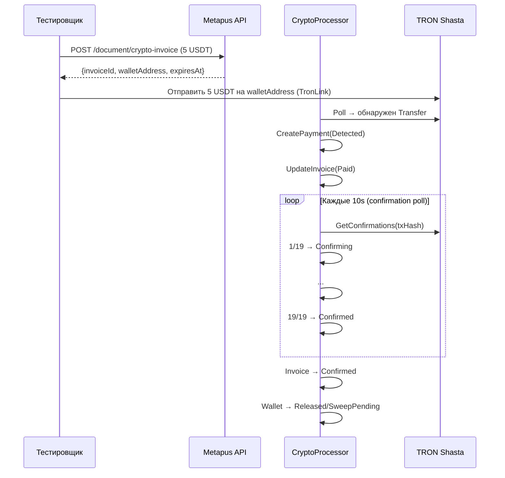

# Ручное E2E тестирование приёма платежа на TRON Shasta

## Текущая инфраструктура

| Компонент | Статус | Детали |
|-----------|--------|--------|
| TRON Watcher | ✅ Реализован | `tron/watcher.go` — polling TronGrid API каждые 3s |
| TRON Client | ✅ Реализован | `tron/client.go` — TRC-20 events + confirmations |
| CryptoProcessor | ✅ Реализован | event consumer + FSM + sweep eval + expiration |
| EventProcessor | ✅ Реализован + протестирован | 42 теста, 6 E2E сценариев |
| Seed Data | ✅ Готово | TRON-SHASTA network, USDT-TRC20 token, merchant, 3 wallets |
| API Endpoints | ❓ Нужна проверка | POST /document/crypto-invoice |
| Frontend | ❓ Нужна проверка | Формы создания инвойса |

### Seed Wallets (из `cmd/seed/main.go`)

| Code | Address | Tier | Status |
|------|---------|------|--------|
| `HOT-TRON-001` | `TYDzsYUEgfGRreSR7oqKMo7pqdXxnPH1Hh` | hot | leased |
| `POOL-TRON-001` | `TVgY6mWpDGGCtPRBxuMSjitVHfPkpJuVRG` | pool | free |
| `POOL-TRON-002` | `TMXMyg87BiHCVfkwvVj3T32SWDSuRQqsPx` | pool | free |

> [!WARNING]
> **Ключевой вопрос**: Seed wallets используют **фиксированные адреса**, но у нас **нет приватных ключей** от них. Для реального тестирования на Shasta нужно:
> 1. Сгенерировать **свой** TRON аккаунт на Shasta
> 2. Получить тестовые TRX через [Shasta Faucet](https://www.trongrid.io/shasta)
> 3. Получить тестовые USDT на контракте `TG3XXyExBkPp9nzdajDZsozEu4BkaSJozs`
> 4. Обновить seed wallet address на свой адрес **ИЛИ** создать wallet через API

---

## Варианты сценариев

### Сценарий 1: 🟢 Happy Path — полная оплата



**Проверяем:**
- Invoice: `created` → `paid` → `confirmed`
- Payment: `detected` → `confirming` → `confirmed`
- Wallet: `leased` → `free` или `sweep_pending`
- FSM audit trail: 2 события
- Время: ~57 секунд (19 × 3s block time)

---

### Сценарий 2: 🟡 Partial Payment — недоплата

```
Инвойс: 10 USDT
Перевод: 5 USDT
Ожидание: Invoice → PartiallyPaid, Payment → Confirmed
Затем: Ещё 5 USDT → Invoice → Paid → Confirmed
```

**Проверяем:**
- Два CryptoPayment для одного инвойса
- Invoice суммирует ReceivedAmount из обоих платежей
- Каждый платёж проходит свой FSM-цикл

---

### Сценарий 3: 🟡 Overpayment — переплата

```
Инвойс: 5 USDT
Перевод: 7 USDT
Ожидание: Invoice → Paid (не Overpaid, пока нет такого статуса)
```

**Проверяем:**
- ReceivedAmount > ExpectedAmount
- Средства не потеряны
- Как система обрабатывает excess

---

### Сценарий 4: 🔴 Expired Invoice — таймаут

```
Инвойс: 5 USDT, TTL = 5 минут
Ждать: 6 минут без оплаты
Ожидание: Invoice → Expired через expirationLoop (1 min tick)
Затем: Перевод на адрес → Silently skipped (нет active invoice)
```

**Проверяем:**
- ExpirationLoop корректно переводит в `expired`
- Wallet возвращается в `free`
- Поздний перевод не создаёт payment

---

### Сценарий 5: 🔴 Dust Attack — микроплатёж

```
Инвойс: 5 USDT
Перевод: 0.0001 USDT (100 minor units < threshold 1000)
Ожидание: Event проигнорирован (dust filter)
```

**Проверяем:**
- Dust threshold работает on-chain
- Нет CryptoPayment record

---

### Сценарий 6: 🟠 Sweep Threshold — порог сбора

```
Настройка: sweep_threshold = 10 USDT
Инвойс 1: 3 USDT → Confirmed, Wallet → Released (balance < threshold)
Инвойс 2: 4 USDT → Confirmed, Wallet → Released
Инвойс 3: 5 USDT → Confirmed, Wallet → Released
SweepEval: total 12 USDT ≥ threshold 10 → Wallet → SweepPending
```

**Проверяем:**
- evaluateSweeps правильно агрегирует баланс
- Sweep запускается только при достижении порога

---

## Пререквизиты для запуска

### 1. TRON Shasta аккаунт
```bash
# Генерация: https://www.trongrid.io/shasta
# Или через TronLink → Settings → Network → Shasta
# Faucet: https://www.trongrid.io/shasta → Claim test TRX
```

### 2. Тестовые USDT
```
# USDT контракт на Shasta: TG3XXyExBkPp9nzdajDZsozEu4BkaSJozs
# Нужен: faucet USDT или заминтить через контракт
```

### 3. Запуск backend + worker
```powershell
# Terminal 1: Backend
$env:TRON_RPC_URL="https://api.shasta.trongrid.io"
$env:TRON_API_KEY="c9c9646e-0626-4035-857b-911c6aba25cc"
go run ./cmd/server

# Terminal 2: Worker (crypto processor)
go run ./cmd/worker
```

### 4. Seed данные
```powershell
go run ./cmd/seed
```

> [!IMPORTANT]
> Нужно обновить адрес одного из POOL wallet'ов на адрес, от которого у нас есть приватный ключ (чтобы получать переводы). Или: создать wallet через API с нашим тестовым адресом.

---
